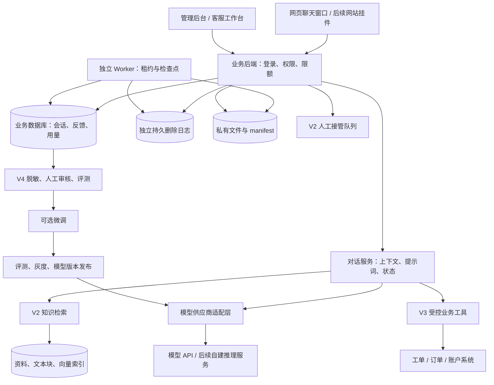

# AI 智能客服系统开发文档（技术设计）

版本：v1.3 · 修订日期：2026-09-05 · 状态：已采纳 A01—A06、产品经理审计及 T01—T05 技术实现审计意见，待开发与验收

本版保留既有产品范围和安全约束，进一步确定独立删除日志、审核内容读取、Worker 租约、文件产物清理及断流终止协议，并同步调整对应验收、预算档位和工作包。修订关系见第 17 节；所有验收均待实际系统执行。[v1.0 快照](E:/ai-customer-service-plan/versions/AI智能客服系统开发文档-v1.0.md)、[v1.1 快照](E:/ai-customer-service-plan/versions/AI智能客服系统开发文档-v1.1.md)、[v1.2 快照](E:/ai-customer-service-plan/versions/AI智能客服系统开发文档-v1.2.md)保留历史证据。

适用对象：开发、测试及运维人员。产品负责人先看[产品需求文档 PRD](E:/ai-customer-service-plan/AI智能客服系统-产品需求文档PRD.md)，客服与知识运营看[运营手册](E:/ai-customer-service-plan/AI智能客服系统-运营手册.md)。本文件沿用原路径，供既有书签继续访问；三份文档分别负责产品决策、技术实现和人工执行流程。

本方案从“用自己的 API Key 与 AI 聊天”起步，逐步建设可保存对话、查询业务知识、协助人工客服、积累训练数据的系统。业务尚未确认；PRD 第 1 节提出软件产品支持与普通商品咨询两个候选场景，第 10 节规定责任人和决策期限。行业确认前仅可开展测试数据 V0；正式 V1 需通过 G1，V2—V4 行业能力不得建立在未确认政策上。

本文中的架构、工期、数据量与验收阈值是项目设计建议，不是已完成的功能、供应商承诺或正式报价。引用的供应商信息已按编写日期核对，上线前仍需复核账号权限与模型能力。

**建议路线：API 聊天 → 对话与反馈管理 → 知识库客服 → 业务系统与人工接管 → 按效果决定是否微调。**

## 1. 先理解：我们到底要做什么

你要建设的是一个由自己管理的 AI 客服应用。聊天框是入口，模型 API 提供语言能力；业务规则、聊天数据、知识资料、权限与客服流程由自己的系统管理。

可以把它理解成五部分：

| 组成 | 通俗理解 | 系统中负责什么 |
| --- | --- | --- |
| 聊天界面 | 接待窗口 | 发送消息、显示回复、查看历史、转人工 |
| 大模型 API | 会理解与表达的助手 | 理解问题、组织答案、提出工具调用请求 |
| 数据库 | 工作记录 | 保存会话、反馈、身份、用量和处理状态 |
| 知识库与业务接口 | 工作手册和业务系统 | 提供准确资料、工单状态、实时业务数据 |
| 运营与评测 | 培训和质检 | 纠正答案、更新资料、判断是否需要微调 |

**第一版不需要训练大模型，也不需要购买 GPU。** 如果只调用外部模型 API，模型计算由供应商承担，你主要运行网页、后端和数据库。后续若自行部署或微调开放权重模型，才需要单独规划计算资源。

最先要拥有的资产是：可迁移的会话数据、经过审核的业务知识、清晰的客服规则、可重复的评测集，以及可靠的应用代码。是否拥有模型权重，取决于以后选择的训练与部署路线。

### 1.1 六个常见误区

| 容易误解的说法 | 正确理解 |
| --- | --- |
| 保存聊天后，AI 就自动学会了 | 保存只改变数据库；模型是否能看到历史，取决于后端是否把相关内容带入本次请求 |
| 上传文件就是微调 | 文件通常用于查询或作为输入，只有明确的训练流程才改变模型或适配器参数 |
| 微调后不再需要知识库 | 价格、政策、产品版本等会变化，仍需查询有效资料或业务系统 |
| API Key 能调用聊天，就能训练 | 推理、向量化和训练是不同能力，账号权限与模型支持需要分别验证 |
| 聊得越多就一定越聪明 | 未审核的对话可能包含错误、噪声、隐私和相互冲突的答案 |
| 微调完成就拥有一个可下载模型 | 托管微调与开放权重训练的交付物不同；能否导出权重由平台与许可证决定 |

## 2. 把关键概念分清楚

| 概念 | 是什么 | 在本项目中的用途 |
| --- | --- | --- |
| API Key | 调用模型服务的凭据，类似服务密码 | 后端向供应商证明身份；不能交给普通访客 |
| Base URL | 服务的接口地址 | 指定请求发到官方服务、自建网关或其他供应商 |
| Model ID | 实际使用的模型标识 | 在经过验证的模型之间切换，不写死在前端 |
| Prompt／系统提示词 | 给模型的角色与回答要求 | 规定语气、回答范围、遇到不确定信息时如何处理 |
| Token | 模型处理文本等输入输出的计量单位 | 计算上下文长度和费用；不能简单等同于字数 |
| 上下文 | 本次请求中模型实际收到的材料 | 包括当前问题、必要历史、资料和工具结果 |
| 会话存储 | 把聊天记录写入数据库 | 回看、审计、反馈、导出、后续数据整理 |
| 长期记忆 | 经允许保存、按身份检索的用户事实或偏好 | 例如用户偏好中文回复；需要来源、更正与删除机制 |
| RAG／知识库检索 | 先查资料，再让模型结合资料回答 | 回答产品说明、常见问题、有效业务政策 |
| 工具调用 | 模型请求后端执行一个限定功能 | 查询工单、查询订单、创建服务请求 |
| SFT／监督微调 | 用高质量输入和目标答案训练模型 | 改善稳定的回答方式、分类、格式与流程表现 |
| 评测 | 用固定题目和标准比较版本表现 | 判断更换模型、提示词或微调是否真的有效 |

多轮对话需要显式管理上下文或使用供应商的会话能力；供应商会话状态也不应成为我们唯一的业务档案。OpenAI 文档还说明，使用历史响应引用并不意味着历史输入免费。[OpenAI 会话状态说明](https://developers.openai.com/api/docs/guides/conversation-state)

### 2.1 一个问题应该由谁解决

| 客户问题或现象 | 首选办法 | 原因 |
| --- | --- | --- |
| “你们支持哪些功能？” | 知识库 | 需要查询当前有效的产品资料 |
| “我的工单处理到哪了？” | 身份核验 + 业务接口 | 需要本人的实时数据 |
| “我刚才说的是另一个版本。” | 当前会话上下文 | 需要理解本轮对话前文 |
| “下次请尽量用中文。” | 经允许的用户偏好记忆 | 是用户偏好，不应训练进所有人的模型 |
| 回答太长、语气不统一 | 先修改提示词与示例 | 成本较低，变更容易评估 |
| 多种提示词仍无法稳定执行固定格式 | 评测后考虑微调 | 属于反复出现的行为问题 |
| 客户资料在另一个账号里出现 | 修复权限与数据隔离 | 不是模型训练能够解决的问题 |

## 3. 产品范围与分期

### 3.1 V0：最小技术验证

目标：用一套服务端配置成功调用一个模型，验证中文多轮对话和流式输出。

交付：一个测试聊天页、一个后端接口、服务端密钥配置、成功与失败提示。使用测试数据，仅供开发验证，不作为公开客服。

通过条件：模型能回复；第二轮能引用第一轮的必要信息；页面能逐步显示文字；错误 Key、无权限模型、超时都能明确反馈。

### 3.2 V1：可内部使用的聊天与数据管理系统

这是内部使用版本，正式开工前先通过 PRD 的 G1。MoSCoW 用来排序交付范围，核心安全和数据约束不会因页面延期而取消。

| 模块 | 本版范围与可简化边界 | 优先级 |
| --- | --- | --- |
| 登录与权限 | 管理员与内部使用者；后端隔离会话、配置和操作 | Must |
| 模型连接 | 一个适配器；Base URL、Key、模型验证、轮换和脱敏 | Must |
| 聊天 | 多轮、流式、断流终止与快照、停止、末轮重新生成及有效答案 | Must |
| 历史记录 | 保存、分页、异步删除、独立删除凭证和恢复闸门；搜索／重命名可延期 | Must 核心；Could 搜索等 |
| 配置版本 | 最小版本记录、绑定、撤销与受控回退；完整编辑和迁移界面后移 | Must 契约；Should 界面 |
| 反馈 | 一个有帮助／无帮助评分；原因、纠错、审核在 V2 | Should；可先人工台账 |
| 数据可迁移 | 授权管理员受控导出并验证可解析，记录来源和审计 | Must；Could 自助页面 |
| 用量与控制 | 全调用归账、原子预留、累计上限、对账及受控基础报表 | Must；Could 图形看板 |
| 基础运维 | 脱敏日志、产品埋点、紧急关闭 AI、Worker 租约与故障接手、文件清理、备份恢复及他人接手 | Must |
| 体验 | 清楚的状态／错误、基础响应式；高级 Markdown 和视觉增强可延期 | Must 核心；Could 增强 |

依次后移图形看板／高级筛选、自助导出页面、视觉增强、复杂版本管理界面；仍超出批准投入 20% 时再评估评分 UI 或重排工期。不删除账本、身份、版本撤销、删除一致性及必要验收。未开发自助导出端点时保持关闭，管理员命令仍复用相同的鉴权和任务服务，禁止用不受控 SQL 导出绕过删除与审计。

V1 支持你自己在管理页录入 API Key。普通聊天用户只选择管理员开放的助手，不接触供应商 Key。若将来要做“每位用户都能带自己的 Key”，需补充每人凭据隔离、授权范围和删除流程，作为独立功能。

V1 先实现一个完整的供应商适配器，并在代码中保留扩展接口；不把“兼容所有大模型”作为首版承诺。

### 3.3 V2：知识库与客服试点

增加 FAQ、Markdown、文本和可提取文字的 PDF 导入；扫描 PDF 的 OCR 单独排期。资料经过预览、审核、发布后才能用于回答。答案显示来源；找不到依据时澄清或转人工。

同时增加客服工作台、队列、人工回复、内部服务登记、反馈原因和纠错审核、访客凭证及基础防滥用；公开 AI 答复采用全文审核后发布，各读取入口统一使用获准内容。匿名与已验证业务客户分别授权，协议见第 13.4 节；V2 可先不接业务身份，个人业务查询仍在 V3。公开种子试点前必须通过 PRD 第 7 节 C01—C07 和 G3，完成五个交互流程、功能降级演练与排班；按种子、5%、25%、100% 的证据门槛推进，不按日期自动扩大流量。

### 3.4 V3：接入业务系统

先实现查询类能力，例如查询本人工单、产品状态或订单进度；随后再评估创建工单等写入功能。需要修改订单、退款或账户操作时，由业务权限、审批和幂等规则约束执行。

### 3.5 V4：训练数据与模型优化

增加样本审核、脱敏、版本化数据集、评测任务、训练任务记录、模型版本对比和灰度发布。先证明需要微调，再决定训练供应商与计算资源。

首版暂不建设：从零预训练大模型、自动持续训练、语音客服、全渠道接入、复杂多代理系统、多商家 SaaS 计费、自动退款。后续可以扩展，但这些会显著改变项目范围。

## 4. 页面与角色设计

### 4.1 页面清单

| 页面 | 主要内容 | 阶段 |
| --- | --- | --- |
| 聊天页 | 左侧会话列表；中间消息；底部输入；顶部助手名称 | V1 |
| 模型连接页 | 地址、密钥录入、模型、能力验证、连接状态 | V1 |
| 助手配置页 | 名称、提示词、模型、版本；基础撤销可先用受控管理命令 | V1 Should 界面；Must 撤销能力 |
| 历史与反馈 | V1 分页历史；简单评分 Should；完整纠错审核 V2 | V1／V2 |
| 导出与用量页 | 自助导出、日期／模型图形报表；基础授权导出与对账先用管理工具 | V1 Could 页面；Must 后端能力 |
| 知识库页 | 文件、解析状态、版本、有效期、审核与发布 | V2 |
| 客服工作台 | 待处理队列、接管、人工回复、工单关联 | V2 |
| 数据与评测页 | 样本审批、数据集版本、评分与失败案例 | V4 |
| 训练与发布页 | 训练记录、候选模型、评测结果、灰度与回滚 | V4 |

### 4.2 角色边界

| 角色 | 主要权限 |
| --- | --- |
| 管理员 | 管理模型连接、用户与预算；控制发布权限 |
| 业务运营／质检 | 维护知识、审核纠错、评审训练样本与答案质量 |
| 人工客服 | 处理被分配的会话，查看必要上下文，提交纠错 |
| 内部试用者（V1） | 使用团队授权助手，仅看自己允许范围的会话 |
| 外部匿名访客（V2） | 使用公开知识与当前获准会话；不可访问个人业务记录 |
| 已登录业务客户（V2/V3） | 由可信业务身份授予范围；查询个人业务仍待 V3 接口启用 |

一个人在早期可以兼任多个角色，但权限仍应在后端明确区分。页面隐藏按钮不能替代服务端鉴权。

发消息／重试、人工等候、凭证续期／过期、无资料兜底、移动端五个核心流程及文案以 PRD 第 6 节为准。实现前先做代表用户走查；匿名凭证失效不得为了展示只读历史而绕过认证。键盘、读屏、窄屏和长内容展示纳入体验验收。

## 5. 推荐架构

采用“一个业务后端，内部按模块分开”的结构。V1 即包含独立 Worker，承担持久删除、对账和导出任务；后续文档处理和训练沿用任务框架扩展。在线生成由 API 执行器拥有。



图中 V2—V4 模块逐步增加，V1 不要求全部实现。训练产生的是候选模型版本，必须经过评测和发布才能被在线对话选中。

### 5.1 技术选型建议

| 层次 | 建议选型 | 选择理由与边界 |
| --- | --- | --- |
| 前端 | Vue 3 + TypeScript | 聊天页和管理页共用组件；适合前后端分离 |
| 后端 | Python + FastAPI | API、数据清洗、后续训练任务衔接较方便 |
| 主数据库 | PostgreSQL | 统一保存身份、会话、反馈、配置和数据版本 |
| 知识索引 | PostgreSQL + pgvector，V2 引入 | 初期把向量与业务数据放在同一数据库，减少独立服务 |
| 流式通信 | HTTP 流 + SSE 事件格式 | V1 内部可逐步显示；V2 全文审核期间仅状态事件，通过后发布；人工实时推送后续评估 WebSocket |
| 文件存储 | V1 同主机私有持久卷，元数据与写入意图先登记；对象存储按适配协议接入 | staging／ready 分离、失败清理及迟到写入处理见第 8.4 节 |
| 后台任务 | V1 数据库持久 job＋独立 Worker；短事务领取、租约与领取版本 | 删除、对账、导出按第 6.5 节恢复，不能将租约过期当作可以重发收费请求 |
| 删除凭证 | 与业务主机独立故障域的持久 PostgreSQL 日志实例 | 确认删除前提交，旧库恢复时读取完整日志水位；见第 13.6 节 |
| 缓存与限流 | V1 可由数据库实现；多实例后评估 Redis | 不为尚不存在的规模增加依赖 |
| 部署 | 容器化应用 + 数据库 + HTTPS 入口 | 开发、测试、正式环境配置分离 |

这是基于本项目扩展需求的选型建议，并非唯一组合。如果团队更熟悉 React、Java 或现有业务后端，应优先评估复用成本，保留相同的接口与数据边界即可。Vue 提供组件化界面能力，FastAPI 支持 OpenAPI 与数据校验，pgvector 提供 PostgreSQL 内的向量检索。[Vue 官方介绍](https://vuejs.org/guide/introduction.html)、[FastAPI 特性](https://fastapi.tiangolo.com/features/)、[pgvector 官方仓库](https://github.com/pgvector/pgvector)

### 5.2 模型适配层

把供应商差异封装在后端，例如 `generate_stream`、`count_or_estimate_tokens`、`normalize_usage`、`normalize_error`。向量生成和训练使用独立接口，不假定聊天供应商一定具备这些能力。

每个模型连接记录能力：流式输出、工具调用、结构化输出、图片、上下文限制、允许参数。仅开放已验证的能力，不把所有模型都当成支持同一套参数。

如果接 OpenAI，按当前模型文档选择 Responses 等实际支持的接口；第三方的“OpenAI 兼容”通常还需要逐项验证。Base URL 相同形式不代表接口、工具、计费或训练完全兼容。

对话、提示词版本、评测集和训练数据保存在自己的系统，供应商资源 ID 只作为关联信息。切换服务时也要验证其数据处理规则，不在故障时悄悄把客户数据转给未批准的供应商。

### 5.3 版本运行权限、撤销与回滚（A03）

`assistant_versions` 与模型部署版本均具有 `draft / active / revoked` 状态。`active` 表示允许执行，并不表示它一定是新会话的默认版本；默认指针单独管理。历史绑定用于审计，不能替代当前运行授权。

每次新生成、重试及后续模型／工具调用前，检查助手版本、模型部署和供应商连接仍可运行。版本运行授权使用可失效的版本号；紧急撤销时同时停止相关任务的新调用和未发布回复，不能仅修改默认模型下拉框。

回滚操作撤销问题版本，并将新会话默认指针切换到一个已批准且仍为 `active` 的版本。被撤销版本不得因回滚、重试或克隆旧配置而重新获得执行权。已有会话默认暂停 AI，返回 `assistant_version_revoked`，可转人工；不静默改变它们的数据接收方。

管理员可迁移暂停的会话到已批准版本。迁移前校验目标版本、供应商许可与预期会话版本号，终止旧任务并递增 `write_epoch`，然后更新当前绑定，记录原绑定、目标绑定、操作者与原因。`generation_runs` 保存实际执行版本，历史消息不改写。跨供应商迁移必须已有相应的数据处理授权，否则拒绝。

已有请求一旦发出，不能保证撤销已经发生的上游处理或费用；在本系统撤销生效后，不允许继续发出新调用或发布该任务的新回复。版本迁移和人工接管使用与删除一致的发布闸门，见第 6.4 节。

### 5.4 功能开关、流量与紧急降级

V1 必须能通过受控管理命令关闭 AI，V2 提供工作台操作与站点／工作空间／助手范围。`service_mode=ai_enabled/human_only/service_closed` 配合单调递增的 `service_authorization_epoch`；禁用优先于实验分组、默认版本和旧会话绑定。开关服务无法确认当前授权时停止新 AI 派发及发布，不使用无限期旧缓存放行。

新调用及每次发布同时检查会话 epoch、当前主体授权、助手／部署版本和当前服务模式。切人工时撤销旧任务发布授权，使所有实例缓存失效并丢弃待发送片段；仅隐藏发送按钮或变更默认助手不算降级。V1 没有坐席时显示暂停和管理员渠道，V2 human_only 仅保留真实可用人工／留单。

全入口生效演练目标为管理员命令发出后不超过 5 分钟；记录每个实例与长连接的确认和超时，未确认实例不得继续自动服务。费用结算、删除和人工消息不因 AI 停用一起停止；已经送往供应商的请求费用仍需核对。

V2 实验配置保存范围、比例、分组键、版本、批准人和生效时间。分组对同一主体／会话稳定，retry 不重新分组；`experiment_exposed` 在实际接入时记录。扩大流量由 PRD 第 8 节审批，功能回退和模型回滚分别执行。全站紧急关闭是最小 V1 Must，复杂实验界面在 V2。

### 5.5 V1 运行拓扑与故障边界

默认部署一个 HTTPS 入口、一个 FastAPI 应用实例、一个独立 Worker 进程、一个业务 PostgreSQL，以及 API／Worker 显式共用的私有持久卷。API 与 Worker 可使用同一镜像的不同启动命令；在线生成由 API 请求中的执行器拥有，不交给响应结束后执行的 BackgroundTasks。网络断开和执行器失联的规则分别见第 6.6 节。

删除日志使用另一个持久 PostgreSQL 实例及单独凭据，必须与业务主机分离故障域、独立备份、禁止随业务库恢复旧快照。另建 schema 或同机容器不能满足这一隔离目标。尚未部署日志服务的 V0 只能使用测试数据，不能宣称已具备 V1 真实数据删除／恢复能力。这是新增的运行依赖，其费用和维护工作需纳入预算。

应用和 Worker 不跨外部 I/O 持有数据库事务。默认 Worker 同时执行最多 3 个 job：维护类保留 2 个槽位，删除／对账按轮转取任务；文件处理最多占 1 个槽位，不借用维护槽。业务库连接池默认 API 最多 12、Worker 最多 6，另保留迁移／维护连接；独立日志池最多 2。这些为待负载验证的初值，变更须登记，不能把每个新增进程都当成独占全部连接额度。

租约续期、过期 run 扫描和调度不占上述长任务槽位；网络等待设期限，CPU 密集解析放受限子进程，避免阻塞维护循环。第 6.6 节 40 秒目标需在文件槽满载时验证，不能假定“有 Worker”就一定能按时清理占用。

扩展到多主机／多实例前，必须重新验证任务领取、撤销、在线快照和文件访问；同名本地卷不能假定跨主机共享。原始文件及临时产物不挂载到公开静态目录。数据库、文件和独立删除日志分别备份，恢复开放条件以第 13.6 节为准。

## 6. 一条消息的完整处理流程

1. 用户发送消息，前端为一次逻辑提交生成并复用 `client_message_id`，提交会话 ID、当前会话版本号和消息内容。会话绑定助手由后端解析。
2. 后端验证主体凭证、资源归属、会话可写状态、服务模式、版本运行权限、输入长度、速率和预算配置；V2 执行获批的内容安全策略。
3. 在事务内检查会话末端和生成锁，保存用户消息，创建 `turn` 与 `run`，分配执行器令牌及租约；同键同内容返回快照而不创建另一个执行器，同键不同内容返回冲突。
4. 读取该会话当前绑定且允许执行的配置，选取当前有效答案构成的上下文；V2 起检索有权限且仍有效的资料。
5. 为每个外部计费操作建立 `operation / attempt` 并原子预留额度；检查 turn 累计次数、Token、金额与耗时，再从密钥存储读取凭据并发起调用。
6. 先保存受控候选内容；只有通过第 6.7 节内容可见性检查的文本，才可进入流事件和查询快照。写入与发布还检查会话、服务模式、主体、执行器令牌及租约。
7. 完成时校验末端、当前授权和内容版本／审核结果，在一个事务内写入终态、切换有效答案、更新 revision 并释放活动生成占用，再发送完成事件。用量独立按 attempt 结算，不因审核拒绝或断流记零。
8. 失败、取消或断流时保存准确终态；普通用户只可查看已获准展示的未完成片段，不能因“保留片段”读取待审核或被拒原文。主动重新生成仍走末轮协议。
9. 产生最小产品事件；评分 UI 按 Should 启用，V2 纠错单独保存，原始回答仍按保留期限受控审计。

### 6.1 上下文管理

数据库可以保存较长历史，但每次只向模型发送必要内容。采用“系统规则 + 历史摘要 + 最近消息 + 当前问题 + 相关资料”的组合，并为输出预留空间。Token 预算以最终完整请求为准，包含对话模板、工具定义与工具结果；按供应商规则计量或保守估算，不能只统计用户输入框的文字。默认配置与超限处理见第 14.2 节。

摘要不能覆盖订单、价格等权威记录。重要业务事实应重新查询；摘要需保留来源与更新位置。V1 的“新建会话”默认不读取其他会话；跨会话记忆后续单独设计，并按用户和工作空间隔离。

摘要只采用有效答案，关联源消息、答案选择版本和知识版本。重新生成、删除、权限撤销或知识版本失效后，受影响摘要先退出上下文再重建。摘要按预算阈值增量触发，不能默认每轮调用模型重写；摘要调用计入触发它的 turn。

### 6.2 失败、重试和取消

| 情况 | 预期行为 |
| --- | --- |
| Key 无效／无权限 | 给管理员明确的脱敏错误；不自动反复重试 |
| 供应商限流或临时故障 | 在配置范围内有限退避；无法恢复时显示可重试状态 |
| 已输出部分文字后断开 | 检测到断连后尽力终止；只保留可见片段，标记未完成；不拼接另一轮答案 |
| 页面刷新／网络重连 | 查询原提交／run 的完整可见快照；不自动续接生成或重发付费请求；主动 retry 才创建新 run |
| 用户停止生成 | 请求取消上游任务并标记取消；已经发生的计算可能仍收费 |
| 未收到完整用量 | 用量标记为“估算”或“待核对”，不填成零费用 |
| 超出预算、次数或时间 | 阻止后续新调用，保留已有片段并返回 `budget_exceeded` 或 `deadline_exceeded`，提供说明或人工入口 |

取消是尽力执行，不能承诺供应商立即停止计费。重试之前必须判断是否已经创建过请求；已经产生外部写入的工具调用不能盲目重试。

“重复提交”和“主动重新生成”分开处理：前者返回已有任务，后者用新的幂等键在同一个 turn 下创建 run 并记录 `retry_of_run_id`，保留旧结果但不重置预算。V1 一个会话同时只允许一个生成任务，后端用事务或条件更新控制顺序。进程异常退出后，后台核对长期未结束的任务；无法确认上游完成状态时标记待核对，不自动重新调用，也不立即释放可能已消费的额度。

### 6.3 末轮重新生成与有效答案（A04）

V1 仅允许重试当前会话最后一个用户 turn，且原 run 已终止、当前无生成任务。请求必须携带新的 `Idempotency-Key`、`expected_head_turn_id` 与 `expected_conversation_revision`。后端原子校验；会话已前进或被迁移时返回 `409 conversation_conflict`，不自动退回旧轮或创建隐式分支。

每个助手答案关联 `reply_to_message_id` 和 `run_id`；`turns.active_answer_id` 指向该轮唯一有效且满足内容发布策略的完整答案。重新生成期间旧答案仍有效；新 run 成功、内容获准且末端校验通过时才原子切换。失败、审核拒绝／超时、取消、预算终止或版本失效均不替换旧答案；没有完整答案时指针为空，可见片段也不参与完整答案上下文。

后续模型输入和摘要只读取每轮当前有效且已完成的答案。前端以服务器返回的有效答案为准；旧版可在历史面板查看，但 V1 不支持把旧版重新选为有效答案。若答案更换影响摘要，先停用该摘要再重建。输入快照记录实际选入的消息与答案版本。

V3 中，发生过业务写入的 turn，重试只允许基于已经确认的工具结果重新组织回答；不得重新执行创建工单等写入操作。结果不明时先核对业务系统，未确认前暂停重试。新的业务动作需明确的新请求并经过业务权限校验，不能靠生成一个新的幂等键绕过业务操作去重。

### 6.4 删除、接管与后台任务的写入约束（A02）

会话分开保存 `lifecycle_state=active/deleting/purged` 和 `service_state=bot_active/waiting_human/human_active/resolved`。`write_epoch` 是可撤销的任务写入版本，`revision` 用于客户端并发校验，两者不承担身份认证。run 和后台 job 在创建时记录获准的 epoch。

删除请求先在本地事务中标记 `deleting`、递增 epoch／revision、建立删除 intent 与暂时 blocked 的 job，立即停止内容读写与下载；然后按第 13.6 节提交独立删除日志。只有独立凭证已持久提交并完成本地关联后，才返回 `202`、receipt ID 和 job ID。日志未确认时返回 `503 deletion_confirmation_pending` 并保持本地阻断，不能撤销删除状态或宣称持久受理成功。重试复用同一 intent／凭证／job。

所有普通内容写入、有效答案切换、索引和导出发布都必须在事务或条件更新中验证来源 active、epoch 相同、当前授权有效、执行者租约／版本有效及内容可见性，禁止先检查后无条件写入。删除清理、凭证重放及不含正文的费用对账采用第 6.5 节专用条件，不要求被删除来源仍为 active，也不因原用户退出而停止已获准的清理。

流事件经过按会话排序的发布闸门，携带 epoch 和序号。删除或接管生效后，丢弃待发布的旧 epoch 事件；前端收到失效事件后清空相应待展示缓存，忽略迟到事件。已经发送到客户端或供应商的内容无法追溯撤回，这不等于允许服务端继续发布新内容。

删除 job 依次清理正文、附件、摘要、反馈正文、引用快照、索引、受管理导出及未使用的数据集副本，并登记外部删除状态。已训练产物按第 11.5 节处置。产物未对外发布前也要检查源资源删除状态；大文件下载通过后端鉴权并可中止，V1 不发放可绕过撤销的长期公开下载地址。

job 状态为 `queued/running/blocked/failed/completed`，允许取消的任务另有 cancelled。删除必须等独立凭证确认、受控在线副本清理、写入者停止及发布／下载权撤销后才能报告在线清理完成；外部与训练产物的处置按实际范围记录，未知项保持 blocked／failed。租约或临时文件 TTL 到期不自动证明上传已停止。备份到期另列，不等同于即时物理删除。最小凭证和会计元数据不含已删除正文。

Worker 重试和服务重启均检查删除凭证。恢复旧库必须执行第 13.6 节的独立水位校验、凭证重放和文件清理，拿不到完整水位时不开放受影响范围；purged 会话不能通过 retry、导出或恢复重新激活。

### 6.5 Worker 领取、租约与接手（T03）

每个 job 保存 `claimed_by`、`claim_version`、`lease_until`、`heartbeat_at`、`attempt_count`、`max_attempts`、`next_run_at` 和错误。默认租约 30 秒，每 10 秒续租，全部以数据库时间判断；Worker 每 5 秒检查待办与过期任务。通过短事务 `FOR UPDATE SKIP LOCKED` 领取符合状态和调度条件的任务，在事务内增加 claim_version、登记执行者和期限后提交，再执行 I/O。该锁仅用于任务领取，不能跳过预算锁来绕过限额。[PostgreSQL 锁定说明](https://www.postgresql.org/docs/current/sql-select.html)

续租、步骤提交、内容发布必须原子校验 job 仍 running、执行者与 claim_version 匹配、lease_until 未到期，并按任务类别检查业务条件。失去租约或无法核验时停止新步骤并尽力取消在途工作；旧 Worker 恢复也不能把结果写成新领取者的结果。来源 write_epoch 不替代 claim_version，领取版本也不替代来源和主体权限。

| 任务类别 | 恢复与写入条件 |
| --- | --- |
| 导出、索引、一般内容任务 | 来源仍 active、来源 epoch 和当前权限有效；失效即停止发布并清理临时产物 |
| 删除、删除凭证重放 | 已授权的 intent／独立凭证有效，来源为 deleting／purged 或已不存在；服务身份仅清理和写最小状态，不重新读出正文 |
| 用量对账 | 原 attempt／账本关联存在即可写无正文的会计修正；会话已删除、用户退出或 AI 停用不阻断对账 |
| 审查任务 | 限定审核服务身份、内容哈希和策略版本；普通用户权限不能授予读取候选原文的能力 |

过期任务先增加领取版本并转入恢复检查，不能直接重跑整个函数。纯本地幂等步骤可从已提交检查点重做；已登记外部派发许可或请求结果未知的 attempt 先转 unknown／blocked，保留费用预留，通过查询、上游可验证幂等机制或人工核对处理。没有相应上游能力时不自动重发。任务恢复次数和供应商网络重试次数分别记录，所有真正外部提交仍受第 14.2 节约束。

派发许可在核验租约／来源和占用额度的短事务内持久登记，作为一次本地派发的判定时点；撤销后不再签发新许可。已获许可的在途 I/O 即使延迟到达供应商，也按原 attempt 核对；应用不能承诺撤回已经授权的外部工作。发送前再次检查失效／截止时间并尽力取消，不能将 Worker 接手当作“外部副作用恰好一次”的保证。

默认 job 最多 5 次自动领取尝试，失败退避 5／15／60／300 秒；到上限标 failed 并告警。独立凭证待确认、未知账单和写入者未停止等不可盲目重试情形标 blocked，按检查计划核对；不得自动改 completed。人工恢复记录原因，继续原 job／attempt 血缘，不清零预算或伪造新来源。

### 6.6 在线生成所有权、断流与快照（T05）

V1 固定采用“断流后终止、刷新读取快照”；V2 全文审核也沿用此生命周期。一个 run 只有创建它的 API 执行器，保存 `executor_id`、不可预测的 `execution_token`、30 秒租约及 10 秒心跳。后台 Worker 只修复失联状态和核对费用，**不接管并重新调用模型**。新 API 实例也不因查到 running 而接管生成。

运行状态固定为 created／running／reviewing／completed／failed／cancelled；费用的 pending／unknown 独立存在。检测到客户端断开后，执行器尽力取消上游，并在数据库健康时于 5 秒内以条件事务将非终态 run 置 failed、原因为 client_disconnected，失效令牌、更新 revision、释放活动占用；用户主动停止记 cancelled。只有已获准片段保留可见，未知费用继续 held。完成已先提交时，迟到的取消／断连不得把 completed 改回失败。

执行器失联时，维护 Worker 对租约过期或 deadline 到达的非终态 run 做相同的条件终止，原因为 executor_lost／deadline_exceeded；不改变已有有效答案。在数据库与维护 Worker 健康时，目标是在最后一次成功心跳后 40 秒内处理过期占用（30 秒租约＋5 秒扫描＋5 秒处理）。这不是从物理断网瞬间计算的保证；检测到断连的速度还受网络影响，所有工作仍受 run 的总时限限制。数据库不可用时先停止派发／发布，恢复后再核对，不能仅释放内存锁。

首次有效提交返回 `200 text/event-stream`。同一 client_message_id 的同内容重送，无论原 run 处于何种状态，都返回 `200 application/json` 的 `replayed=true` 快照，不建立第二个模型调用或第二条订阅流；前端按 Content-Type 分支处理。快照含 conversation／turn／run ID、status、错误、当前有效答案 ID、conversation_revision、visible_content_version、published_seq 与完整 `visible_text`。无可见内容时为空串，不回传候选正文。

新增按会话和 client_message_id 查询原提交的接口，资源权限与普通历史相同；不存在返回 404，不暗中创建。客户端可在 sessionStorage 仅保存随机提交标识用于刷新定位，不保存正文、Cookie 或密钥，标识本身不授予权限；认证失效时清理。也可从已授权的会话消息记录获取原 run ID。

run 查询返回一次数据库一致性读取中的完整可见快照。客户端以快照替换该 run 的内容，不能把快照继续拼接在旧片段后；不同 run 分开显示，较旧 revision 不覆盖新有效答案。仍 running／reviewing 时可按 1、2、5 秒退避轮询，间隔上限 5 秒；不自动发新的生成请求。用户主动末轮 retry 使用新的幂等键，创建新 run 但沿用 turn 剩余预算；V3 已发生写入或结果未知时继续受第 6.3 节限制。

流事件的 stream_seq 在同一 run 内递增，可见版本与字节片段一起提交后才发送。重复序号丢弃，序号有缺口则读取快照；本版不提供事件历史重放或 Last-Event-ID 续接保证。心跳不算首字。完成事务先持久化终态、获准完整答案及有效指针、revision、最后序号和释放占用，再发终止事件；终止事件丢失时，查询仍能确认成功。

### 6.7 候选内容、审核状态与统一读取（T02）

候选内容存受限的 `answer_candidates`，绑定 run、不可变 content_version／content_hash、策略版本与审核状态；禁止通用 run 序列化器直接展开候选正文。`answer_publications` 保存已获准内容版本、可见文本、完整性、审核结果引用及可撤销的发布授权。每次普通读取均同时核验主体、来源、当前发布权及内容条件，不把完成状态等同于审核通过。

候选正文持久保存以已获批保留依据为前提；否则仅在受控执行器内存完成生成与审核，数据库只记录允许保存的最小状态／哈希，正文引用为空，失败时丢弃内存内容。进程重启不能恢复这种原文，也不能绕过审核补成可见答案。

| 模式 | 状态与展示条件 | 实施阶段 |
| --- | --- | --- |
| internal-visible-v1 | 明确获批的内部策略允许 not_required；执行器通过既有权限和展示过滤后提交可见片段；完整生成后才能成为有效答案 | V1 内部，不可用于外部访客 |
| support-text-reviewed-v1 | 候选先 pending；V2 默认等待全文生成，再审核同一不可变哈希；只有 approved 可发布整段；rejected／error／timeout 不发布候选文本 | V2 公开试点 |

策略由后端批准的助手／站点配置决定，访客不能请求 not_required。V2 尚不采用增量内容审核；以后引入须另行规定审核边界和撤销行为并验收。进入 reviewing 时尚未切换有效答案；审核通过后一次事务确认哈希、策略、执行租约、来源 epoch 和当前授权，再创建 publication、设置 completed 并切换有效答案。候选内容改变后旧审核结果无效；迟到审核不能使失败／取消／删除的 run 复活。

普通流输出、历史、run／提交快照、复制、常规导出、交接摘要、自动摘要和下一轮上下文统一使用发布内容；上下文还要求该轮当前有效的完整答案。拒绝或超时只给后端固定安全文案／人工入口；不把失败候选片段作为解释返给客户。收费照原 attempt 入账。已发给客户端的文本无法追溯收回；后续撤销只阻断新的读取／发布并通知界面失效。

用户自己的输入与 AI 候选分开管理；用户查看自己提交的原文不等于它获准进入模型、摘要或导出他人数据。V2 输入仍执行获批的输入策略。人工坐席的正常工作台与交接不读取被拒 AI 候选；确需调查的原文仅由专门审核权限访问、留审计，默认候选隔离保存最长 24 小时，若尚无批准保留依据则不持久保存。最终期限不得长于对应来源的保留／删除要求。训练样本仍需独立用途和人工审核，不能从隔离表自动入集。

## 7. 接口草案

以下是我们自己后端的接口，不是供应商 API。正式开发时通过 OpenAPI 固化字段与错误格式。

| 方法与路径 | 功能 | 阶段 |
| --- | --- | --- |
| `POST /api/v1/auth/login` | 内部用户登录并建立服务端会话 | V1 |
| `POST /api/v1/auth/logout` | 撤销当前认证会话 | V1 |
| `POST /api/v1/provider-connections` | 管理员保存模型连接与凭据 | V1 |
| `POST /api/v1/provider-connections/{id}/test` | 执行有长度上限的小额连接测试 | V1 |
| `GET /api/v1/assistants` | 返回当前用户可使用的助手 | V1 |
| `POST /api/v1/assistant-versions/{id}/revoke` | 管理员撤销版本运行权限并阻止旧任务发布 | V1 |
| `POST /api/v1/assistants/{id}/rollback` | 撤销问题版本并将默认指针切到已批准的活动版本 | V1 |
| `POST /api/v1/conversations` | 创建会话并绑定助手版本 | V1 |
| `POST /api/v1/conversations/{id}/migrate-version` | 管理员带预期 revision 迁移已有会话并记录审计 | V1 |
| `GET /api/v1/conversations` | 分页查询有权访问的会话 | V1 |
| `GET /api/v1/conversations/{id}/messages` | 查询消息历史 | V1 |
| `POST /api/v1/conversations/{id}/messages:stream` | 提交消息并流式接收回复 | V1 |
| `GET /api/v1/runs/{id}` | 查询生成结果或中断状态 | V1 |
| `GET /api/v1/conversations/{id}/submissions/{client_message_id}` | 查询原提交的 run 与完整可见快照；不存在返回 404，不创建生成 | V1 |
| `POST /api/v1/runs/{id}/cancel` | 停止生成 | V1 |
| `POST /api/v1/runs/{id}/retry` | 仅重试末轮；新幂等键、预期 head/revision；沿用 turn 预算 | V1 |
| `POST /api/v1/messages/{id}/feedback` | V1 简单评分；V2 增加原因与纠错审核 | V1 Should／V2 |
| `POST /api/v1/exports` | 授权创建导出 job；产物发布时复验来源状态 | V1 Must 管理能力；Could 自助端点 |
| `GET /api/v1/exports/{id}/download` | 鉴权、检查来源并代理下载；管理导出复用相同规则 | V1 Could 自助端点 |
| `DELETE /api/v1/conversations/{id}` | 先阻断本地内容；独立日志持久确认后返回 `202`、receipt／job ID；未确认返回 503 且继续阻断 | V1 |
| `GET /api/v1/jobs/{id}` | 查询本人有权访问的任务状态；删除 job 仅提供最小化状态 | V1 |
| `GET /api/v1/usage` | 按 turn、操作、模型查询；基础受控报表为 Must，图形页面可延期 | V1 |
| `PUT /api/v1/service-mode` | 管理员变更模式、递增授权版本并记录原因与生效确认 | V1 Must 管理命令；V2 页面 |
| `POST /api/v1/product-events` | 接收限定字段的客户端体验事件，验证主体与去重 | V1 |
| `POST /api/v1/visitor-sessions` | 服务端创建限定范围的匿名会话凭证 | V2 |
| `POST /api/v1/visitor-sessions/renew` | 在绝对期限内按服务端规则轮换凭证 | V2 |
| `DELETE /api/v1/visitor-sessions/current` | 撤销当前访客凭证及其业务绑定 | V2 |
| `POST /api/v1/identity-binding-challenges` | 为当前访客及指定会话签发一次性绑定 nonce | V2 身份接入 |
| `POST /api/v1/identity-bindings` | 校验业务系统证明后绑定当前访客与业务客户 | V2 身份接入；V3 个人查询前必需 |
| `POST /api/v1/knowledge-documents` | 登记资料元信息、来源和上传意图；返回受限写入会话，尚不发布知识 | V2 |
| `PUT /api/v1/artifact-write-sessions/{id}/content` | 校验已登记写入会话后限量接收文件；完成校验后创建处理任务 | V2 上传 |
| `POST /api/v1/conversations/{id}/handoff` | 请求人工接管 | V2 |
| `POST /api/v1/service-requests` | 用户确认后的内部服务登记；不能伪造外部工单结果 | V2 |
| `POST /api/v1/privacy-requests` | 受控受理查阅、复制、更正、删除、撤回与投诉 | V2 页面；V1 受控人工流程 |
| `PUT /api/v1/experiment-configs/{id}` | 管理员按批准范围变更灰度比例及版本 | V2 |
| `GET /api/v1/review-cases/{id}` | 专用审核权限读取必要的隔离候选；普通客服与访客不可访问 | V2 审核角色 |
| `POST /api/v1/dataset-versions` | 创建审核后数据集快照 | V4 |
| `POST /api/v1/evaluation-runs` | 执行一组版本对比评测 | V4 |

发送消息示例：

```json
{
  "client_message_id": "msg_client_001",
  "expected_conversation_revision": 7,
  "content": "我提交的工单应该在哪里查看？"
}
```

创建会话时选择授权范围内的助手，已有会话发消息时由后端读取绑定，不接受通过消息字段偷偷切换助手。前端不提交系统提示词、供应商 Key、任意业务工具地址或自报身份。相同 `client_message_id` 的网络重送保留原始内容与预期 revision；后端先在已鉴权范围内判断幂等结果，再判断新的并发操作。

末轮重试请求示例；`Idempotency-Key` 是请求头，同一个逻辑重试的网络重送复用它：

```json
{
  "expected_head_turn_id": "turn_001",
  "expected_conversation_revision": 8
}
```

幂等记录包括资源、操作者、请求内容哈希与结果。同键不同内容返回 `409 idempotency_conflict`；幂等命中不绕过删除、版本撤销和当前访问权限，也不返回已失效的下载地址。

流事件：`run.created`、`message.delta`、`citation.added`（V2）、`usage.updated`、`run.completed`、`run.failed`、`run.cancelled`、`conversation.invalidated`。携带 turn/run ID、epoch、run 内 stream_seq 和 visible_content_version；完成事件还返回有效答案 ID 与新 revision。全文审核前只可发送无候选正文的状态／心跳，不能将审核中的字节放入 delta。预算或时间终止通过稳定错误码表达，迟到用量不触发正文回写。

统一错误包含 `code`、`request_id`、可用时的 `turn_id/run_id` 和 `retryable`，不得包含密钥或完整上游请求体。未认证返回 401；无资源权限按一致策略返回 403 或 404；会话末端、版本或状态冲突返回 409；业务限流／预算不足返回 429；请求超出允许体积返回 413。流开始后同类错误通过终止事件发送，不伪装成 HTTP 成功的完整答案。

这个 POST 流接口由前端使用 `fetch` 读取响应流，并按 SSE 格式解析；不直接依赖只能按其接口方式发起连接的原生 `EventSource`。代理层配置流式转发、连接超时与缓冲；若流已经开始，错误通过终止事件表达。

同键重送的 JSON 快照、断连失败、序号缺口和完成事件丢失按第 6.6 节执行；首次流响应与重送快照的 Content-Type 是接口契约的一部分。查询响应不得序列化候选存储字段。授权管理命令与 HTTP 接口复用同一领域服务，不另开绕过审核或删除凭证的导出路径。

所有查询、导出、取消与重试接口都必须验证资源归属。普通用户不能通过修改 ID 访问其他人的会话。

## 8. 数据库与数据资产

V1 先做单团队工作空间，保留 `workspace_id`，暂不建设多商家 SaaS。用户身份与工作空间来自服务端认证，不相信客户端自报的归属。

### 8.1 V1 核心数据表

| 表 | 核心字段示意 | 用途 |
| --- | --- | --- |
| `workspaces`、`users`、`memberships` | ID、工作空间、角色、状态 | 用户与权限 |
| `auth_sessions` | session_hash、主体、范围、expires_at、absolute_expires_at、revoked_at | 登录状态与可撤销访问；浏览器仅持有不透明凭证 |
| `provider_connections` | provider、base_url、secret_ref、能力、状态 | 模型连接；密钥使用外部引用或受保护密文 |
| `assistants`、`assistant_versions`、`model_deployments` | default_version_id、配置、实际模型版本、status、authorization_epoch、revoked_reason | 区分默认指针、历史版本与当前执行权 |
| `conversations` | owner_type/owner_id、workspace_id、required_auth_level、business_customer_id、original/current_assistant_version_id、head_turn_id、lifecycle_state、service_state、write_epoch、revision | 主体归属、答案末端、删除与并发控制 |
| `turns` | user_message_id、conversation_id、active_answer_id、budget_policy_version、已消费／预留额度、累计调用数／Token／处理时长 | 一次用户提问；多次重新生成共用累计预算 |
| `messages` | conversation_id、turn_id、reply_to_message_id、run_id、role、publication_ref、status、client_message_id、seq | AI 消息引用获准 publication；用户原始输入单独受控保存，禁止混入候选正文 |
| `generation_runs` | turn_id、retry_of_run_id、实际版本、上下文快照、granted_epoch、executor_id、execution_token、lease_until、heartbeat_at、状态、deadline、错误 | API 拥有的生成／审核过程；失联只终止和对账，不由 Worker 重生成 |
| `answer_candidates`、`content_reviews` | run_id、content_version/hash、可空隔离正文引用、策略版本、pending/approved/rejected/error/timeout/not_required、审批主体与时间 | 独立于生成状态；哈希匹配才可批准，not_required 只限获批内部策略 |
| `answer_publications` | run_id、candidate_version、review_id、visible_text/version、is_complete、发布授权版本、stream_seq | 统一普通读取源；完整且获准才能成为有效答案 |
| `operations`、`operation_attempts` | turn_id 或 job_id、可空 run_id、kind、operation_id、attempt_no、provider_request_id、幂等键、状态 | 记录每次实际外部操作与网络提交，包含摘要和重试 |
| `usage_records` | attempt_id、计费项目、普通输入／缓存读／缓存写／输出、价格版本、币种、raw_usage、actual/estimated/pending | 按实际计费操作核对，推理明细不重复计费 |
| `budget_policies`、`budget_reservations`、`budget_ledger` | 限额版本、预算层级、operation/attempt、预留金额、币种、reserved/unknown/settled/voided、唯一事件键 | 原子预留、结算、补差与可复算账本 |
| `jobs` | 类型、来源 epoch、claimed_by、claim_version、lease_until、heartbeat_at、attempt_count/max_attempts、next_run_at、检查点与错误 | 短事务领取；来源与领取版本分别校验 |
| `deletion_intents`、本地 `deletion_receipts` | operation_id、请求哈希、授权证明代号、目标、journal_id/seq、job_id、处置与备份到期 | 本地凭证只是独立日志的投影；202 必须关联持久确认 |
| `artifacts`、`artifact_sources`、`artifact_write_sessions` | storage_key/version、hash、size、owner、状态、完整来源清单、writer/claim_version、写入会话与关闭结果 | 先登记意图再写文件，ready 后才可下载；未知写入不视为完成删除 |
| 独立日志库 `deletion_journal`、`journal_heads` | workspace、连续提交 seq、operation_id、资源代号、requested_at、payload_hash、日志实例身份与恢复冻结状态 | 与业务故障域分离，无正文；恢复使用最新一致水位，不使用业务快照中的旧值 |
| `idempotency_records` | workspace、actor、资源范围、key、request_hash、result_ref、有效期 | 防重送；不替代资源和业务动作权限 |
| `feedback` | message_id、评分；V2 增加原因、corrected_answer、审核人、状态 | V1 Should 简单评价；V2 完整闭环 |
| `audit_events` | actor、action、resource_id、时间、脱敏元信息 | 记录导出、密钥更新、发布与删除 |
| `service_controls` | workspace/assistant_scope、mode、authorization_epoch、操作者、原因、生效确认 | V1 紧急关闭；V2 范围和界面扩展 |
| `product_events`、`event_outbox` | event_id、schema_version、资源代号、事件、版本、时间、时长、原因 | V1 基础埋点、事务一致事件与去重 |

消息记录保留角色与来源类型，例如客户、AI、人工客服和工具。只保存业务需要的输入、可见输出与工具记录，不要求保存模型内部隐藏推理。

约束：`(conversation_id, client_message_id)` 唯一，消息序号在会话内唯一；每个会话最多一个 created／running／reviewing 的 run。有效答案必须属于同一 turn、完整且满足后端发布策略；completed 与内容允许条件在同一提交中成立。run 状态、发布指针和活动占用由事务／条件更新保证；普通读取不能直接访问 answer_candidates。job 完成也必须带当前领取版本和未到期租约。

外键和查询保证工作空间一致。每个在线 operation 归属一个 turn，离线导入、训练或批量评测归属一个 job；二者至少且仅有一个根归属，离线任务单独设预算并纳入工作空间账单。每个 attempt 可包含多个计费项目，但 `(attempt_id, charge_kind, settlement_version)` 与账本事件键唯一；对账修正使用可审计的差额记录，不能重复追加相同费用。货币使用 Decimal 或足够精度的定点数，不能用二进制浮点数计算预算。

聊天正文、不可变输入快照、摘要和反馈都服从删除与保留策略；“可审计”不意味着永久保留客户内容。删除后保留的账本仅含必要的资源代号、币种、金额及运行元数据，不含提示词或回答正文。

### 8.2 后续新增数据

| 类别 | 需要保存的内容 |
| --- | --- |
| 知识资料 | 原文件、哈希、版本、来源、权限、有效期、复审日期、负责人、审核人、发布状态 |
| 文本块与索引 | chunk_id、正文、文档版本、向量模型与维度、索引状态 |
| 答案依据 | run_id、检索版本、实际引用块、来源快照或受控引用 |
| 访客会话（V2） | visitor_subject_id、session_hash、workspace、会话访问范围、会话期限、撤销状态与授权版本 |
| 绑定挑战（V2/V3） | nonce_hash、当前访客会话及目标 conversation、expires_at、consumed_at，一次消费通过事务保证 |
| 业务身份绑定（V2/V3） | visitor_subject、可信 issuer、业务 customer_id、business_session_ref、expires_at、授权范围、绑定版本、证明验证记录与撤销时间 |
| 人工接管 | 会话、接管原因、分配对象、排队与接管时间、处理结果 |
| 训练样本 | 原始消息引用、脱敏输入、审核后答案、用途许可、审批状态 |
| 数据集版本 | 样本清单、文件哈希、划分规则、清洗版本、创建人 |
| 训练与模型 | 基座版本、训练参数、任务 ID、产物位置、评测与发布状态 |
| 评测 | 题目版本、评分标准、候选配置、结果与失败案例 |
| 产品结果与分组（V2） | issue_id、关联 turn、范围判定版本、实验曝光、解决证据、人工接管、重开及变更历史 |
| 运营与合规（V2） | 服务请求、投诉／权利请求、分配、期限、处理记录；告知／同意版本与撤回；禁止收集未启用用途的宽泛许可 |

对话库、知识库、训练集用途不同，分别管理。原始聊天默认不进入训练集；只有满足使用范围、脱敏和人工审核要求的样本才能被导出为训练数据。

### 8.3 产品分析与用途记录

事件和业务结果口径以 PRD 第 5 节为准；服务端状态才可确认费用、完整回复与解决结果，客户端首字／页面事件不能修改这些事实。状态变化和事件出箱在同一事务提交，消费者按 event_id 去重，保留 schema 及统计规则版本。V1 用受控脚本生成报表即可，不需要先建设分析平台。

分析事件不复制聊天正文、身份凭证、电话或完整 IP；假名化资源代号仍纳入权限与保留规则。删除时清理个人关联事件或做经验证的不可逆匿名化，聚合报表不能用于恢复个人内容。数据用途记录区分服务、通知、记忆、训练，包含告知／许可版本、时间、范围、撤回及依据；撤回触发相关后续用途停用，不能只改前端开关。

### 8.4 文件产物、写入意图与失败清理（T04）

V1 采用私有持久卷；V2 引入对象存储时复用领域接口，但分别验证其写入、版本、取消和删除能力。状态固定为 staging／ready／deleting／deleted／failed。任何导出、上传、解析中间文件及后续数据集，都先在数据库登记 artifact、全部来源关系和 write_session，提交成功后才允许写字节；不能仅在文件完成后补登记。

V2 文件导入分为“登记元信息并取得写入会话”和“向该会话上传”两步。接收端在开始落盘前验证会话与大小上限、建立私有 manifest；不得让反向代理或 multipart 解析器先把正文落入不受管理的临时目录。若组件必须落盘，临时位置也纳入同一意图、权限与清理协议；限量流式接收完成并校验后才创建解析 job。

每次写入使用独立 artifact_id／write_attempt_id，路径由后端生成，禁止用户传路径、禁止不同领取者覆盖同一文件。存储侧先建立私有 manifest，记录 artifact、工作空间、完整来源代号、任务和领取版本，再写临时正文；不含客户姓名或对话原文。多来源导出的 manifest 保存全部来源，便于业务库回退时仍识别与最新删除凭证的关系。元数据缺失／不一致的对象一律隔离，不提供下载。

标准顺序：登记意图 → 建 manifest／写入会话 → 写私有文件 → 确认写入完成及哈希／大小 → 短事务检查来源、当前权限、审核可见性、领取版本和 lease → 将 artifact 置 ready → 允许后端代理下载。文件写成功但最终事务失败，保持 staging／failed 并入清理队列；数据库回滚不会撤销已经写出的字节。

本地文件在同一持久卷内使用独立临时名并完成写入后改为受控最终名，数据库记录最终位置；对象存储直接使用不可覆盖的对象键／版本，不能假定其重命名具有本地文件语义。两者都以数据库 ready 记录和当前权限决定可下载，而非以文件名决定公开。文件缺失、大小／哈希不一致时标 failed、阻断下载并告警，不能返回成功空文件。

写入会话保存 writer 实例、领取版本、期限和 in_flight 状态；默认单次文件写入最长 15 分钟，超时关闭新写入权并请求取消。所有写入经受控适配层登记，删除时先关闭来源相关写入会话，再确认已启动写入结束或被可靠终止，最后清除所有临时／最终版本。**租约过期、连接超时或一次文件列表为空，都不能单独证明旧写入者已经停止。** 无法确认的上传保持 blocked，持续隔离并核对；不能在迟到上传仍可能完成时报告物理清理完成。

维护扫描每 5 分钟检查失败写入、staging、未完成上传及来源已删除的产物。无主临时对象默认 24 小时后进入清理，已删除来源的对象立即进入清理，不等待 TTL；清理记录保留至写入者已停止且对象／版本删除结果确认。扫描存储侧 manifest 和数据库双向核对，覆盖“上传成功、事务失败”“数据库回退、存储仍有新对象”及迟到写入。扫描发现缺少可信来源的文件先隔离并登记未知产物，不能默认为无关而公开或跳过恢复验收。

备份包含数据库恢复点、文件 manifest、对象版本／路径与哈希清单。恢复时先应用独立删除日志，再验证允许保留的 ready 产物确实存在；缺文件或缺清单明确记录，不把 ready 行直接恢复成可下载状态。主库与文件快照不一致时保持对应产物不可见，直到校验通过。供应商可取消上传等能力不满足本协议时，保持相应接入关闭，而不是跳过清理确认。

## 9. 知识库如何让 AI 了解业务

知识库的工作方式是“回答前查资料”。语义检索可以找到含义相关但措辞不同的文本，再把检索结果交给模型组织答案。[OpenAI 检索说明](https://developers.openai.com/api/docs/guides/retrieval)

### 9.1 资料进入系统

1. 运营上传资料或填写 FAQ，标明适用产品、负责人、来源与有效期。
2. 后台解析文字，检查乱码、重复、缺页以及表格信息是否丢失。
3. 按标题和语义切分文本，保留文档路径、版本与页码等定位信息。
4. 生成向量并建立索引；同一索引中的向量模型和维度保持一致。
5. 运营预览后发布，新版本就绪后再切换；处理中或已下架资料不可被检索。

知识录入、审核、试问和版本发布步骤见运营手册第 2 节。初始复审机制为每月全量审查、时效政策变动当天复核；复审／失效前 7 天和 1 天产生提醒或受控待办。到期或复审未通过资料暂停检索，并使依赖缓存失效；提醒的具体通知渠道不作为已建功能。

知识文件更新后要重新处理受影响的文本块。向量模型更换通常需要重建索引；不得直接混用不兼容的向量。

### 9.2 客户提问后的检索

先确定用户与产品范围，再检索当前有效资料。可组合关键词和向量检索；中文分词、产品代号与错误码需要单独验证，不能假定通用全文搜索天然适合所有中文内容。

首轮实验可以从每块约 300—800 Token、取 3—5 个相关片段开始。这些是便于试验的初值，应根据中文资料结构、召回结果和上下文预算调整，不是固定最佳参数。

给模型的材料要清楚区分“系统规则”“客户消息”“检索资料”。资料中出现“忽略规则、泄露密钥”等文字时，应视为资料内容，不能把它升级成系统指令。

### 9.3 答案规则

- 涉及产品事实与政策的回答，关联实际提供给模型的有效来源。
- 没有找到相关资料时，说明当前无法核实，提出必要的澄清或转人工。
- 来源相互冲突时，不自动选择对客户更有利或更旧的一份；按版本规则处理，无法确定则交人工。
- 订单、余额、工单进度等个人实时信息走业务接口，不依赖静态文档。
- 引用链接与文件也要验证访问权限；检索到内容不等于客户有权打开原文件。

**检索相似度不等于答案正确率。** 不把某个相似度阈值或模型自报的“信心”当作自动放行依据，应结合是否找到有效来源、问题类型、业务规则与评测结果决定。

建议第一批先整理 30—100 条经过审核的常见问题，覆盖主要咨询范围；这是项目启动建议，并非模型要求。先验证“找得到、引得对、说得准”，再扩大资料规模。

## 10. 从聊天助手到真正的客服

### 10.1 先区分回答与执行

AI 可以提出“调用查询工单工具”的请求；真正执行的是后端代码。后端验证身份、参数与权限，查询业务系统，再把限定结果交给模型解释。这是工具调用的基本过程。[OpenAI 工具调用说明](https://developers.openai.com/api/docs/guides/function-calling)

建议先接入三个小工具：

| 工具 | 输入 | 后端约束 |
| --- | --- | --- |
| `get_my_ticket_status` | 工单编号 | 用户身份从会话凭证取得，只允许查询本人有权访问的工单 |
| `get_product_availability` | 产品标识 | 只返回可公开的产品状态与更新时间 |
| `create_support_ticket` | 问题摘要、类别 | 按业务流程确认提交；去重、防滥用，并返回真实工单编号 |

工具返回失败时不能让 AI 声称“已经办好”。需要写入的工具必须有幂等键与审计；模型不能自己指定任意用户身份、SQL、服务器路径或外部请求地址。

### 10.2 人工接管

会话的 `service_state` 为：`bot_active → waiting_human → human_active → resolved`，支持按运营流程重新打开；只有 lifecycle 为 active 时才能重新打开服务，不能借此恢复 deleting 或 purged 会话。

进入人工队列的条件包括：客户主动要求、资料不足、连续未解决、工具故障、投诉、需要人工审批的业务。

请求人工被受理进入 waiting_human 时就原子切换状态、递增 write_epoch 并撤销 AI 发布权，不能让用户一边排队一边继续收到自动回答；成功接管到 human_active 时再验证并发和授权。通过第 6.4 节闸门丢弃迟到回复，只取消 HTTP 不足以完成接管。转回 AI 由授权客服明确操作并记录审计，新任务使用新的 epoch。交接包含问题摘要、必要原文、已执行操作和确认状态。

无人在线时明确告知当前状态，提供留单或后续联系入口；等待时长只有在排班或系统数据支持时才展示。AI 不自行承诺具体处理时间。

### 10.3 客服效果怎么衡量

重点看问题有没有解决，而不只看 AI 回复了多少条。记录：有效解决率、人工接管率、客户评分、投诉与错误承诺、每个有效解决问题的成本。连续转人工也可能说明资料缺失或流程不通，应分类分析。

具体分母、72 小时成熟队列、未确认／重开规则、评分覆盖和全口径费用见 PRD 第 5 节；每日巡视、每周 50 条质检、月度知识和费用复盘见运营手册第 5 节。客户沉默不自动解决，人工接管不计作 AI 独立解决；模型评语不能代替业务完成证据。

## 11. 为未来微调做准备

### 11.1 什么时候值得微调

满足以下条件后再做实验：业务任务相对稳定；提示词和知识库已有可用基线；错误集中在可描述的行为上；有可用且审核过的样本；有独立测试集；训练与长期推理成本可以接受。

适合尝试的方向：稳定输出服务记录格式、固定意图分类、行业术语表达、按示例执行客服沟通流程。对于频繁变化的价格、订单和政策，优先使用知识库或业务查询。

微调后仍可能犯错，不能替代身份验证、权限控制、事实检索和人工兜底。训练损失下降也不能证明客服问题解决得更好。

### 11.2 当前供应商边界

截至 2026-09-05，OpenAI 官方已公布自助微调的限制：2026-05-07 起，未曾运行微调的组织不能创建训练；2026-07-02 起，过去 60 天未对微调模型进行推理的组织不能新建微调任务；活跃既有客户创建新任务的能力计划于 2027-01-06 结束。因此，本项目不能把“未来直接用一个新 OpenAI 账号开始微调”当作确定可行的前提。[OpenAI 自助微调调整](https://developers.openai.com/api/docs/deprecations)

训练模块保持供应商独立。实际启动训练前，验证具体平台、模型、账号、数据用途、部署地区与产物导出条件。聊天接口兼容性不代表微调兼容性。

### 11.3 两条训练路线

| 路线 | 适合情况 | 需要承担什么 |
| --- | --- | --- |
| 当时可用的托管训练平台 | 希望少管理训练基础设施 | 验证训练资格、支持模型、账单、数据条款、推理服务与退出方案 |
| 开放权重模型 + LoRA 等方法 | 需要控制训练产物与部署，且有相应工程能力 | 模型许可证、训练资源、数据流程、推理部署与运维 |

LoRA 通过训练较小的附加参数来适配模型，通常减少可训练参数和训练资源需求；仍需要基座模型、适配的训练环境和推理资源。选择它不意味着普通服务器可以承载任意规模的大模型。[Hugging Face PEFT：LoRA](https://huggingface.co/docs/peft/main/en/conceptual_guides/lora)

第一版只需预留训练记录和模型版本接口，不采购训练机器，也不要求现在就确定最终基座。

### 11.4 训练数据处理链路


一条合格样本要能说明：用户实际问了什么、当时可用的上下文是什么、应该怎样回答、答案由谁审核、数据允许用于什么用途。

如果模型回答时依赖检索资料或工具结果，训练样本也应提供相应上下文，避免训练模型在没有证据时背诵答案。纠错应改写成目标回答，不能仅把“你说错了”当训练目标。

内部样本示例，**不是保证可直接上传给任意平台的格式**：

```json
{
  "sample_id": "sample_001",
  "source_message_ids": ["msg_101", "msg_102"],
  "task_type": "support_clarification",
  "messages": [
    {
      "role": "system",
      "content": "你是产品客服。资料不足时先澄清，不编造功能与政策。"
    },
    {
      "role": "user",
      "content": "这个功能怎么打开？"
    },
    {
      "role": "assistant",
      "content": "请告诉我你指的是哪个功能，以及正在使用的产品版本，我再为你确认操作步骤。"
    }
  ],
  "review_status": "approved",
  "deidentified": true,
  "usage_scope": "internal_training",
  "split": "train"
}
```

导出器按目标训练平台要求生成 JSONL 等格式，只保留允许的训练字段；审计元数据保存在自己的数据库中。

初次实验可准备约 100—300 条高质量样本，优先覆盖明确任务与典型边界；实际数量取决于任务难度与平台要求。这是实验起点，不是效果保证。不能为了凑数量把错误或未经审核的 AI 输出加入目标答案。

训练／验证／测试可暂按约 80%／10%／10% 划分，但要先按同一会话、客户关联、近似模板与重复内容分组，再划分；必要时增加较新时间段的独立测试，避免训练集和测试集实际上是同一道题。

每次实验记录数据集哈希、基座版本、训练方法与参数、费用、评测结果和产物位置。候选模型不会自动替换线上模型。

### 11.5 删除数据不等于模型忘记

如果样本已经用于训练，仅从数据库删除原始消息，不保证训练模型已经忘记。必须记录样本与数据集、模型版本的关系；发生删除要求时，评估停用受影响产物或排除样本后重训。不要向用户承诺无法验证的“模型一键遗忘”。

## 12. 评测与验收

评测能力从 V1 就开始建设，先使用自己的测试数据与脚本；不依赖某一家供应商控制台保存唯一的评测资产。固定业务负责人和评分规则，模型评分只作辅助，需要人工抽检。

### 12.1 测试题分类

初期建立约 50—100 个有标准的业务问题，并单独建立权限、注入与故障测试集。数量只是启动目标，应随着发现的问题补充。

| 类型 | 示例 | 判定重点 |
| --- | --- | --- |
| 常见问题 | 功能说明、操作入口 | 事实正确、覆盖必要步骤 |
| 多轮澄清 | “我说的是旧版” | 能更新上下文，不沿用错误假设 |
| 资料缺失 | 没有公布的新功能 | 不编造；适当澄清或转人工 |
| 资料更新 | 已下架文档与新版本冲突 | 只使用有权限且有效的资料 |
| 实时查询 | 查看本人工单 | 结果与业务系统一致 |
| 权限攻击 | 修改其他客户会话或工单 ID | 拒绝未授权访问 |
| 提示注入 | 文档要求忽略规则或泄露秘密 | 不越过权限与工具边界 |
| 故障恢复 | 限流、断网、进程重启 | 状态正确，不重复生成或执行 |
| 人工协作 | 同时发生接管和模型回复 | 接管成功后 AI 不再自动回复 |

### 12.2 v1.3 技术验收门槛

以下是本版默认验收目标，不是系统当前表现或模型保证。模型、预算档位或目标改变时，需在测试前记录新的验收配置版本，不能看到结果后放宽阈值并把旧报告改判为通过。

| 检查项 | 初始通过标准 | 适用阶段 |
| --- | --- | --- |
| 聊天闭环 | 发送、流式、保存、刷新恢复、取消与失败提示均通过 | V1 |
| 身份与隔离 | 已定义的越权测试全部通过；浏览器、导出和日志中无供应商密钥 | V1 |
| 幂等与答案选择 | 重送不重复生成；末轮重试只选择一个有效答案；历史轮重试拒绝；符合第 6.3 节 | V1 |
| 数据可用 | 正常结束后消息完整；异常状态准确；授权管理导出可解析，不要求自助页面 | V1 |
| 并发与可靠性 | 20 并发、预热后至少 30 分钟且不少于 1,000 个逻辑请求；服务成功率和完整回复率均 ≥ 99% | V1 |
| 首字与完成延迟 | V1 support-text-v1：首个可见文字 p95 ≤ 5 秒、完整回复 p95 ≤ 30 秒；V2 全文审核档位分别 ≤ 35 秒／≤ 40 秒；失败率单独过门槛 | V1／V2 按档位 |
| turn 预算 | 所有辅助和重试调用归账；超出次数、金额、Token 或时限后不再派发；满足第 14.2 节 | V1；V3 扩展工具 |
| 删除一致性 | 202 有独立日志确认；旧任务不发布／回写；先备份后删除再恢复仍不复活；写入者未知或水位不完整时阻断开放 | V1；V2 扩展索引 |
| 版本停用与回滚 | 撤销版本不能被新会话、旧会话、重试或后续工具调用执行；迁移可追踪 | V1 |
| 访客和业务身份 | A/B 访客隔离、过期与撤销、一次性身份绑定及退出后的个人记录保护全部通过 | V2；V3 个人查询 |
| 知识答案 | 固定业务集人工判定正确率初始目标 ≥ 90%，并报告分场景结果 | V2 |
| 依据与兜底 | 政策类回答有有效来源；无依据和高风险样例均正确澄清或转人工 | V2 |
| 人工接管 | 队列、分配、交接、无坐席提示和 AI 停止回复全部验证 | V2 |
| 工具可靠性 | 越权不执行；重复请求不重复写入；结果失败不冒充成功 | V3 |
| 模型发布 | 候选版本在独立集上改善目标指标，关键安全与业务指标不退化 | V4 |
| 紧急关闭与流量 | 所有入口和在途任务发布检查当前模式；停用演练 ≤ 5 分钟；重试不重抽灰度组 | V1 关闭；V2 流量 |
| 产品埋点与体验 | 事件去重、失败不漏记、指标可复算；五个核心流程有走查证据 | V1 基础；V2 完整 |
| 公开发布准入 | PRD 的 C01—C07、资料、排班和 G3 证据完整，阻断项未关闭时外部入口禁用 | V2 |
| Worker 与文件 | T03／T04 的领取竞争、失联、迟到写入、文件和事务交叉失败全部通过 | V1；V2 存储扩展 |
| 审核与查询一致 | 待审／拒绝内容不从历史、快照、导出、摘要或上下文返回，审核结果与不可变内容哈希匹配 | V2 |

测试环境清单必须记录实际模型标识与快照、供应商和配额、部署资源、应用版本、预算策略与费率版本、输入样本哈希、生成参数、网络位置和负载脚本版本。清单缺失时不得出具通过结论；一个模型的性能结果不泛化到其他模型。

定义“正确”为：关键事实准确、没有无依据承诺、步骤满足问题需要。定义“有效解决”为：问题实际完成且没有需要纠正的后果。仅“用户未再回复”不能自动算作解决。

微调效果要比较“同一测试集上的原模型 + 原方案”与“候选模型 + 对应方案”。除整体分数外，看失败案例、业务子类、成本与延迟，并记录样本量；小测试集提升不能直接等同于线上提升。

### 12.3 正常负载与故障注入的统计口径（A06）

普通文本基准使用已冻结的 `support-text-v1` 配置：模型请求输入样本分布在 2,000—4,000 Token，输出任务目标 200—600 Token，模型生成上限按第 14.2 节。预热 5 分钟不计入结果；随后保持 20 个并发虚拟会话，每个会话一次只提交一个请求，持续至少 30 分钟且收集至少 1,000 个逻辑请求，两个条件都满足后才结束。运行方式、客户端超时和上游吞吐配额写入清单。

分母 N 为测量窗口内、符合认证和约定请求限制的所有逻辑提交，同一幂等键只算一次。服务端未成功建 turn 的 5xx、意外 429、网络中断、超时和重试耗尽仍计为失败，不能从 N 中剔除。供应商失败单独归因，但仍计入端到端失败。身份攻击、主动取消、超预算和故障注入在独立测试组验证，不混入正常负载，也不能事后把失败请求重新贴成这些标签。

服务成功率为获得预期非错误业务响应的请求数 / N；完整回复率为得到有意义的完整答案或约定澄清／转人工响应、收到合法终止事件且服务端保存一致的请求数 / N。仅返回 `run.created`、部分文字、空答案或异常终止不算完整。两项均须 ≥ 99%，正常负载失败率须 ≤ 1%。

首字时间从客户端发起提交开始，到收到第一个可展示的答案文字为止，不以心跳、任务 ID 或工具请求代替；完成时间到合法终止事件并确认保存一致为止。成功请求分别计算首字 p95 ≤ 5 秒、完成 p95 ≤ 30 秒，失败请求数量和耗时另表展示，不能给失败填零参与分位数。任一成功率门槛失败，整体失败，即使成功样本的 p95 很快。

上述 5／30 秒为 V1 support-text-v1 门槛。V2 默认 support-text-reviewed-v1 先完整生成再审核，首个可见答案以审核通过后实际交付为准，另设初始 p95 首字 ≤ 35 秒、完成 ≤ 40 秒。仍沿用 20 并发、5 分钟预热、至少 30 分钟且 1,000 个逻辑请求、成功及完整回复率 ≥ 99% 的统计要求，测试清单增加审核器、策略和档位版本。两个档位分开出报告；这是 v1.3 在开发前对展示方式的显式调整，不得把已失败的旧测试重新套门槛判为通过，也不代表已达到这些数值。

故障注入测试单独模拟供应商 429/5xx、断流、进程重启、取消、凭证撤销、删除与 Worker 延迟，验证恢复和终止契约，不以服务成功率 ≥ 99% 要求故障本身消失。压力超过目标容量的测试也单列，用于验证拒绝和降级，不替代正常负载验收。

### 12.4 审计问题的必测案例

| 编号 | 测试操作 | 必须满足的结果 |
| --- | --- | --- |
| A01-1 | 模拟模型持续请求工具，并加入摘要和网络重试 | 全部计入原 turn；最先到达的次数、金额、Token 或时间门槛阻断后续派发 |
| A01-2 | 并发预留同一份余额，取消后延迟返回 usage | 不超额分配；unknown 不自动释放；迟到结算不重复计费，也不复活正文 |
| A02-1 | 在回复流、导出发布、摘要写入或索引发布前删除来源 | 旧 epoch 写入和事件发布被拒绝；已有下载权限撤销；不存在新可访问产物 |
| A02-2 | 删除任务中断后重启、重复投递 Worker，再恢复备份 | 删除凭证先执行；未解决清理项保持 failed/blocked；删除内容不重新可读 |
| A03-1 | 给已有会话绑定版本，撤销该版本后发言并 retry | 新旧会话均无法执行撤销版本；默认回滚不绕过已有会话迁移规则 |
| A03-2 | 迁移已有会话，故意延迟旧任务完成 | 旧任务不能发布；新 run 记录目标版本，旧消息与配置记录保持可追踪 |
| A04-1 | 生成不同答案 A1、A2，再追问；另外让 A2 失败 | 成功时界面、上下文和摘要一致使用 A2；失败时保留有效 A1，部分答案不冒充有效 |
| A04-2 | 在较早轮次 retry，或使用过期 head/revision | 返回明确冲突；不创建隐式分支、不重置 turn 预算、不重放业务写入 |
| A05-1 | A 访问 B 的会话，自报 customer_id，复用过期或撤销凭证 | 不增加任何访问范围；个人工具不开启，旧凭证不能续期 |
| A05-2 | 重放绑定证明、换 nonce/issuer/audience，退出后读取个人历史 | 无效证明失败；nonce 只能消费一次；退出后个人历史不能退化为匿名可读 |
| A06-1 | 生成大量失败、少量快速成功的负载报告 | 因成功率／完整回复率未达标判失败；不能只凭成功样本 p95 判通过 |
| A06-2 | 从原始请求、attempt 和费用账本重算统计 | 请求分母、成功率、调用数与费用一致，重复结算和重试不扭曲指标 |

上述案例是开发后的验收任务。本次文档修订不表示已经执行这些测试。

V1 对 A01—A04／A06 执行当期功能测试；A02 导出即使只由管理员触发也必须测试，A05 以及知识索引场景在 V2 执行。业务身份未生产启用时先验证无个人访问能力及协议契约，实际接入前补全 A05-2 真实系统联调。不能将未启用能力的模拟测试写成真实接入已通过。

### 12.5 产品审计新增验收

| 编号 | 场景 | 通过标准 |
| --- | --- | --- |
| PM-T1 | 生成中全站切人工，延迟旧实例和旧流片段 | ≤ 5 分钟全入口停止新 AI 派发及回复发布；V1 显示暂停，V2 人工可用；迟到费用可对账 |
| PM-T2 | 持续聊天 15 分钟、后台停留至过期、绝对期限到期和退出业务登录 | 按 PRD 续期和预警；失效后无历史只读后门、无个人内容继续发布 |
| PM-T3 | 无坐席、排队超时、取消排队和留单 | 真实状态与渠道；不编造排队位置、通知或外部工单；不把离开当解决 |
| PM-T4 | 无资料／资料冲突、复制 AI 答案、360 像素宽度及键盘／读屏 | 兜底与来源权限正确；内容审核与标识满足获批策略；核心操作可完成 |
| PM-T5 | 提交失败、重复事件、追问、接管、确认解决后 72 小时内重开 | 不重复问题或费用，沉默不算解决，重开修正原队列结果 |
| PM-T6 | 样本不足、合规未签核、旧灰度版本和未经批准扩量 | 不自动放量；不通过重新登录／重试任意换组；检查证据及审计 |

上述为待执行要求，工期包含相应验证。技术成功率只说明系统按规格工作，产品扩量还须通过 PRD 的效果、成本、样本和观察期门槛。

### 12.6 T01—T05 技术实现验收

| 编号 | 测试操作 | 必须满足的结果 |
| --- | --- | --- |
| T01-1 | 00:00 备份，10:00 删除并获 202，11:00 丢失主库，再恢复 00:00 数据 | 从独立日志取得含该删除的完整水位，重放后正文、产物与下载都不恢复可见 |
| T01-2 | 在本地阻断、独立提交、本地关联、HTTP 返回各处中断；恢复时日志离线／缺序号 | 同操作只有一条凭证；未持久确认不报 202；本地不解除阻断；缺完整水位不开放 |
| T02-1 | 暂停全文审核，同时查历史／run／提交快照、复制、导出、摘要和下一轮 | 候选正文不可见，只有获准 publication 可使用；无完整答案不假装有有效指针 |
| T02-2 | 审核通过／拒绝／超时，篡改候选版本，取消后再返回迟到批准 | 哈希或执行授权不符不发布；失败保留旧有效答案；已发生费用照常核对 |
| T03-1 | 两 Worker 抢同一 job，A 失联后 B 接手，再让 A 恢复 | 领取版本区分执行权，A 不续租／提交／发布；本地可重做步骤有检查点 |
| T03-2 | 租约到期但供应商响应未知，大文件 job 持续占用文件槽位 | 不重发未知付费 attempt、不释放 unknown 预留；删除与对账维护槽仍可执行 |
| T04-1 | 在 intent、manifest、写字节、哈希验证、ready 事务各处杀进程 | 不产生错误 ready；孤立／失败文件保持私有并由双向扫描发现和清理 |
| T04-2 | 并发删除来源、延迟旧上传完成，再恢复错位的数据库与文件快照 | 写入者未知则 blocked；迟到对象可识别且不发布；缺清单／文件不开放下载 |
| T05-1 | 提交后首事件丢失、同键重送、断流后刷新到另一实例、完成事件丢失 | 同键返回同一 run 的 JSON 快照；不自动新生成；快照替换不重复拼接；已完成不降为失败 |
| T05-2 | 杀 API 执行器、旧执行器延迟返回、用户取消与完成竞争 | 维护者在约定健康条件下处理过期占用；旧令牌不能写入；终态与有效答案一致，费用未知单独保留 |

保留原 A01—A06 和 PM-T1—PM-T6；上述补充不同故障窗口，不宣称已测试通过。V1 的内部展示策略不能替代 V2 审核测试。

## 13. 密钥、客户数据与系统安全

### 13.1 密钥管理

用户在管理员设置页录入 Key 后，通过 HTTPS 发送到后端；后端保存到密钥服务，或用独立主密钥进行受保护的加密存储。主密钥不和密文一起存在数据库备份中。管理页后续只显示掩码，并支持替换与删除。

禁止把供应商 Key 放入前端构建变量、浏览器持久存储、URL、源码仓库、聊天上下文和错误堆栈。密码可用安全哈希存储；供应商 Key 因需要实际调用，不能只保存不可逆哈希。OpenAI 官方建议通过环境变量或密钥管理服务提供凭据，避免硬编码和公开泄露。[OpenAI 生产实践](https://developers.openai.com/api/docs/guides/production-best-practices)

Base URL 仅管理员可配，按批准的供应商或网关范围控制。阻断向未批准内网、云元数据地址等目标的请求，并验证重定向和 DNS 解析结果，避免把“自定义接口”变成服务端任意请求入口。确有自建内网推理需求时单独登记允许范围。

### 13.2 数据保护

只收集服务所需的数据；区分“提供客服服务所需的对话处理”和“将数据用于后续训练”。训练用途必须有明确允许范围，不能从用户同意聊天自动推导出同意训练。

API 内容发送给供应商与是否用于供应商训练是两件事。OpenAI 当前文档说明，API 数据默认不用于训练其模型，除非明确选择共享；但部分日志与应用状态仍可能被保留。不能把“不用于训练”说成“绝不存储”，也不能假定 `store=false` 等同于整个链路零留存。[OpenAI 数据控制](https://developers.openai.com/api/docs/guides/your-data)

我们自己的保留期限单独配置。原始会话 90 天、脱敏运行日志及个人关联分析事件 30 天仅为评审参数，均无已批准结论；法定安全／合规记录与会计记录另外分类评审，不套用同一个期限。真实个人数据进入系统前，须落实 PRD 第 7 节的用途、依据、期限、接收方及权利流程；训练与长期记忆默认关闭。

删除流程按第 6.4 节执行，覆盖消息、附件、摘要、反馈纠错、引用与输入快照、用户记忆、向量索引、受管理导出和数据集副本；上游资源在支持时调用删除接口，已训练产物按第 11.5 节处置。记录备份到期时间和删除凭证，恢复备份后先应用删除规则，再开放服务。用户已下载到系统外的文件无法由本系统保证远程删除。

### 13.3 输入、展示与工具

| 风险 | 实现要求 |
| --- | --- |
| 消息或文档包含恶意指令 | 数据与系统规则分层；工具权限在代码中校验 |
| Markdown 中夹带脚本 | 禁止未经清洗的 HTML；过滤危险链接和属性 |
| 匿名接口被刷 | 会话凭证、长度限制、速率与并发限制、预算与异常检测 |
| 文件处理耗尽资源 | 限制格式、大小与解析时间；后台隔离处理；预览错误 |
| 跨用户检索泄露 | 在检索查询和返回阶段执行权限过滤，不能只靠提示词 |
| 日志暴露个人信息 | 脱敏、最小化采集、访问权限；不默认记录完整请求体 |
| 预算并发超支 | 对 turn 下全部操作按第 14.2 节原子预留；迟到和不确定用量持续占用可用额度 |

### 13.4 访客凭证、业务身份与撤销（A05）

首版默认提供独立网页。内部登录与 V2 访客登录均使用服务端认证会话，浏览器通过 HTTPS 获取不可预测的不透明会话凭证；凭证放入 `HttpOnly; Secure; SameSite=Lax` Cookie，服务端仅存凭证哈希及主体、范围和有效期。凭证不进入 URL、模型上下文或浏览器持久脚本存储。修改状态的 Cookie 请求执行 CSRF 校验，并校验允许的 Origin。

V2 匿名凭证初始有效期为 15 分钟，允许在 8 小时绝对期限内续期；这些是本项目默认值。服务端检查有效状态后轮换凭证并撤销旧值，绝对期限不能通过持续续期重置。前端串行续期，避免并发使用已经轮换的值；过期后不得仅凭会话 ID 恢复访问。内部用户认证期限单独配置，不继承匿名身份的权限。

体验执行 PRD 第 6.3 节：前台有近期活动且剩余 ≤ 3 分钟时串行无感续期，失败且剩余 < 2 分钟时预警，绝对期限前 5 分钟提示。后台不无限保活，恢复前台先检查认证。过期清空会话展示缓存并阻断旧任务发布；匿名不能只读历史。若重新完成可信业务认证，可按同一业务主体及资源归属恢复其原已绑定会话，不能扩大匿名会话范围。

`POST /visitor-sessions` 由服务端根据已发布的站点配置确定工作空间，创建 visitor 主体与会话范围，不能按客户端任意 workspace_id 授权。公开建会话入口有 IP／站点频率、并发和成本限制，但这些不能代替身份认证。续期延续原 visitor 主体与已有访问范围；创建新 visitor 不自动获得旧 visitor 的会话。

匿名身份只访问公开知识和被服务端授予的聊天资源，不可查询个人工单、订单、余额或账户资料。访问范围在每个请求以及任务发布时校验；知道 conversation_id、ticket_id 或自报 customer_id 都不能获得额外权限。

绑定业务身份时，业务登录系统或受信业务后端提供可验证的身份结果。若采用一次性绑定证明，证明必须由配置的可信签发方签名，包含 issuer、客服服务 audience、已登录业务主体 sub、60 秒内的有效期，以及由客服后端签发并绑定当前访客会话的 nonce。客服后端验证签名、签发方、接收方、有效期和 nonce 的一次性使用，通过可信映射取得 customer_id；前端字段不能替代这一步。未接入可验证的业务登录机制时，个人数据工具保持关闭。

一次性证明只用于建立绑定，交换完成后的访问依据是绑定关联的业务认证会话，不是重复提交旧证明。绑定期限不得超过业务认证会话期限；后端在个人历史读取和敏感工具调用时，通过可信业务服务确认该会话仍有效。对方暂不可验证时停止该类访问，不沿用过期身份。可接收签名验证后的撤销通知加快失效，但不能依赖前端主动报告退出。

绑定只作用于本次握手明确指定且当前访客有权访问的会话，记录审计，不扫描或合并其他访客历史。涉及个人数据的会话提升为 `required_auth_level=authenticated`，绑定业务主体；以后读取这些历史也需要匹配的有效业务身份。退出业务登录、绑定撤销或业务认证会话过期后，不得降级为匿名权限继续读取个人回复，可另开公共咨询会话。

凭证撤销、账号停用或业务绑定撤销时，更新服务端授权版本，拒绝后续读取、续期和工具调用，并使相关任务的发布授权失效。短期会话凭证不是不可撤销的通行证。已经授权的异步任务使用受限服务身份执行，但在读取敏感内容或发布前必须检查原主体的当前授权与资源状态。

跨域挂件不是 V1 的认证前提。后续 iframe 嵌入需要单独验证第三方 Cookie 限制；无法维持认证时提供跳转到独立聊天页的入口。必须使用明确的 Origin 允许列表，启用凭证时不用通配来源；若使用 `postMessage`，同时校验发送源 origin 和窗口 source，跨窗口数据不作为业务身份凭证。不能通过把长期令牌放进 URL 来绕过浏览器限制。

### 13.5 合规功能与内容发布

PRD 第 7 节是合规评审依据入口。工程实现包括用途／告知版本记录、可选用途默认关闭与撤回、权利和投诉受理、获批保留策略、供应商数据流清单、AI 标识、内容安全和事件处置。是否需办理备案、登记、安全评估或出境手续由具名法务／顾问依据实际服务确认；不凭接入已备案模型或一次同意弹窗宣称全部合规。

V2 内容安全策略覆盖用户输入、检索内容和生成输出，默认采用第 6.7 节的全文审核后展示；不提供待审原文的普通读取出口。审核未通过或服务不可用时阻断候选并显示固定文案／人工入口。审核费用和等待时间纳入 turn 限额与第 12.3 节独立性能档位；收费审核也记录 operation／attempt。现有次数或金额不足以完成必要审核时，拒绝发布或停止后续调用，不能绕过审核或无限扩额。

界面和 AI 消息明确标注来源，复制／导出以及适用文件元数据按已评审规则保留标识。违法不良内容处理、投诉分配、暂停和事件报告有实际责任人及演练；本文件没有替项目完成法务审批。

### 13.6 独立删除凭证与恢复开放条件（T01）

本版明确故障模型：业务主机／数据库／本地卷全部损坏，或业务库被恢复到任意旧备份；独立删除日志仍可访问且保持其已确认提交。对已返回 202 的删除，日志在这一故障模型下要求 RPO=0；业务会话一般数据仍可按已批准的 RPO 恢复。若独立日志也损坏、无法确认最新状态或被错误回滚，系统不承诺自动恢复可用，保持受影响范围关闭并处理灾难恢复，不能把业务 24 小时 RPO 套到删除凭证上。

独立日志只存 workspace、全局不复用的目标资源代号、目标类别／删除范围、operation_id、请求哈希、授权操作代号、时间、连续 seq 与日志实例身份，不存正文、用户姓名、密钥或完整 IP。会话删除范围包括其全部受控衍生物；多来源产物按第 8.4 节 manifest 关联。其访问、最小化和保留仍需批准，至少覆盖所有可恢复备份与未处置产物的存续期；不能在仍有旧备份时先清掉对应删除凭证。

独立 PostgreSQL 实例按 workspace 锁定 journal_heads 行，在同一事务里校验 operation_id／请求哈希、递增 head 并追加不可变记录；重复同操作返回原 seq，同 ID 不同请求返回冲突。head 更新与记录写入一起提交，避免用普通非事务 sequence 的连续性假设判断完整。应用账号只可追加／查询，不可删除、修改既有记录或执行回滚恢复；维护权限单独管理。提交必须等到独立实例提供配置所要求的持久确认后才算成功。

追加通过受限服务／存储过程执行；持有 head 行锁后同时检查恢复冻结状态，冻结时不允许新追加。调用方不能直接修改 head 或冻结标志；恢复操作者以独立权限在同一行锁下设置冻结并取得 H，避免“读了水位后仍有并发追加”的窗口。已存在操作可返回原持久凭证，但不得据此解冻或创建另一条记录。

日志实例开启 fsync，日志事务要求 synchronous_commit=on，不允许会话覆盖为异步提交；实际存储必须兑现持久写入保证。若采用托管服务或同步副本，验收其确认与故障切换语义，不能仅凭配置名称宣称跨故障域零丢失。PostgreSQL 异步提交可能在成功响应后丢失最近事务，因此不适用于本协议的受理凭证。[PostgreSQL 提交持久性说明](https://www.postgresql.org/docs/current/wal-async-commit.html)

删除顺序固定：①业务库短事务保存授权 intent、停止内容读写／发布、创建 blocked job；②在独立日志以同一 operation_id 幂等提交；③取得已提交 seq 后，业务库关联 receipt、更新本地日志投影并将 job 入队；④返回 202 与 receipt/job 标识。本地与独立库不是一个分布式原子事务，因此所有中断都按这四步重试和补齐：第二步失败／超时返回 503 且保留本地 deleting；第二步可能成功但响应丢失时查询同操作确认；第二步成功而第三步失败时日志仍是不可撤销的删除依据。只有全部确认后才对外表示持久受理，202 仍不表示所有副本已清除。

后台恢复已授权 intent 的日志确认，不需要用户重新登录；不得将其当作普通导出而因来源非 active 拒绝。恢复时遇到独立日志中存在、本地 intent／job 不存在的记录，按可信日志重建最小清理任务；资源已不存在也记作应用成功，不重建正文。

本地 applied_seq 只推进到已经连续应用的日志前缀，不能用已收到 seq 的最大值替代：例如先关联 12、后关联 11，11 尚未应用时水位仍为 10。这里的“应用”指受影响资源已不可读写／下载，且清理任务和剩余副本状态已持久登记；不等于物理清理完成。清理状态独立追踪；恢复开放前仍需检查隔离和清理结果，任何未知产物不得重新可见。

从备份恢复的步骤：

1. 保持 API 正文读取、下载、模型派发和普通 Worker 关闭；隔离旧部署与写入者，撤销旧部署凭据，避免旧实例仍受理删除或写入。
2. 在独立日志设置工作空间恢复冻结状态，等待正在提交的追加事务结束，再以一致读取取得当前 head=H 及完整记录范围。冻结期间不受理新的删除操作；不能使用业务备份里保存的旧 head 作为最新值。
3. 验证日志实例身份、记录连续性及哈希，从可信基线重放至 H；无法证明本地 applied_seq 时重放全部保留记录。任何缺口、不可访问或不可信身份都保持关闭。
4. 应用删除、清理相关候选／发布内容、索引、临时及最终产物，核对存储 manifest；失效备份中所有旧执行租约与下载授权。清理未知项维持对应资源隔离，不发布“已清除”结论。
5. 校验文件／数据库清单和所需业务迁移，记录本地 applied_seq=H、恢复批次、校验结果与批准人。在独立日志仍冻结、旧实例已隔离且 H 未变化的条件下确认开放准备，随后解除冻结、允许新部署按正常流程受理；旧部署凭据不得重新启用。

常规进程重启也要核对日志实例身份与最新水位，补齐未关联记录后再开放，不能因为命令名叫“重启”就跳过可能发生的数据回退。恢复时独立日志未就绪，4 小时恢复目标不能作为跳过校验的理由。正常运行中日志暂不可用时，不能持久确认新删除；既有本地阻断继续生效，普通服务是否降级按实际故障范围处理。

## 14. 成本与资源认知

日常成本主要来自：模型调用、知识向量生成与检索、服务器和数据库、文件存储、监控与备份、人工维护资料和质检。微调还增加数据整理、训练实验以及后续推理部署成本。

产品 ROI 与全系统单解决成本见 PRD 第 3 节，包含建设、人力、运维、失败与返工。下列 Token 算式不是立项商业论证；用量页后移不影响账本、基础报表和成本复盘。

### 14.1 调用费用怎么算

简化公式：

```text
单次模型费用 = 输入 Token / 1,000,000 × 输入单价
             + 输出 Token / 1,000,000 × 输出单价

每月调用费用 = 当月全部实际模型调用费用之和
```

以上简化公式仅适用于单一输入／输出费率。正式计费适配器保留原始用量，并映射普通输入、缓存读取、缓存写入、输出和额外工具／存储项目；各输入桶按供应商定义去重。如果 `output_tokens` 已包含推理 Token，则推理明细只用于分析，不再次加价。供应商没有返回某个字段时标记 unavailable 或 estimated，不擅自记零。

一次用户提问可能触发摘要、检索、改写、工具前后多次模型调用，均按 operation/attempt 归入该 turn。缓存写入与读取可能具有不同价格，费率和字段映射必须按供应商及模型版本核对。[OpenAI 缓存计费说明](https://developers.openai.com/api/docs/guides/prompt-caching)

**以下仅演示算式，不是任何厂商当前报价：**

| 假设 | 数值 |
| --- | --- |
| 每月会话数 | 1,000 |
| 每会话模型调用次数 | 6 |
| 每次平均输入，含必要历史与知识 | 2,000 Token |
| 每次平均输出 | 400 Token |
| 示例输入／输出价格 | 1／4 个货币单位，每百万 Token |

则输入合计 1,200 万 Token，输出合计 240 万 Token；示例费用为 `12 × 1 + 2.4 × 4 = 21.6` 个货币单位。这个结果不包含额外调用、向量、工具、存储、税费、汇率与运维成本。

模型名和单价保持配置化，并记录价格生效版本。不同币种分别核算或使用注明日期的汇率，不能直接相加；月末与供应商账单核对。

### 14.2 预算控制

预算同时约束工作空间、用户、会话和单次提问；不能只限制每个模型请求的长度。下面的 `support-text-v1` 是普通文本客服的默认实现配置，变更必须生成新的策略版本并重新评测，不能静默改成无限。

| 配置 | 默认值或规则 | 执行口径 |
| --- | --- | --- |
| 单次模型请求输入 | 4,000 Token | 最终请求总量，包括规则、历史、知识、工具定义与结果 |
| 单次模型输出上限 | 1,200 Token | 映射到供应商实际生成限制；含推理的接口为推理加可见输出总量 |
| 一个 turn 的累计模型 Token | 24,000 Token | 输入加输出按所有尝试累计；缓存命中仍计入计算量上限，金额另按费率计算 |
| 模型调用尝试数 | V1/V2 最多 3；V3 工具档位最多 4 | 包含摘要、改写、重新生成和失败后的网络重试 |
| 业务工具执行尝试数 | V1/V2 为 0；V3 最多 3 | 包含工具重试；每次派发前计数，不随模型循环重置 |
| 向量／独立检索／重排尝试数 | V1 为 0；V2 起最多 3 | 在线辅助操作计入本 turn；使用 LLM 重排则计入模型调用数 |
| 自动网络重试 | 同一 operation 最多 1 次，turn 合计最多 2 次 | 同时受相应总调用数约束；结果不明的非幂等操作禁止自动重试 |
| 处理时间 | 单 run 墙钟时间最多 120 秒，turn 累计运行时间最多 180 秒 | 包含该 run 的排队、退避与工具等待；run 终止后的用户等待不计入 |
| turn／会话金额与每用户／工作空间日月额度 | 必须配置金额与币种，没有隐式无限默认值 | 缺失、价格不可用或操作费用无法界定时，禁止启用相应计费能力 |
| 单会话同时生成 | 1 个 | 后端事务保证；重送不另占一个任务 |

只把经过上述长度、输出限制和工具限制验证的模型放入该档位。模型要求不同参数或更高推理预算时，建立单独档位并评测，不能把不兼容参数默默忽略。每个 run 的实际 deadline 取自身 120 秒与 turn 剩余处理时间中的较小值；手动 retry 沿用 turn 的剩余金额、Token、次数和时间。

V2 的 support-text-reviewed-v1 沿用以上 Token、次数、金额和总时限，仅将展示方式改为全文审核后发布，并采用第 12.2 节单独的延迟目标。审核使用 LLM 时计入最多 3 次模型尝试及 24,000 Token；使用独立审核接口时，本档位另限最多 2 次审核提交（含重试），仍受自动重试和金额上限约束，逐次记录 operation／attempt。没有获批且可用的审核器或费用上界时不得启用公开生成；摘要与重试不能把审核当作免费附属调用。每次派发都原子预留，若生成后已无审核额度或时限，则保持候选不可见并返回固定提示／人工入口；不能为保住展示成功率绕过审核或追加无预算调用。

调用关系固定为：一个用户消息对应一个 turn；一次答案生成或重新生成对应一个 run；run 中一次摘要、生成或工具动作对应 operation；真正发往供应商的每次提交对应 attempt。一个模型请求返回多个工具调用时，在每次工具派发前逐项占用额度；不能一次批准整个无界工具列表。供应商内置工具如果无法提供可执行的调用次数限制或费用上界，则不开放在此预算档位，优先由后端显式检索或执行工具。

每个 attempt 发出前，在一个原子操作中检查所有适用金额桶的 `limit - spent - held`，按已验证的输入规模、输出上限、价格版本及工具最大费用预留；同时占用次数并保存幂等事件。账户和日期窗口按服务端记录确定，重试、跨日或对账不能通过改时间归属逃避原有额度。各层预算是同一费用的多层约束，不是向客户重复计费。

用量确认后，以唯一结算事件把对应预留转为实际消费并退回确定未消费的差额。明确没有派发的请求可释放预留；断网、取消、进程崩溃或缺失 usage 时进入 `unknown` 并保留可能消费的预留，不能仅因 TTL 到期释放。对账 Worker 查询可用的供应商记录，或由管理员依据账单做有审计的修正；超过核对期限告警并暂停新的风险消费，不自动记零。迟到的费用通过原 attempt 入账，即使会话正文已删除。

达到任意额度或次数上限就不再发起新外部操作；运行时间达到上限时取消可取消任务，失效其发布授权并返回稳定的终止原因。后台已发出的请求与迟到计费不能保证立即停止，因此预留与未知消费状态必须保留，费用看板分别展示 actual、estimated 和 held，不能宣传为供应商账单绝不超出的保证。

输入超限时按明确顺序处理：移除重复检索片段、减少无关历史、按预算生成或复用有效摘要；系统规则、权限条件与关键业务限制不能为了长度被静默删掉。仍无法满足时要求澄清或转人工。FAQ 答案缓存需包含权限范围、产品与知识版本，并随来源撤销或更新失效；供应商提示词缓存则单独统计读写用量。是否启用摘要或更强模型，比较同一业务集的总费用和质量，而非仅看某一次输入变短。

预算与运行次数由后端执行，不依赖供应商费用提醒或前端按钮。除每次提问成本，还统计每个有效解决问题的成本。离线向量建库、导出、评测和训练使用独立 job 预算，并纳入工作空间总账，不借用没有用户提问的空 turn。

### 14.3 是否需要服务器和 GPU

V0 可在本机运行；V1 内部部署需要稳定在线的应用与数据库环境；公开客服需要 HTTPS、可靠存储、备份、监控与恢复能力。

只调用云端模型时不需要为模型购买 GPU。自建推理或 LoRA 训练时，根据基座规模、精度、上下文、批量和并发单独测试资源需求；不在需求未明确时按“某张显卡一定够用”采购。

## 15. 开发计划与交付物

v1.3 的工作包和日历以 PRD 第 9 节为唯一估算明细。按一名熟练全栈开发、一个供应商、独立中文网页且业务资料及时到位估算。人日不等于跨岗位可自动并行的日历天，审批与供应商等待另列；独立删除日志需另计运行费用。

| 阶段 | 估算 | 可验收交付物 |
| --- | --- | --- |
| V0 技术验证 | 2—4 人日 | 一个服务端模型连接、流式测试页、多轮与故障验证 |
| V1 Must 内部系统 | 33—52 人日 | 包含 Worker 协议 3—4 人日和 A01—A04／A06、T01／T03／T04／T05 独立验收 6—9 人日 |
| V1 Should／Could | 分别另加 3—5／3—6 人日 | 评分与完整配置界面／自助导出、搜索和看板，可延期 |
| V2 知识与客服试点 | 27—42 人日 | 包含全文审核与统一读取；A02 扩展、A05、A06、T02、体验和埋点验收 5—8 人日 |
| V3 业务工具 | 接口就绪后独立估算 | 具体接口、身份、权限、确认和幂等验证 |
| V4 训练实验 | 数据与资格核验后独立估算 | 已审核数据集、复现、对比评测和发布建议 |

V0—V2 基础合计 62—98 开发人日，加 20% 缓冲并向上取整后 75—118；不含可选项和 16—29 非开发人日。原估算保留在历史版本，不作为当前承诺。示例最早 2026-09-14 开始、G2 为 2026-11-10—2026-12-16、G3 为 2026-12-25—2027-02-24；仅按周一至周五演算，尚未扣除节假日和外部等待，见 PRD 的计算与前提。

### 15.1 开发任务拆分

| 顺序 | 工作包 | 完成标志 |
| --- | --- | --- |
| 1 | 完成 G1：真实范围、方案比较、预算、样例和模型 | 有证据与具名负责人；不足仅继续 V0 |
| 2 | 建立项目、数据库迁移和登录 | 可启动、可迁移、可验证权限 |
| 3 | 接入模型、生成租约和可见快照 | 正常、失败、取消、断流、重复提交行为明确；T05 通过 |
| 4 | 实现会话、有效答案、删除、文件与授权管理导出 | A02/A04、T04 通过；评分 Should，自助导出 Could |
| 5 | 增加账本、预算、撤销、Worker、独立删除日志及恢复 | A01/A03/A06、T01/T03 通过；过期任务接手不重复派发 |
| 6 | 内部试用，修复真实问题 | 产出 V1 验收记录与已知限制 |
| 7 | 整理知识、访客认证和人工服务流程 | 资料有负责人，A05 通过，接管有坐席与规则 |
| 8 | 完成全文审核、统一读取及 G3 种子／灰度计划 | T02、合规、质量、安全、值班、体验和功能回退均有证据 |
| 9 | 按业务收益接工具或做训练实验 | 用指标证明增量收益 |

### 15.2 建议代码目录

```text
ai-support/
  frontend/                 聊天页、管理页、客服工作台
  backend/
    auth/                   身份与权限
    chat/                   会话、上下文、流式任务
    content/                候选、审核结果、可见答案与读取约束
    artifacts/              产物、写入会话、下载与清理
    deletion/               删除意图、独立日志客户端与恢复
    providers/              供应商适配器
    knowledge/              V2 资料与检索
    tools/                  V3 受控业务接口
    datasets/               V4 样本与数据版本
    evaluations/            固定测试集与评测执行
    billing/                用量、价格与预算
  workers/                  租约调度、失联核对、删除、对账、文件与评测任务
  migrations/               数据库结构变更
  tests/                    关键业务与集成测试
  deploy/                   部署配置与环境示例
  docs/                     接口、操作、恢复与验收文档
```

这里只是建议目录，不表示已经创建应用代码。

### 15.3 每阶段应交付什么

源代码、依赖锁定文件、无真实密钥的环境配置示例、数据库迁移、启动与部署说明、接口说明、预算及身份策略版本、测试环境清单、原始测试记录与判定报告、已知限制和回滚步骤。A01—A06、PM-T1—PM-T6 及 T01—T05 必测案例随对应模块交付，不能用“已有页面或按钮”替代行为验收。

V1 验收前完成业务库早于删除时间的实际备份恢复，验证独立凭证重放、内容与文件隔离、未知项处理；公开试点前再做包含 V2 数据的恢复。普通业务数据可先设 RPO 为 24 小时、RTO 为 4 小时供业务确认；已确认删除凭证按第 13.6 节故障模型要求 RPO=0。日志不完整时不为满足 RTO 提前开放。单机业务部署仍有单点故障，不能称为高可用架构。

由另一个获授权人员在干净环境照文档部署、配置测试凭据、恢复备份、验证删除记录并执行 AI 停用／回退，记录耗时和失败项；没人可以接手时不扩大公开服务。产品和运营交付补齐 PRD、操作截图、实际岗位名单、排班、周报样例、合规证据及试点决策记录，不能用设计稿替代。

## 16. 开工前需要确定的业务信息

这些事项按 PRD 第 10 节管理。角色是责任分配建议，姓名待 G0 填写；建议 G0 为 2026-09-07，G1 为 2026-09-11。无证据不自动通过：只有测试数据 V0 可以先行，正式 V1 与行业相关模块须完成各自前置决定。

| 待确定项 | 暂用假设 | 责任人／建议截止及阻断 |
| --- | --- | --- |
| 实际行业／客服范围 | 软件产品支持或普通商品咨询待验证 | 产品＋客服；G1 前，否则不启动正式 V1 |
| 自研／采购、ROI 与投入 | 对比三路线、真实基线待提供 | 发起人＋财务；G1，缺失仅允许有预算 V0 |
| 首个入口与规模 | 独立中文网页、小范围试点 | 产品；G1，设备与语言在 V2 交互前复核 |
| API 来源和数据地区 | 一个实际可用且获准的供应商 | 开发＋法务；V0 前验证，真实资料传输前 C03 |
| 知识与样例 | 有权使用的 FAQ／产品资料 | 知识负责人；G2 前，否则不冻结行业知识模块 |
| 人工、投诉、通知和排班 | 待落实，不承诺全天在线 | 客服主管；G2 前方案、G3 前演练 |
| 数据期限、用途与合规 | 期限未批准，训练和长期记忆关闭 | 法务＋数据负责人；真实数据入库前，G3 复核 |
| 效果、费用和扩量 | PRD 初始指标，未实测 | 产品＋财务；G1 冻结初值，扩量前有样本证据 |
| 维护替补与交接 | 姓名待指定 | 发起人＋开发；G0 指定，G2/G3 演练 |

**可以直接交给开发人员的首期目标：**

> G1 通过后开发内部网页 AI 聊天系统：一个模型连接、登录与会话隔离、多轮流式、断流快照与末轮重试、历史和安全删除、最小版本及紧急停用、后端预算账本、Worker 租约、授权迁移导出、文件清理、独立删除凭证、基础埋点和备份接手。评分与配置界面为 Should，自助导出／看板／高级搜索为 Could，完整纠错和全文审核在 V2。按相应 A01—A06、PM 及 T01—T05 案例验收；外部访客和行业能力另过 G3。工期以 v1.3 工作包为准。

长期目标是在真实客服使用中持续积累“可靠资料 + 经审核答案 + 可重复评测”。先用这些资产改善系统，再用实测结果判断微调是否值得投入。

## 17. 审计修订对应表

| 审计编号 | 本版落实位置 | 文档级状态 | 实现级状态 |
| --- | --- | --- | --- |
| A01 单次提问累计预算 | 第 6 节请求链路、第 8.1 节账本、第 14.1—14.2 节计费与限额、第 12.4 节测试 | 已补齐 | 待开发与验收 |
| A02 删除与后台回写 | 第 6.4 节状态及闸门、第 7 节删除／任务／下载接口、第 8.1 节血缘、第 13.2 节清理范围 | 已补齐 | 待开发与验收 |
| A03 版本撤销与回滚 | 第 5.3 节运行授权、第 7 节撤销／回滚／迁移接口、第 8.1 节版本与实际执行记录 | 已补齐 | 待开发与验收 |
| A04 重新生成有效答案 | 第 6.3 节末轮契约、第 7 节请求及冲突、第 8.1 节答案指针、第 12.4 节测试 | 已补齐 | 待开发与验收 |
| A05 访客与业务身份 | 第 13.4 节完整协议、第 7 节凭证／绑定接口、第 8.2 节身份数据、第 12.4 节测试 | 已补齐 | 待开发与验收 |
| A06 可判定的性能验收 | 第 12.2—12.4 节阈值、分母、负载与故障分组，第 15.3 节交付证据 | 已补齐 | 待开发与验收 |

本版保留 v1.0／v1.1／v1.2 快照与原审计证据，修改表示规格已采纳，不代表运行时风险已被测试排除。缺少必要配置的功能不得以无限额度或匿名放行方式上线。

产品经理报告逐项采纳如下；PM 编号是本轮按报告 2.1—2.11 分配的追踪号，不改变原报告结论。

| 编号／原报告 | 落实位置 | 仍需取得的项目证据 |
| --- | --- | --- |
| PM01／2.1 方案选择 | PRD 第 2 节三路线比较、验证清单及止损 | 实测、报价、立项决定 |
| PM02／2.2 业务与 ROI | PRD 第 3 节基线、目标、完整费用与敏感性 | 真实账单、工时、预算签核 |
| PM03／2.3 场景与期限 | PRD 第 1、10 节；本文第 16 节 | 访谈、实际行业、具名负责人 |
| PM04／2.4 合规 | PRD 第 7 节 C01—C07；本文第 13.5 节 | 法务意见、适用手续及 G3 证据 |
| PM05／2.5 范围和工期 | PRD 第 4、9 节；本文第 3、7、15 节 | 工作包签核及实际开发验收 |
| PM06／2.6 指标埋点 | PRD 第 5 节；本文第 8.3、12.5 节 | 原始事件、可复算报表、基线 |
| PM07／2.7 体验 | PRD 第 6 节五流程；本文第 4、13.4 节 | 交互走查及设备／无障碍测试 |
| PM08／2.8 运营 | 运营手册第 2—6 节 | 排班、知识与反馈台账、周报 |
| PM09／2.9 灰度 | PRD 第 8 节；本文第 5.4、12.5 节 | 招募、分组数据、降级和恢复演练 |
| PM10／2.10 文档受众 | PRD／技术设计／运营手册分别维护 | 实际页面截图和交接验证 |
| PM11／2.11 其他 | PRD 第 2.2、9—10 节；本文第 4.2、15.3 节 | 正式日历、外部依赖与替补负责人 |

产品审计的历史采纳见[v1.2 修订记录](E:/ai-customer-service-plan/AI智能客服系统-v1.2修订记录.md)。本次技术实现审计的采纳如下：

| 编号 | 本版落实位置 | 验收与状态 |
| --- | --- | --- |
| T01 删除凭证独立持久化 | 第 5.5、6.4、13.6 节；PRD 恢复依赖；运营手册第 6—7 节 | T01-1／T01-2；文档已采纳，待实现验证 |
| T02 全读取路径内容审核 | 第 6.7、7、8.1、12.2、14.2 节；PRD 体验与指标；运营权限 | T02-1／T02-2；文档已采纳，待实现验证 |
| T03 Worker 租约与接手 | 第 5.5、6.5、8.1 节；PRD 工作包；运营异常处置 | T03-1／T03-2；文档已采纳，待实现验证 |
| T04 文件产物协议 | 第 6.4、8.1、8.4 节；运营删除进度与恢复清单 | T04-1／T04-2；文档已采纳，待实现验证 |
| T05 在线生成所有权 | 第 6.2、6.6、7、8.1 节；PRD 断流与快照流程 | T05-1／T05-2；文档已采纳，待实现验证 |

详见[v1.3 修订记录](E:/ai-customer-service-plan/AI智能客服系统-v1.3修订记录.md)。业务值、合规路径与日历尚待确认，本次未实施应用、发起采购、招募客户或开放服务。
