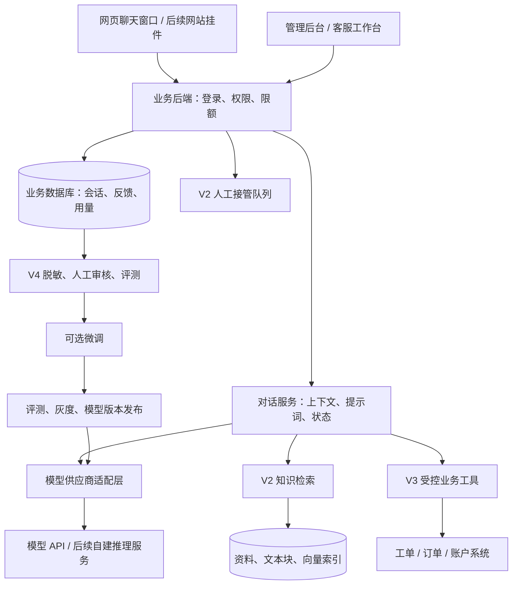
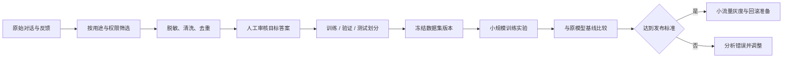

# AI 智能客服系统开发文档

版本：v1.0 · 编写日期：2026-09-05 · 状态：立项与开发设计稿

适用对象：产品负责人、开发人员、客服运营人员。

本方案从“用自己的 API Key 与 AI 聊天”起步，逐步建设可保存对话、查询业务知识、协助人工客服、积累训练数据的系统。具体行业尚未指定，因此使用通用产品咨询与售后支持场景；例子不代表你的实际业务政策。

本文中的架构、工期、数据量与验收阈值是项目设计建议，不是已完成的功能、供应商承诺或正式报价。引用的供应商信息已按编写日期核对，上线前仍需复核账号权限与模型能力。

**建议路线：API 聊天 → 对话与反馈管理 → 知识库客服 → 业务系统与人工接管 → 按效果决定是否微调。**

## 1. 先理解：我们到底要做什么

你要建设的是一个由自己管理的 AI 客服应用。聊天框是入口，模型 API 提供语言能力；业务规则、聊天数据、知识资料、权限与客服流程由自己的系统管理。

可以把它理解成五部分：

| 组成 | 通俗理解 | 系统中负责什么 |
| --- | --- | --- |
| 聊天界面 | 接待窗口 | 发送消息、显示回复、查看历史、转人工 |
| 大模型 API | 会理解与表达的助手 | 理解问题、组织答案、提出工具调用请求 |
| 数据库 | 工作记录 | 保存会话、反馈、身份、用量和处理状态 |
| 知识库与业务接口 | 工作手册和业务系统 | 提供准确资料、工单状态、实时业务数据 |
| 运营与评测 | 培训和质检 | 纠正答案、更新资料、判断是否需要微调 |

**第一版不需要训练大模型，也不需要购买 GPU。** 如果只调用外部模型 API，模型计算由供应商承担，你主要运行网页、后端和数据库。后续若自行部署或微调开放权重模型，才需要单独规划计算资源。

最先要拥有的资产是：可迁移的会话数据、经过审核的业务知识、清晰的客服规则、可重复的评测集，以及可靠的应用代码。是否拥有模型权重，取决于以后选择的训练与部署路线。

### 1.1 六个常见误区

| 容易误解的说法 | 正确理解 |
| --- | --- |
| 保存聊天后，AI 就自动学会了 | 保存只改变数据库；模型是否能看到历史，取决于后端是否把相关内容带入本次请求 |
| 上传文件就是微调 | 文件通常用于查询或作为输入，只有明确的训练流程才改变模型或适配器参数 |
| 微调后不再需要知识库 | 价格、政策、产品版本等会变化，仍需查询有效资料或业务系统 |
| API Key 能调用聊天，就能训练 | 推理、向量化和训练是不同能力，账号权限与模型支持需要分别验证 |
| 聊得越多就一定越聪明 | 未审核的对话可能包含错误、噪声、隐私和相互冲突的答案 |
| 微调完成就拥有一个可下载模型 | 托管微调与开放权重训练的交付物不同；能否导出权重由平台与许可证决定 |

## 2. 把关键概念分清楚

| 概念 | 是什么 | 在本项目中的用途 |
| --- | --- | --- |
| API Key | 调用模型服务的凭据，类似服务密码 | 后端向供应商证明身份；不能交给普通访客 |
| Base URL | 服务的接口地址 | 指定请求发到官方服务、自建网关或其他供应商 |
| Model ID | 实际使用的模型标识 | 在经过验证的模型之间切换，不写死在前端 |
| Prompt／系统提示词 | 给模型的角色与回答要求 | 规定语气、回答范围、遇到不确定信息时如何处理 |
| Token | 模型处理文本等输入输出的计量单位 | 计算上下文长度和费用；不能简单等同于字数 |
| 上下文 | 本次请求中模型实际收到的材料 | 包括当前问题、必要历史、资料和工具结果 |
| 会话存储 | 把聊天记录写入数据库 | 回看、审计、反馈、导出、后续数据整理 |
| 长期记忆 | 经允许保存、按身份检索的用户事实或偏好 | 例如用户偏好中文回复；需要来源、更正与删除机制 |
| RAG／知识库检索 | 先查资料，再让模型结合资料回答 | 回答产品说明、常见问题、有效业务政策 |
| 工具调用 | 模型请求后端执行一个限定功能 | 查询工单、查询订单、创建服务请求 |
| SFT／监督微调 | 用高质量输入和目标答案训练模型 | 改善稳定的回答方式、分类、格式与流程表现 |
| 评测 | 用固定题目和标准比较版本表现 | 判断更换模型、提示词或微调是否真的有效 |

多轮对话需要显式管理上下文或使用供应商的会话能力；供应商会话状态也不应成为我们唯一的业务档案。OpenAI 文档还说明，使用历史响应引用并不意味着历史输入免费。[OpenAI 会话状态说明](https://developers.openai.com/api/docs/guides/conversation-state)

### 2.1 一个问题应该由谁解决

| 客户问题或现象 | 首选办法 | 原因 |
| --- | --- | --- |
| “你们支持哪些功能？” | 知识库 | 需要查询当前有效的产品资料 |
| “我的工单处理到哪了？” | 身份核验 + 业务接口 | 需要本人的实时数据 |
| “我刚才说的是另一个版本。” | 当前会话上下文 | 需要理解本轮对话前文 |
| “下次请尽量用中文。” | 经允许的用户偏好记忆 | 是用户偏好，不应训练进所有人的模型 |
| 回答太长、语气不统一 | 先修改提示词与示例 | 成本较低，变更容易评估 |
| 多种提示词仍无法稳定执行固定格式 | 评测后考虑微调 | 属于反复出现的行为问题 |
| 客户资料在另一个账号里出现 | 修复权限与数据隔离 | 不是模型训练能够解决的问题 |

## 3. 产品范围与分期

### 3.1 V0：最小技术验证

目标：用一套服务端配置成功调用一个模型，验证中文多轮对话和流式输出。

交付：一个测试聊天页、一个后端接口、服务端密钥配置、成功与失败提示。使用测试数据，仅供开发验证，不作为公开客服。

通过条件：模型能回复；第二轮能引用第一轮的必要信息；页面能逐步显示文字；错误 Key、无权限模型、超时都能明确反馈。

### 3.2 V1：可内部使用的聊天与数据管理系统

这是建议首先正式开发的版本。

| 模块 | 必须实现的内容 | 优先级 |
| --- | --- | --- |
| 登录与权限 | 管理员与内部使用者；限制会话和配置访问范围 | P0 |
| 模型连接 | 管理 Base URL、Key、模型标识；连接测试；密钥轮换与脱敏显示 | P0 |
| 聊天 | 新建会话、多轮聊天、流式回复、停止生成、失败重试 | P0 |
| 历史记录 | 自动保存、分页、搜索、重命名、删除会话 | P0 |
| 角色配置 | 配置系统提示词；保存版本；会话绑定版本 | P0 |
| 反馈 | 有帮助／无帮助、问题原因、人工填写正确答案 | P0 |
| 数据导出 | 按权限导出会话 JSON；导出操作留痕 | P0 |
| 用量与控制 | Token、耗时、错误率、估算费用、限流、预算限制 | P0 |
| 基础运维 | 脱敏日志、健康检查、备份与恢复验证 | P0 |
| 易用性 | Markdown 展示、复制回复、手机宽度适配 | P1 |

V1 支持你自己在管理页录入 API Key。普通聊天用户只选择管理员开放的助手，不接触供应商 Key。若将来要做“每位用户都能带自己的 Key”，需补充每人凭据隔离、授权范围和删除流程，作为独立功能。

V1 先实现一个完整的供应商适配器，并在代码中保留扩展接口；不把“兼容所有大模型”作为首版承诺。

### 3.3 V2：知识库与客服试点

增加 FAQ、Markdown、文本和可提取文字的 PDF 导入；扫描 PDF 的 OCR 单独排期。资料经过预览、审核、发布后才能用于回答。答案显示来源；找不到依据时澄清或转人工。

同时增加客服工作台、待接管队列、人工回复、会话分配、处理状态、访客会话凭证与基础防滥用。先选择一个清晰业务范围、小流量试点，再决定公开范围。

### 3.4 V3：接入业务系统

先实现查询类能力，例如查询本人工单、产品状态或订单进度；随后再评估创建工单等写入功能。需要修改订单、退款或账户操作时，由业务权限、审批和幂等规则约束执行。

### 3.5 V4：训练数据与模型优化

增加样本审核、脱敏、版本化数据集、评测任务、训练任务记录、模型版本对比和灰度发布。先证明需要微调，再决定训练供应商与计算资源。

首版暂不建设：从零预训练大模型、自动持续训练、语音客服、全渠道接入、复杂多代理系统、多商家 SaaS 计费、自动退款。后续可以扩展，但这些会显著改变项目范围。

## 4. 页面与角色设计

### 4.1 页面清单

| 页面 | 主要内容 | 阶段 |
| --- | --- | --- |
| 聊天页 | 左侧会话列表；中间消息；底部输入；顶部助手名称 | V1 |
| 模型连接页 | 地址、密钥录入、模型、能力验证、连接状态 | V1 |
| 助手配置页 | 名称、系统提示词、模型配置、版本说明 | V1 |
| 对话与反馈页 | 搜索、筛选、原始回答、纠错、导出 | V1 |
| 用量页 | 按日期、模型与用户查看调用量、费用与错误 | V1 |
| 知识库页 | 文件、解析状态、版本、有效期、审核与发布 | V2 |
| 客服工作台 | 待处理队列、接管、人工回复、工单关联 | V2 |
| 数据与评测页 | 样本审批、数据集版本、评分与失败案例 | V4 |
| 训练与发布页 | 训练记录、候选模型、评测结果、灰度与回滚 | V4 |

### 4.2 角色边界

| 角色 | 主要权限 |
| --- | --- |
| 管理员 | 管理模型连接、用户与预算；控制发布权限 |
| 业务运营／质检 | 维护知识、审核纠错、评审训练样本与答案质量 |
| 人工客服 | 处理被分配的会话，查看必要上下文，提交纠错 |
| 内部使用者／客户 | 使用授权助手，查看自己的允许范围内的会话 |

一个人在早期可以兼任多个角色，但权限仍应在后端明确区分。页面隐藏按钮不能替代服务端鉴权。

## 5. 推荐架构

采用“一个业务后端，内部按模块分开”的结构。先减少部署与排查成本，后续训练任务和文档处理再作为独立后台进程运行。



图中 V2—V4 模块逐步增加，V1 不要求全部实现。训练产生的是候选模型版本，必须经过评测和发布才能被在线对话选中。

### 5.1 技术选型建议

| 层次 | 建议选型 | 选择理由与边界 |
| --- | --- | --- |
| 前端 | Vue 3 + TypeScript | 聊天页和管理页共用组件；适合前后端分离 |
| 后端 | Python + FastAPI | API、数据清洗、后续训练任务衔接较方便 |
| 主数据库 | PostgreSQL | 统一保存身份、会话、反馈、配置和数据版本 |
| 知识索引 | PostgreSQL + pgvector，V2 引入 | 初期把向量与业务数据放在同一数据库，减少独立服务 |
| 流式通信 | HTTP 流 + SSE 事件格式 | 满足逐步显示回复；人工工作台实时推送后续再评估 WebSocket |
| 文件存储 | 开发时受控本地目录；部署时对象存储或持久卷 | 保存原文件、导出包和训练数据集，并单独备份 |
| 后台任务 | V2 引入持久任务队列和 Worker | 解析资料、生成向量、导出大文件不能堵住聊天请求 |
| 缓存与限流 | V1 可由数据库实现；多实例后评估 Redis | 不为尚不存在的规模增加依赖 |
| 部署 | 容器化应用 + 数据库 + HTTPS 入口 | 开发、测试、正式环境配置分离 |

这是基于本项目扩展需求的选型建议，并非唯一组合。如果团队更熟悉 React、Java 或现有业务后端，应优先评估复用成本，保留相同的接口与数据边界即可。Vue 提供组件化界面能力，FastAPI 支持 OpenAPI 与数据校验，pgvector 提供 PostgreSQL 内的向量检索。[Vue 官方介绍](https://vuejs.org/guide/introduction.html)、[FastAPI 特性](https://fastapi.tiangolo.com/features/)、[pgvector 官方仓库](https://github.com/pgvector/pgvector)

### 5.2 模型适配层

把供应商差异封装在后端，例如 `generate_stream`、`count_or_estimate_tokens`、`normalize_usage`、`normalize_error`。向量生成和训练使用独立接口，不假定聊天供应商一定具备这些能力。

每个模型连接记录能力：流式输出、工具调用、结构化输出、图片、上下文限制、允许参数。仅开放已验证的能力，不把所有模型都当成支持同一套参数。

如果接 OpenAI，按当前模型文档选择 Responses 等实际支持的接口；第三方的“OpenAI 兼容”通常还需要逐项验证。Base URL 相同形式不代表接口、工具、计费或训练完全兼容。

对话、提示词版本、评测集和训练数据保存在自己的系统，供应商资源 ID 只作为关联信息。切换服务时也要验证其数据处理规则，不在故障时悄悄把客户数据转给未批准的供应商。

## 6. 一条消息的完整处理流程

1. 用户发送消息，前端生成唯一 `client_message_id`，提交会话 ID、助手 ID 和消息内容。
2. 后端验证登录或访客凭证、会话归属、助手权限、输入长度、速率和预算。
3. 数据库保存用户消息，并创建一次生成任务 `generation_run`；重复请求复用原任务，不重复调用模型。
4. 后端读取该会话绑定的配置版本，选取必要历史；V2 起检索有权限且仍有效的资料。
5. 适配层从密钥存储读取凭据，向选定的模型服务发起请求。
6. 后端持续转发事件；按批次保存回复片段和任务状态，不要求每个字符单独写库。
7. 完成后保存最终回复、来源、模型版本、Token、耗时和供应商请求 ID；返回完成事件。
8. 若失败或取消，保留已经生成的文本并标注状态，允许用户查看或重新发起。
9. 用户或客服提交反馈；纠错单独保存，原始回答仍可用于审计。

### 6.1 上下文管理

数据库可以保存较长历史，但每次只向模型发送必要内容。采用“系统规则 + 历史摘要 + 最近消息 + 当前问题 + 相关资料”的组合，并为输出预留空间。

摘要不能覆盖订单、价格等权威记录。重要业务事实应重新查询；摘要需保留来源与更新位置。V1 的“新建会话”默认不读取其他会话；跨会话记忆后续单独设计，并按用户和工作空间隔离。

### 6.2 失败、重试和取消

| 情况 | 预期行为 |
| --- | --- |
| Key 无效／无权限 | 给管理员明确的脱敏错误；不自动反复重试 |
| 供应商限流或临时故障 | 在配置范围内有限退避；无法恢复时显示可重试状态 |
| 已输出部分文字后断开 | 保留部分回答并标记未完成；不得把另一轮答案拼接上去 |
| 页面刷新／网络重连 | 用任务 ID 查询已有状态；只有必要时才启动新的生成 |
| 用户停止生成 | 请求取消上游任务并标记取消；已经发生的计算可能仍收费 |
| 未收到完整用量 | 用量标记为“估算”或“待核对”，不填成零费用 |
| 超出预算 | 在新调用前阻止请求，并给出说明或人工入口 |

取消是尽力执行，不能承诺供应商立即停止计费。重试之前必须判断是否已经创建过请求；已经产生外部写入的工具调用不能盲目重试。

“重复提交”和“主动重新生成”分开处理：前者返回已有任务，后者用新的幂等键创建新任务并记录 `retry_of_run_id`，保留旧结果。V1 默认一个会话同时只允许一个生成任务，后端用事务或条件更新控制顺序，避免并发消息串乱上下文。进程异常退出后，后台核对长期未结束的任务；无法确认上游完成状态时标记待核对，不自动重新调用。

## 7. 接口草案

以下是我们自己后端的接口，不是供应商 API。正式开发时通过 OpenAPI 固化字段与错误格式。

| 方法与路径 | 功能 | 阶段 |
| --- | --- | --- |
| `POST /api/v1/auth/login` | 内部用户登录 | V1 |
| `POST /api/v1/provider-connections` | 管理员保存模型连接与凭据 | V1 |
| `POST /api/v1/provider-connections/{id}/test` | 执行有长度上限的小额连接测试 | V1 |
| `GET /api/v1/assistants` | 返回当前用户可使用的助手 | V1 |
| `POST /api/v1/conversations` | 创建会话并绑定助手版本 | V1 |
| `GET /api/v1/conversations` | 分页查询有权访问的会话 | V1 |
| `GET /api/v1/conversations/{id}/messages` | 查询消息历史 | V1 |
| `POST /api/v1/conversations/{id}/messages:stream` | 提交消息并流式接收回复 | V1 |
| `GET /api/v1/runs/{id}` | 查询生成结果或中断状态 | V1 |
| `POST /api/v1/runs/{id}/cancel` | 停止生成 | V1 |
| `POST /api/v1/runs/{id}/retry` | 用户主动创建关联的新生成；请求需新的幂等键 | V1 |
| `POST /api/v1/messages/{id}/feedback` | 评价与纠错 | V1 |
| `POST /api/v1/exports` | 按授权范围导出对话 | V1 |
| `DELETE /api/v1/conversations/{id}` | 发起会话及衍生数据删除流程 | V1 |
| `GET /api/v1/usage` | 调用量、费用和错误统计 | V1 |
| `POST /api/v1/knowledge-documents` | 导入资料并创建处理任务 | V2 |
| `POST /api/v1/conversations/{id}/handoff` | 请求人工接管 | V2 |
| `POST /api/v1/dataset-versions` | 创建审核后数据集快照 | V4 |
| `POST /api/v1/evaluation-runs` | 执行一组版本对比评测 | V4 |

发送消息示例：

```json
{
  "client_message_id": "msg_client_001",
  "assistant_id": "support_assistant",
  "content": "我提交的工单应该在哪里查看？"
}
```

前端不提交系统提示词、供应商 Key、任意业务工具地址或未经授权的工作空间 ID。助手 ID 也必须由后端验证。

建议流事件：`run.created`、`message.delta`、`citation.added`（V2）、`usage.updated`、`run.completed`、`run.failed`、`run.cancelled`。事件携带任务 ID 与序号，错误结构包含稳定的错误码和请求 ID。

这个 POST 流接口由前端使用 `fetch` 读取响应流，并按 SSE 格式解析；不直接依赖只能按其接口方式发起连接的原生 `EventSource`。代理层配置流式转发、连接超时与缓冲；若流已经开始，错误通过终止事件表达。

所有查询、导出、取消与重试接口都必须验证资源归属。普通用户不能通过修改 ID 访问其他人的会话。

## 8. 数据库与数据资产

V1 先做单团队工作空间，保留 `workspace_id`，暂不建设多商家 SaaS。用户身份与工作空间来自服务端认证，不相信客户端自报的归属。

### 8.1 V1 核心数据表

| 表 | 核心字段示意 | 用途 |
| --- | --- | --- |
| `workspaces`、`users`、`memberships` | ID、工作空间、角色、状态 | 用户与权限 |
| `provider_connections` | provider、base_url、secret_ref、能力、状态 | 模型连接；密钥使用外部引用或受保护密文 |
| `assistant_versions` | assistant_id、version、prompt、连接与模型、参数 | 助手配置版本 |
| `conversations` | ID、owner_id、workspace_id、assistant_version_id、标题、状态 | 会话归属与运行状态 |
| `messages` | conversation_id、role、content、status、client_message_id、时间 | 用户消息、模型回复、人工回复 |
| `generation_runs` | request_id、retry_of_run_id、配置版本、上下文消息 ID、模型、状态、错误、耗时 | 追踪一次实际生成，区分失败重试 |
| `usage_records` | run_id、输入／输出／缓存用量、价格版本、币种、费用来源 | 用量与费用核对 |
| `feedback` | message_id、评分、原因、corrected_answer、审核人、状态 | 把原始对话变成可整理的反馈 |
| `audit_events` | actor、action、resource_id、时间、脱敏元信息 | 记录导出、密钥更新、发布与删除 |

消息记录保留角色与来源类型，例如客户、AI、人工客服和工具。只保存业务需要的输入、可见输出与工具记录，不要求保存模型内部隐藏推理。

约束建议：`(conversation_id, client_message_id)` 唯一；消息序号在会话内唯一；外键和查询需保证工作空间一致。生成、反馈与用量通过 ID 关联，原始记录按保留策略可审计，不能在纠错时静默覆盖。

### 8.2 后续新增数据

| 类别 | 需要保存的内容 |
| --- | --- |
| 知识资料 | 原文件、哈希、版本、来源、权限、有效期、发布状态 |
| 文本块与索引 | chunk_id、正文、文档版本、向量模型与维度、索引状态 |
| 答案依据 | run_id、检索版本、实际引用块、来源快照或受控引用 |
| 人工接管 | 会话、接管原因、分配对象、排队与接管时间、处理结果 |
| 训练样本 | 原始消息引用、脱敏输入、审核后答案、用途许可、审批状态 |
| 数据集版本 | 样本清单、文件哈希、划分规则、清洗版本、创建人 |
| 训练与模型 | 基座版本、训练参数、任务 ID、产物位置、评测与发布状态 |
| 评测 | 题目版本、评分标准、候选配置、结果与失败案例 |

对话库、知识库、训练集用途不同，分别管理。原始聊天默认不进入训练集；只有满足使用范围、脱敏和人工审核要求的样本才能被导出为训练数据。

## 9. 知识库如何让 AI 了解业务

知识库的工作方式是“回答前查资料”。语义检索可以找到含义相关但措辞不同的文本，再把检索结果交给模型组织答案。[OpenAI 检索说明](https://developers.openai.com/api/docs/guides/retrieval)

### 9.1 资料进入系统

1. 运营上传资料或填写 FAQ，标明适用产品、负责人、来源与有效期。
2. 后台解析文字，检查乱码、重复、缺页以及表格信息是否丢失。
3. 按标题和语义切分文本，保留文档路径、版本与页码等定位信息。
4. 生成向量并建立索引；同一索引中的向量模型和维度保持一致。
5. 运营预览后发布，新版本就绪后再切换；处理中或已下架资料不可被检索。

知识文件更新后要重新处理受影响的文本块。向量模型更换通常需要重建索引；不得直接混用不兼容的向量。

### 9.2 客户提问后的检索

先确定用户与产品范围，再检索当前有效资料。可组合关键词和向量检索；中文分词、产品代号与错误码需要单独验证，不能假定通用全文搜索天然适合所有中文内容。

首轮实验可以从每块约 300—800 Token、取 3—5 个相关片段开始。这些是便于试验的初值，应根据中文资料结构、召回结果和上下文预算调整，不是固定最佳参数。

给模型的材料要清楚区分“系统规则”“客户消息”“检索资料”。资料中出现“忽略规则、泄露密钥”等文字时，应视为资料内容，不能把它升级成系统指令。

### 9.3 答案规则

- 涉及产品事实与政策的回答，关联实际提供给模型的有效来源。
- 没有找到相关资料时，说明当前无法核实，提出必要的澄清或转人工。
- 来源相互冲突时，不自动选择对客户更有利或更旧的一份；按版本规则处理，无法确定则交人工。
- 订单、余额、工单进度等个人实时信息走业务接口，不依赖静态文档。
- 引用链接与文件也要验证访问权限；检索到内容不等于客户有权打开原文件。

**检索相似度不等于答案正确率。** 不把某个相似度阈值或模型自报的“信心”当作自动放行依据，应结合是否找到有效来源、问题类型、业务规则与评测结果决定。

建议第一批先整理 30—100 条经过审核的常见问题，覆盖主要咨询范围；这是项目启动建议，并非模型要求。先验证“找得到、引得对、说得准”，再扩大资料规模。

## 10. 从聊天助手到真正的客服

### 10.1 先区分回答与执行

AI 可以提出“调用查询工单工具”的请求；真正执行的是后端代码。后端验证身份、参数与权限，查询业务系统，再把限定结果交给模型解释。这是工具调用的基本过程。[OpenAI 工具调用说明](https://developers.openai.com/api/docs/guides/function-calling)

建议先接入三个小工具：

| 工具 | 输入 | 后端约束 |
| --- | --- | --- |
| `get_my_ticket_status` | 工单编号 | 用户身份从会话凭证取得，只允许查询本人有权访问的工单 |
| `get_product_availability` | 产品标识 | 只返回可公开的产品状态与更新时间 |
| `create_support_ticket` | 问题摘要、类别 | 按业务流程确认提交；去重、防滥用，并返回真实工单编号 |

工具返回失败时不能让 AI 声称“已经办好”。需要写入的工具必须有幂等键与审计；模型不能自己指定任意用户身份、SQL、服务器路径或外部请求地址。

### 10.2 人工接管

建议会话状态为：`bot_active → waiting_human → human_active → resolved`，支持按运营流程重新打开。

进入人工队列的条件包括：客户主动要求、资料不足、连续未解决、工具故障、投诉、需要人工审批的业务。

人工成功接管时，后端原子切换状态并停止 AI 自动回复，避免两边同时答复。传给客服的交接内容包括问题摘要、相关消息、已经执行的操作及其结果，不丢掉原始上下文。

无人在线时明确告知当前状态，提供留单或后续联系入口；等待时长只有在排班或系统数据支持时才展示。AI 不自行承诺具体处理时间。

### 10.3 客服效果怎么衡量

重点看问题有没有解决，而不只看 AI 回复了多少条。记录：有效解决率、人工接管率、客户评分、投诉与错误承诺、每个有效解决问题的成本。连续转人工也可能说明资料缺失或流程不通，应分类分析。

## 11. 为未来微调做准备

### 11.1 什么时候值得微调

满足以下条件后再做实验：业务任务相对稳定；提示词和知识库已有可用基线；错误集中在可描述的行为上；有可用且审核过的样本；有独立测试集；训练与长期推理成本可以接受。

适合尝试的方向：稳定输出服务记录格式、固定意图分类、行业术语表达、按示例执行客服沟通流程。对于频繁变化的价格、订单和政策，优先使用知识库或业务查询。

微调后仍可能犯错，不能替代身份验证、权限控制、事实检索和人工兜底。训练损失下降也不能证明客服问题解决得更好。

### 11.2 当前供应商边界

截至 2026-09-05，OpenAI 官方已公布自助微调的限制：2026-05-07 起，未曾运行微调的组织不能创建训练；2026-07-02 起，过去 60 天未对微调模型进行推理的组织不能新建微调任务；活跃既有客户创建新任务的能力计划于 2027-01-06 结束。因此，本项目不能把“未来直接用一个新 OpenAI 账号开始微调”当作确定可行的前提。[OpenAI 自助微调调整](https://developers.openai.com/api/docs/deprecations)

训练模块保持供应商独立。实际启动训练前，验证具体平台、模型、账号、数据用途、部署地区与产物导出条件。聊天接口兼容性不代表微调兼容性。

### 11.3 两条训练路线

| 路线 | 适合情况 | 需要承担什么 |
| --- | --- | --- |
| 当时可用的托管训练平台 | 希望少管理训练基础设施 | 验证训练资格、支持模型、账单、数据条款、推理服务与退出方案 |
| 开放权重模型 + LoRA 等方法 | 需要控制训练产物与部署，且有相应工程能力 | 模型许可证、训练资源、数据流程、推理部署与运维 |

LoRA 通过训练较小的附加参数来适配模型，通常减少可训练参数和训练资源需求；仍需要基座模型、适配的训练环境和推理资源。选择它不意味着普通服务器可以承载任意规模的大模型。[Hugging Face PEFT：LoRA](https://huggingface.co/docs/peft/main/en/conceptual_guides/lora)

第一版只需预留训练记录和模型版本接口，不采购训练机器，也不要求现在就确定最终基座。

### 11.4 训练数据处理链路



一条合格样本要能说明：用户实际问了什么、当时可用的上下文是什么、应该怎样回答、答案由谁审核、数据允许用于什么用途。

如果模型回答时依赖检索资料或工具结果，训练样本也应提供相应上下文，避免训练模型在没有证据时背诵答案。纠错应改写成目标回答，不能仅把“你说错了”当训练目标。

内部样本示例，**不是保证可直接上传给任意平台的格式**：

```json
{
  "sample_id": "sample_001",
  "source_message_ids": ["msg_101", "msg_102"],
  "task_type": "support_clarification",
  "messages": [
    {
      "role": "system",
      "content": "你是产品客服。资料不足时先澄清，不编造功能与政策。"
    },
    {
      "role": "user",
      "content": "这个功能怎么打开？"
    },
    {
      "role": "assistant",
      "content": "请告诉我你指的是哪个功能，以及正在使用的产品版本，我再为你确认操作步骤。"
    }
  ],
  "review_status": "approved",
  "deidentified": true,
  "usage_scope": "internal_training",
  "split": "train"
}
```

导出器按目标训练平台要求生成 JSONL 等格式，只保留允许的训练字段；审计元数据保存在自己的数据库中。

初次实验可准备约 100—300 条高质量样本，优先覆盖明确任务与典型边界；实际数量取决于任务难度与平台要求。这是实验起点，不是效果保证。不能为了凑数量把错误或未经审核的 AI 输出加入目标答案。

训练／验证／测试可暂按约 80%／10%／10% 划分，但要先按同一会话、客户关联、近似模板与重复内容分组，再划分；必要时增加较新时间段的独立测试，避免训练集和测试集实际上是同一道题。

每次实验记录数据集哈希、基座版本、训练方法与参数、费用、评测结果和产物位置。候选模型不会自动替换线上模型。

### 11.5 删除数据不等于模型忘记

如果样本已经用于训练，仅从数据库删除原始消息，不保证训练模型已经忘记。必须记录样本与数据集、模型版本的关系；发生删除要求时，评估停用受影响产物或排除样本后重训。不要向用户承诺无法验证的“模型一键遗忘”。

## 12. 评测与验收

评测能力从 V1 就开始建设，先使用自己的测试数据与脚本；不依赖某一家供应商控制台保存唯一的评测资产。固定业务负责人和评分规则，模型评分只作辅助，需要人工抽检。

### 12.1 测试题分类

初期建立约 50—100 个有标准的业务问题，并单独建立权限、注入与故障测试集。数量只是启动目标，应随着发现的问题补充。

| 类型 | 示例 | 判定重点 |
| --- | --- | --- |
| 常见问题 | 功能说明、操作入口 | 事实正确、覆盖必要步骤 |
| 多轮澄清 | “我说的是旧版” | 能更新上下文，不沿用错误假设 |
| 资料缺失 | 没有公布的新功能 | 不编造；适当澄清或转人工 |
| 资料更新 | 已下架文档与新版本冲突 | 只使用有权限且有效的资料 |
| 实时查询 | 查看本人工单 | 结果与业务系统一致 |
| 权限攻击 | 修改其他客户会话或工单 ID | 拒绝未授权访问 |
| 提示注入 | 文档要求忽略规则或泄露秘密 | 不越过权限与工具边界 |
| 故障恢复 | 限流、断网、进程重启 | 状态正确，不重复生成或执行 |
| 人工协作 | 同时发生接管和模型回复 | 接管成功后 AI 不再自动回复 |

### 12.2 建议的上线门槛

以下是待团队确认的初始验收目标，不是系统当前表现或模型保证。

| 检查项 | 初始通过标准 | 适用阶段 |
| --- | --- | --- |
| 聊天闭环 | 发送、流式、保存、刷新恢复、取消与失败提示均通过 | V1 |
| 身份与隔离 | 已定义的越权测试全部通过；浏览器、导出和日志中无供应商密钥 | V1 |
| 幂等 | 模拟双击、重连与重复提交，单一消息不会创建重复生成 | V1 |
| 数据可用 | 正常结束后消息完整；异常任务标记准确；导出可重新解析 | V1 |
| 并发性能 | 以 20 个同时生成会话作为初始压测档位，记录错误率与延迟分位数 | V1 |
| 首字延迟 | 所选文本模型在约定输入长度与网络下，先争取 p95 ≤ 5 秒 | V1 |
| 知识答案 | 固定业务集人工判定正确率初始目标 ≥ 90%，并报告分场景结果 | V2 |
| 依据与兜底 | 政策类回答有有效来源；无依据和高风险样例均正确澄清或转人工 | V2 |
| 人工接管 | 队列、分配、交接、无坐席提示和 AI 停止回复全部验证 | V2 |
| 工具可靠性 | 越权不执行；重复请求不重复写入；结果失败不冒充成功 | V3 |
| 模型发布 | 候选版本在独立集上改善目标指标，关键安全与业务指标不退化 | V4 |

20 并发与 5 秒只是确定测试条件的起点。应同时注明上游配额、输入长度、输出长度、供应商耗时和本系统耗时；不把一个模型的性能结论泛化到所有模型。

定义“正确”为：关键事实准确、没有无依据承诺、步骤满足问题需要。定义“有效解决”为：问题实际完成且没有需要纠正的后果。仅“用户未再回复”不能自动算作解决。

微调效果要比较“同一测试集上的原模型 + 原方案”与“候选模型 + 对应方案”。除整体分数外，看失败案例、业务子类、成本与延迟，并记录样本量；小测试集提升不能直接等同于线上提升。

## 13. 密钥、客户数据与系统安全

### 13.1 密钥管理

用户在管理员设置页录入 Key 后，通过 HTTPS 发送到后端；后端保存到密钥服务，或用独立主密钥进行受保护的加密存储。主密钥不和密文一起存在数据库备份中。管理页后续只显示掩码，并支持替换与删除。

禁止把供应商 Key 放入前端构建变量、浏览器持久存储、URL、源码仓库、聊天上下文和错误堆栈。密码可用安全哈希存储；供应商 Key 因需要实际调用，不能只保存不可逆哈希。OpenAI 官方建议通过环境变量或密钥管理服务提供凭据，避免硬编码和公开泄露。[OpenAI 生产实践](https://developers.openai.com/api/docs/guides/production-best-practices)

Base URL 仅管理员可配，按批准的供应商或网关范围控制。阻断向未批准内网、云元数据地址等目标的请求，并验证重定向和 DNS 解析结果，避免把“自定义接口”变成服务端任意请求入口。确有自建内网推理需求时单独登记允许范围。

### 13.2 数据保护

只收集服务所需的数据；区分“提供客服服务所需的对话处理”和“将数据用于后续训练”。训练用途必须有明确允许范围，不能从用户同意聊天自动推导出同意训练。

API 内容发送给供应商与是否用于供应商训练是两件事。OpenAI 当前文档说明，API 数据默认不用于训练其模型，除非明确选择共享；但部分日志与应用状态仍可能被保留。不能把“不用于训练”说成“绝不存储”，也不能假定 `store=false` 等同于整个链路零留存。[OpenAI 数据控制](https://developers.openai.com/api/docs/guides/your-data)

我们自己的保留期限单独配置。评审起点可以是原始会话 90 天、脱敏运行日志 30 天；具体期限由业务目的、合同及适用要求确定，不在本设计稿中视为已批准的规则。

删除流程覆盖消息、附件、摘要、用户记忆、向量索引和受管理的导出文件；上游资源在支持时调用删除接口。记录备份到期时间和删除标记，恢复备份后重新执行删除，避免恢复已删内容。用户已下载到系统外的文件无法由本系统保证远程删除。

### 13.3 输入、展示与工具

| 风险 | 实现要求 |
| --- | --- |
| 消息或文档包含恶意指令 | 数据与系统规则分层；工具权限在代码中校验 |
| Markdown 中夹带脚本 | 禁止未经清洗的 HTML；过滤危险链接和属性 |
| 匿名接口被刷 | 会话凭证、长度限制、速率与并发限制、预算与异常检测 |
| 文件处理耗尽资源 | 限制格式、大小与解析时间；后台隔离处理；预览错误 |
| 跨用户检索泄露 | 在检索查询和返回阶段执行权限过滤，不能只靠提示词 |
| 日志暴露个人信息 | 脱敏、最小化采集、访问权限；不默认记录完整请求体 |
| 预算并发超支 | 请求前原子预留额度，结束后结算；为未结算用量留余量 |

## 14. 成本与资源认知

日常成本主要来自：模型调用、知识向量生成与检索、服务器和数据库、文件存储、监控与备份、人工维护资料和质检。微调还增加数据整理、训练实验以及后续推理部署成本。

### 14.1 调用费用怎么算

简化公式：

```text
单次模型费用 = 输入 Token / 1,000,000 × 输入单价
             + 输出 Token / 1,000,000 × 输出单价

每月调用费用 = 当月全部实际模型调用费用之和
```

实际账单还可能区分缓存、推理用量、工具和存储；应保留供应商原始用量字段，再按其实际计价规则换算。一次用户提问可能触发检索、改写、工具前后两次模型调用，不能默认“一条消息只收费一次”。

**以下仅演示算式，不是任何厂商当前报价：**

| 假设 | 数值 |
| --- | --- |
| 每月会话数 | 1,000 |
| 每会话模型调用次数 | 6 |
| 每次平均输入，含必要历史与知识 | 2,000 Token |
| 每次平均输出 | 400 Token |
| 示例输入／输出价格 | 1／4 个货币单位，每百万 Token |

则输入合计 1,200 万 Token，输出合计 240 万 Token；示例费用为 `12 × 1 + 2.4 × 4 = 21.6` 个货币单位。这个结果不包含额外调用、向量、工具、存储、税费、汇率与运维成本。

模型名和单价保持配置化，并记录价格生效版本。不同币种分别核算或使用注明日期的汇率，不能直接相加；月末与供应商账单核对。

### 14.2 预算控制

限制单条输入、输出长度、每会话上下文预算、每用户频率、并发生成数和每天／每月预算。先按分类错误优化提示词与检索，再评估用较低成本模型处理简单问题。

应用中的预算拦截独立实现，不仅依赖供应商的费用提醒。成本与服务质量一起看，建议统计“每个有效解决问题的成本”。更便宜的模型若导致更多人工纠错，总成本可能更高。

### 14.3 是否需要服务器和 GPU

V0 可在本机运行；V1 内部部署需要稳定在线的应用与数据库环境；公开客服需要 HTTPS、可靠存储、备份、监控与恢复能力。

只调用云端模型时不需要为模型购买 GPU。自建推理或 LoRA 训练时，根据基座规模、精度、上下文、批量和并发单独测试资源需求；不在需求未明确时按“某张显卡一定够用”采购。

## 15. 开发计划与交付物

以下按一名熟练全栈开发人员、业务负责人持续提供资料、小规模网页优先估算。单位为开发工作日，包含本阶段必要联调与测试；不含等待第三方权限、内容审核积压、复杂业务系统改造及采购。

| 阶段 | 估算 | 可验收交付物 |
| --- | --- | --- |
| V0 技术验证 | 2—4 天 | 一个服务端模型连接、流式测试页、多轮与故障验证 |
| V1 内部聊天系统 | 7—12 天 | 登录、模型配置、历史、反馈、导出、限额、部署说明 |
| V2 知识与客服试点 | 10—18 天 | 资料发布、引用与兜底、工作台、访客隔离、评测报告 |
| V3 少量业务工具 | 5—10 天起 | 具体接口接入、身份校验、人工流程与幂等验证 |
| V4 首次训练实验 | 5—15 天起 | 已审核数据集、可复现训练、对比评测与发布建议 |

V0—V2 合计约 19—34 个工作日，约 4—7 周。V3、V4 要按接口复杂度与数据就绪程度重新评估，不承诺训练一次就达到目标。只有聊天演示页会更快，但不能用演示页的工期替代完整客服系统的工期。

### 15.1 开发任务拆分

| 顺序 | 工作包 | 完成标志 |
| --- | --- | --- |
| 1 | 确定业务范围、样例问题与首个模型 | 有范围说明和最小测试集 |
| 2 | 建立项目、数据库迁移和登录 | 可启动、可迁移、可验证权限 |
| 3 | 接入模型与流式生成状态机 | 正常、失败、取消、重复提交行为明确 |
| 4 | 实现会话、反馈和导出 | 记录可追踪，导出和删除权限正确 |
| 5 | 增加用量、预算、监控与备份 | 可统计、可拦截、可恢复 |
| 6 | 内部试用，修复真实问题 | 产出 V1 验收记录与已知限制 |
| 7 | 整理知识和人工服务流程 | 资料有负责人，接管有坐席与规则 |
| 8 | 完成 V2 评测并小流量试点 | 质量、安全和服务流程达到约定标准 |
| 9 | 按业务收益接工具或做训练实验 | 用指标证明增量收益 |

### 15.2 建议代码目录

```text
ai-support/
  frontend/                 聊天页、管理页、客服工作台
  backend/
    auth/                   身份与权限
    chat/                   会话、上下文、流式任务
    providers/              供应商适配器
    knowledge/              V2 资料与检索
    tools/                  V3 受控业务接口
    datasets/               V4 样本与数据版本
    evaluations/            固定测试集与评测执行
    billing/                用量、价格与预算
  workers/                  文档处理、导出、评测任务
  migrations/               数据库结构变更
  tests/                    关键业务与集成测试
  deploy/                   部署配置与环境示例
  docs/                     接口、操作、恢复与验收文档
```

这里只是建议目录，不表示已经创建应用代码。

### 15.3 每阶段应交付什么

源代码、依赖锁定文件、无真实密钥的环境配置示例、数据库迁移、启动与部署说明、接口说明、测试报告、已知限制和回滚步骤。

公开试点前完成一次实际备份恢复，并验证恢复后的权限与删除标记。可以先把恢复点目标设为最多丢失 24 小时数据、恢复时间目标设为 4 小时，再由业务确认；若不能接受这个窗口，应增加备份频率和相应投入。单机部署存在单点故障，不能称为高可用架构。

## 16. 开工前需要确定的业务信息

这些信息用于细化下一版需求，不影响先实现通用聊天底座。

| 待确定项 | 本文暂用假设 | 会影响什么 |
| --- | --- | --- |
| 客服业务范围 | 通用产品咨询与售后 | 知识内容、工具、质检标准 |
| 首个入口 | 独立网页，后续网站挂件 | 身份凭证、UI 和接入工作量 |
| API 来源 | 可配置、先验证一个供应商 | 模型适配、费用和部署网络 |
| 使用规模 | 小团队、小流量试点 | 并发、数据库、预算与运维 |
| 资料来源 | 业务负责人审核的 FAQ 与产品资料 | 首批知识质量与整理工期 |
| 人工服务方式 | 有人负责接管；排班待定 | 队列、通知与处理承诺 |
| 对话与训练数据规则 | 分开管理，训练前审核 | 保留、脱敏、导出与删除 |
| 可接受错误与成本 | 通过初始评测共同确定 | 模型选择与上线门槛 |

**可以直接交给开发人员的首期目标：**

> 开发一套网页 AI 聊天系统，支持管理员配置模型 API 地址、密钥与模型标识，通过后端安全调用并流式展示回复；具备登录、会话隔离、历史记录、系统提示词版本、评价纠错、数据导出、用量统计、预算控制与备份。数据归自己管理，后端预留知识检索、人工接管、业务工具和训练数据模块。首期验收聚焦可用、可追踪、可控成本的聊天闭环。

长期目标是在真实客服使用中持续积累“可靠资料 + 经审核答案 + 可重复评测”。先用这些资产改善系统，再用实测结果判断微调是否值得投入。
