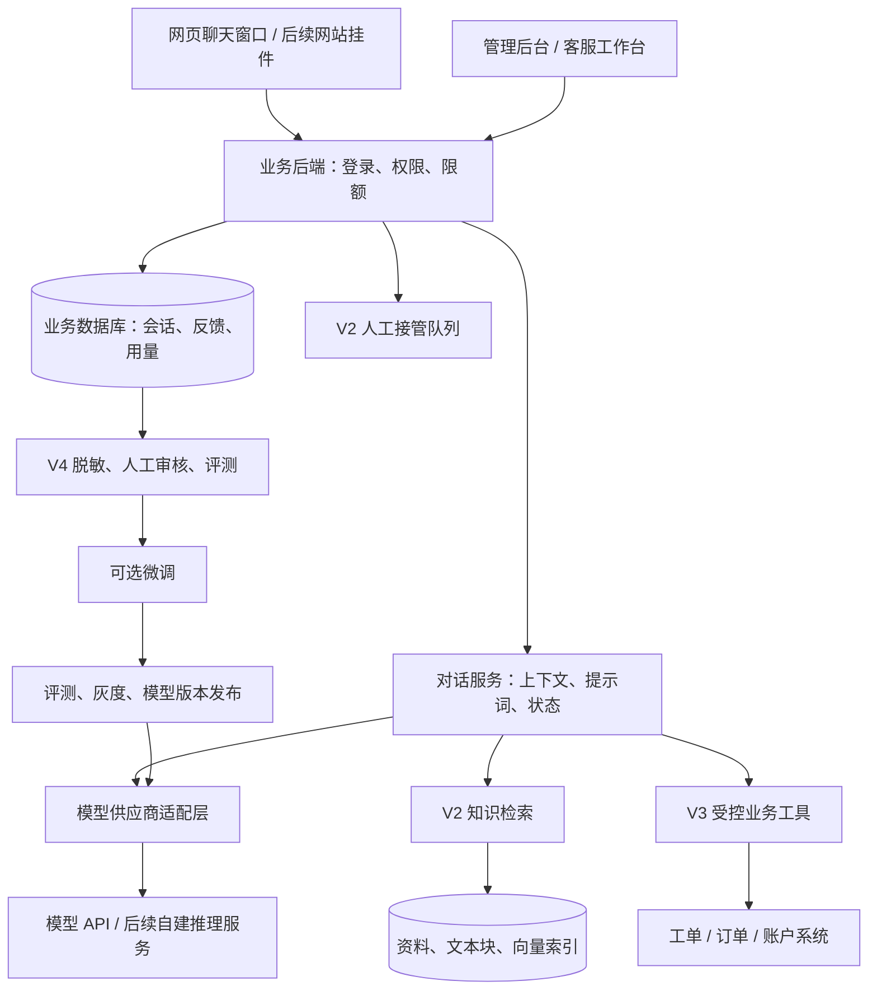

# AI 智能客服系统开发文档

版本：v1.1 · 修订日期：2026-09-05 · 状态：已采纳 A01—A06 审计意见的开发设计稿

本版落实单次提问累计预算、删除并发控制、版本撤销、重新生成答案选择、访客认证和量化验收。修订对应关系见第 17 节；这些是实现要求，实际系统仍需通过测试。[v1.0 历史快照](E:/ai-customer-service-plan/versions/AI智能客服系统开发文档-v1.0.md)保留原审计定位。

适用对象：产品负责人、开发人员、客服运营人员。

本方案从“用自己的 API Key 与 AI 聊天”起步，逐步建设可保存对话、查询业务知识、协助人工客服、积累训练数据的系统。具体行业尚未指定，因此使用通用产品咨询与售后支持场景；例子不代表你的实际业务政策。

本文中的架构、工期、数据量与验收阈值是项目设计建议，不是已完成的功能、供应商承诺或正式报价。引用的供应商信息已按编写日期核对，上线前仍需复核账号权限与模型能力。

**建议路线：API 聊天 → 对话与反馈管理 → 知识库客服 → 业务系统与人工接管 → 按效果决定是否微调。**

## 1. 先理解：我们到底要做什么

你要建设的是一个由自己管理的 AI 客服应用。聊天框是入口，模型 API 提供语言能力；业务规则、聊天数据、知识资料、权限与客服流程由自己的系统管理。

可以把它理解成五部分：

| 组成 | 通俗理解 | 系统中负责什么 |
| --- | --- | --- |
| 聊天界面 | 接待窗口 | 发送消息、显示回复、查看历史、转人工 |
| 大模型 API | 会理解与表达的助手 | 理解问题、组织答案、提出工具调用请求 |
| 数据库 | 工作记录 | 保存会话、反馈、身份、用量和处理状态 |
| 知识库与业务接口 | 工作手册和业务系统 | 提供准确资料、工单状态、实时业务数据 |
| 运营与评测 | 培训和质检 | 纠正答案、更新资料、判断是否需要微调 |

**第一版不需要训练大模型，也不需要购买 GPU。** 如果只调用外部模型 API，模型计算由供应商承担，你主要运行网页、后端和数据库。后续若自行部署或微调开放权重模型，才需要单独规划计算资源。

最先要拥有的资产是：可迁移的会话数据、经过审核的业务知识、清晰的客服规则、可重复的评测集，以及可靠的应用代码。是否拥有模型权重，取决于以后选择的训练与部署路线。

### 1.1 六个常见误区

| 容易误解的说法 | 正确理解 |
| --- | --- |
| 保存聊天后，AI 就自动学会了 | 保存只改变数据库；模型是否能看到历史，取决于后端是否把相关内容带入本次请求 |
| 上传文件就是微调 | 文件通常用于查询或作为输入，只有明确的训练流程才改变模型或适配器参数 |
| 微调后不再需要知识库 | 价格、政策、产品版本等会变化，仍需查询有效资料或业务系统 |
| API Key 能调用聊天，就能训练 | 推理、向量化和训练是不同能力，账号权限与模型支持需要分别验证 |
| 聊得越多就一定越聪明 | 未审核的对话可能包含错误、噪声、隐私和相互冲突的答案 |
| 微调完成就拥有一个可下载模型 | 托管微调与开放权重训练的交付物不同；能否导出权重由平台与许可证决定 |

## 2. 把关键概念分清楚

| 概念 | 是什么 | 在本项目中的用途 |
| --- | --- | --- |
| API Key | 调用模型服务的凭据，类似服务密码 | 后端向供应商证明身份；不能交给普通访客 |
| Base URL | 服务的接口地址 | 指定请求发到官方服务、自建网关或其他供应商 |
| Model ID | 实际使用的模型标识 | 在经过验证的模型之间切换，不写死在前端 |
| Prompt／系统提示词 | 给模型的角色与回答要求 | 规定语气、回答范围、遇到不确定信息时如何处理 |
| Token | 模型处理文本等输入输出的计量单位 | 计算上下文长度和费用；不能简单等同于字数 |
| 上下文 | 本次请求中模型实际收到的材料 | 包括当前问题、必要历史、资料和工具结果 |
| 会话存储 | 把聊天记录写入数据库 | 回看、审计、反馈、导出、后续数据整理 |
| 长期记忆 | 经允许保存、按身份检索的用户事实或偏好 | 例如用户偏好中文回复；需要来源、更正与删除机制 |
| RAG／知识库检索 | 先查资料，再让模型结合资料回答 | 回答产品说明、常见问题、有效业务政策 |
| 工具调用 | 模型请求后端执行一个限定功能 | 查询工单、查询订单、创建服务请求 |
| SFT／监督微调 | 用高质量输入和目标答案训练模型 | 改善稳定的回答方式、分类、格式与流程表现 |
| 评测 | 用固定题目和标准比较版本表现 | 判断更换模型、提示词或微调是否真的有效 |

多轮对话需要显式管理上下文或使用供应商的会话能力；供应商会话状态也不应成为我们唯一的业务档案。OpenAI 文档还说明，使用历史响应引用并不意味着历史输入免费。[OpenAI 会话状态说明](https://developers.openai.com/api/docs/guides/conversation-state)

### 2.1 一个问题应该由谁解决

| 客户问题或现象 | 首选办法 | 原因 |
| --- | --- | --- |
| “你们支持哪些功能？” | 知识库 | 需要查询当前有效的产品资料 |
| “我的工单处理到哪了？” | 身份核验 + 业务接口 | 需要本人的实时数据 |
| “我刚才说的是另一个版本。” | 当前会话上下文 | 需要理解本轮对话前文 |
| “下次请尽量用中文。” | 经允许的用户偏好记忆 | 是用户偏好，不应训练进所有人的模型 |
| 回答太长、语气不统一 | 先修改提示词与示例 | 成本较低，变更容易评估 |
| 多种提示词仍无法稳定执行固定格式 | 评测后考虑微调 | 属于反复出现的行为问题 |
| 客户资料在另一个账号里出现 | 修复权限与数据隔离 | 不是模型训练能够解决的问题 |

## 3. 产品范围与分期

### 3.1 V0：最小技术验证

目标：用一套服务端配置成功调用一个模型，验证中文多轮对话和流式输出。

交付：一个测试聊天页、一个后端接口、服务端密钥配置、成功与失败提示。使用测试数据，仅供开发验证，不作为公开客服。

通过条件：模型能回复；第二轮能引用第一轮的必要信息；页面能逐步显示文字；错误 Key、无权限模型、超时都能明确反馈。

### 3.2 V1：可内部使用的聊天与数据管理系统

这是建议首先正式开发的版本。

| 模块 | 必须实现的内容 | 优先级 |
| --- | --- | --- |
| 登录与权限 | 管理员与内部使用者；限制会话和配置访问范围 | P0 |
| 模型连接 | 管理 Base URL、Key、模型标识；连接测试；密钥轮换与脱敏显示 | P0 |
| 聊天 | 新建会话、多轮聊天、流式回复、停止生成、末轮重新生成及有效答案选择 | P0 |
| 历史记录 | 自动保存、分页、搜索、重命名、异步删除及禁止任务回写 | P0 |
| 角色配置 | 配置系统提示词；版本绑定、撤销、回滚及已有会话迁移 | P0 |
| 反馈 | 有帮助／无帮助、问题原因、人工填写正确答案 | P0 |
| 数据导出 | 按权限导出会话 JSON；导出操作留痕 | P0 |
| 用量与控制 | 按提问归集所有调用；Token、耗时、错误率、费用、原子预留与累计限额 | P0 |
| 基础运维 | 脱敏日志、健康检查、备份与恢复验证 | P0 |
| 易用性 | Markdown 展示、复制回复、手机宽度适配 | P1 |

V1 支持你自己在管理页录入 API Key。普通聊天用户只选择管理员开放的助手，不接触供应商 Key。若将来要做“每位用户都能带自己的 Key”，需补充每人凭据隔离、授权范围和删除流程，作为独立功能。

V1 先实现一个完整的供应商适配器，并在代码中保留扩展接口；不把“兼容所有大模型”作为首版承诺。

### 3.3 V2：知识库与客服试点

增加 FAQ、Markdown、文本和可提取文字的 PDF 导入；扫描 PDF 的 OCR 单独排期。资料经过预览、审核、发布后才能用于回答。答案显示来源；找不到依据时澄清或转人工。

同时增加客服工作台、待接管队列、人工回复、会话分配、处理状态、访客凭证签发与撤销，以及基础防滥用。匿名访客与已验证业务客户分别授权，具体协议见第 13.4 节。先选择一个清晰业务范围、小流量试点，再决定公开范围。

### 3.4 V3：接入业务系统

先实现查询类能力，例如查询本人工单、产品状态或订单进度；随后再评估创建工单等写入功能。需要修改订单、退款或账户操作时，由业务权限、审批和幂等规则约束执行。

### 3.5 V4：训练数据与模型优化

增加样本审核、脱敏、版本化数据集、评测任务、训练任务记录、模型版本对比和灰度发布。先证明需要微调，再决定训练供应商与计算资源。

首版暂不建设：从零预训练大模型、自动持续训练、语音客服、全渠道接入、复杂多代理系统、多商家 SaaS 计费、自动退款。后续可以扩展，但这些会显著改变项目范围。

## 4. 页面与角色设计

### 4.1 页面清单

| 页面 | 主要内容 | 阶段 |
| --- | --- | --- |
| 聊天页 | 左侧会话列表；中间消息；底部输入；顶部助手名称 | V1 |
| 模型连接页 | 地址、密钥录入、模型、能力验证、连接状态 | V1 |
| 助手配置页 | 名称、系统提示词、模型配置、版本说明 | V1 |
| 对话与反馈页 | 搜索、筛选、原始回答、纠错、导出 | V1 |
| 用量页 | 按日期、模型与用户查看调用量、费用与错误 | V1 |
| 知识库页 | 文件、解析状态、版本、有效期、审核与发布 | V2 |
| 客服工作台 | 待处理队列、接管、人工回复、工单关联 | V2 |
| 数据与评测页 | 样本审批、数据集版本、评分与失败案例 | V4 |
| 训练与发布页 | 训练记录、候选模型、评测结果、灰度与回滚 | V4 |

### 4.2 角色边界

| 角色 | 主要权限 |
| --- | --- |
| 管理员 | 管理模型连接、用户与预算；控制发布权限 |
| 业务运营／质检 | 维护知识、审核纠错、评审训练样本与答案质量 |
| 人工客服 | 处理被分配的会话，查看必要上下文，提交纠错 |
| 内部使用者／客户 | 使用授权助手，查看自己的允许范围内的会话 |

一个人在早期可以兼任多个角色，但权限仍应在后端明确区分。页面隐藏按钮不能替代服务端鉴权。

## 5. 推荐架构

采用“一个业务后端，内部按模块分开”的结构。先减少部署与排查成本，后续训练任务和文档处理再作为独立后台进程运行。



图中 V2—V4 模块逐步增加，V1 不要求全部实现。训练产生的是候选模型版本，必须经过评测和发布才能被在线对话选中。

### 5.1 技术选型建议

| 层次 | 建议选型 | 选择理由与边界 |
| --- | --- | --- |
| 前端 | Vue 3 + TypeScript | 聊天页和管理页共用组件；适合前后端分离 |
| 后端 | Python + FastAPI | API、数据清洗、后续训练任务衔接较方便 |
| 主数据库 | PostgreSQL | 统一保存身份、会话、反馈、配置和数据版本 |
| 知识索引 | PostgreSQL + pgvector，V2 引入 | 初期把向量与业务数据放在同一数据库，减少独立服务 |
| 流式通信 | HTTP 流 + SSE 事件格式 | 满足逐步显示回复；人工工作台实时推送后续再评估 WebSocket |
| 文件存储 | 开发时受控本地目录；部署时对象存储或持久卷 | 保存原文件、导出包和训练数据集，并单独备份 |
| 后台任务 | V1 使用数据库持久 job 与 Worker；V2 按需要扩展队列 | V1 执行删除、对账与导出；V2 增加解析和向量任务，不堵住聊天请求 |
| 缓存与限流 | V1 可由数据库实现；多实例后评估 Redis | 不为尚不存在的规模增加依赖 |
| 部署 | 容器化应用 + 数据库 + HTTPS 入口 | 开发、测试、正式环境配置分离 |

这是基于本项目扩展需求的选型建议，并非唯一组合。如果团队更熟悉 React、Java 或现有业务后端，应优先评估复用成本，保留相同的接口与数据边界即可。Vue 提供组件化界面能力，FastAPI 支持 OpenAPI 与数据校验，pgvector 提供 PostgreSQL 内的向量检索。[Vue 官方介绍](https://vuejs.org/guide/introduction.html)、[FastAPI 特性](https://fastapi.tiangolo.com/features/)、[pgvector 官方仓库](https://github.com/pgvector/pgvector)

### 5.2 模型适配层

把供应商差异封装在后端，例如 `generate_stream`、`count_or_estimate_tokens`、`normalize_usage`、`normalize_error`。向量生成和训练使用独立接口，不假定聊天供应商一定具备这些能力。

每个模型连接记录能力：流式输出、工具调用、结构化输出、图片、上下文限制、允许参数。仅开放已验证的能力，不把所有模型都当成支持同一套参数。

如果接 OpenAI，按当前模型文档选择 Responses 等实际支持的接口；第三方的“OpenAI 兼容”通常还需要逐项验证。Base URL 相同形式不代表接口、工具、计费或训练完全兼容。

对话、提示词版本、评测集和训练数据保存在自己的系统，供应商资源 ID 只作为关联信息。切换服务时也要验证其数据处理规则，不在故障时悄悄把客户数据转给未批准的供应商。

### 5.3 版本运行权限、撤销与回滚（A03）

`assistant_versions` 与模型部署版本均具有 `draft / active / revoked` 状态。`active` 表示允许执行，并不表示它一定是新会话的默认版本；默认指针单独管理。历史绑定用于审计，不能替代当前运行授权。

每次新生成、重试及后续模型／工具调用前，检查助手版本、模型部署和供应商连接仍可运行。版本运行授权使用可失效的版本号；紧急撤销时同时停止相关任务的新调用和未发布回复，不能仅修改默认模型下拉框。

回滚操作撤销问题版本，并将新会话默认指针切换到一个已批准且仍为 `active` 的版本。被撤销版本不得因回滚、重试或克隆旧配置而重新获得执行权。已有会话默认暂停 AI，返回 `assistant_version_revoked`，可转人工；不静默改变它们的数据接收方。

管理员可迁移暂停的会话到已批准版本。迁移前校验目标版本、供应商许可与预期会话版本号，终止旧任务并递增 `write_epoch`，然后更新当前绑定，记录原绑定、目标绑定、操作者与原因。`generation_runs` 保存实际执行版本，历史消息不改写。跨供应商迁移必须已有相应的数据处理授权，否则拒绝。

已有请求一旦发出，不能保证撤销已经发生的上游处理或费用；在本系统撤销生效后，不允许继续发出新调用或发布该任务的新回复。版本迁移和人工接管使用与删除一致的发布闸门，见第 6.4 节。

## 6. 一条消息的完整处理流程

1. 用户发送消息，前端为一次逻辑提交生成并复用 `client_message_id`，提交会话 ID、当前会话版本号和消息内容。会话绑定助手由后端解析。
2. 后端验证主体凭证、资源归属、会话可写状态、版本运行权限、输入长度、速率和预算配置。
3. 在事务内检查会话末端和生成锁，保存用户消息，创建 `turn` 与生成任务 `run`；相同幂等键和相同内容复用原结果，同键不同内容返回冲突。
4. 读取该会话当前绑定且允许执行的配置，选取当前有效答案构成的上下文；V2 起检索有权限且仍有效的资料。
5. 为每个外部计费操作建立 `operation / attempt` 并原子预留额度；检查 turn 累计次数、Token、金额与耗时，再从密钥存储读取凭据并发起调用。
6. 任务写入或发布前通过会话状态与 `write_epoch` 检查；分批保存回复片段并转发带版本号的事件，不要求每个字符单独写库。
7. 完成时再次检查会话末端与授权，在事务内设置当前有效答案，保存来源、实际模型版本、Token、耗时和供应商请求 ID，结算已知用量；通过发布闸门返回完成事件。
8. 若失败或取消，保留已经生成的文本并标注状态，允许用户查看或重新发起。
9. 用户或客服提交反馈；纠错单独保存，原始回答仍可用于审计。

### 6.1 上下文管理

数据库可以保存较长历史，但每次只向模型发送必要内容。采用“系统规则 + 历史摘要 + 最近消息 + 当前问题 + 相关资料”的组合，并为输出预留空间。Token 预算以最终完整请求为准，包含对话模板、工具定义与工具结果；按供应商规则计量或保守估算，不能只统计用户输入框的文字。默认配置与超限处理见第 14.2 节。

摘要不能覆盖订单、价格等权威记录。重要业务事实应重新查询；摘要需保留来源与更新位置。V1 的“新建会话”默认不读取其他会话；跨会话记忆后续单独设计，并按用户和工作空间隔离。

摘要只采用有效答案，关联源消息、答案选择版本和知识版本。重新生成、删除、权限撤销或知识版本失效后，受影响摘要先退出上下文再重建。摘要按预算阈值增量触发，不能默认每轮调用模型重写；摘要调用计入触发它的 turn。

### 6.2 失败、重试和取消

| 情况 | 预期行为 |
| --- | --- |
| Key 无效／无权限 | 给管理员明确的脱敏错误；不自动反复重试 |
| 供应商限流或临时故障 | 在配置范围内有限退避；无法恢复时显示可重试状态 |
| 已输出部分文字后断开 | 保留部分回答并标记未完成；不得把另一轮答案拼接上去 |
| 页面刷新／网络重连 | 用任务 ID 查询已有状态；不因刷新自动新建生成；主动重试走末轮重试协议 |
| 用户停止生成 | 请求取消上游任务并标记取消；已经发生的计算可能仍收费 |
| 未收到完整用量 | 用量标记为“估算”或“待核对”，不填成零费用 |
| 超出预算、次数或时间 | 阻止后续新调用，保留已有片段并返回 `budget_exceeded` 或 `deadline_exceeded`，提供说明或人工入口 |

取消是尽力执行，不能承诺供应商立即停止计费。重试之前必须判断是否已经创建过请求；已经产生外部写入的工具调用不能盲目重试。

“重复提交”和“主动重新生成”分开处理：前者返回已有任务，后者用新的幂等键在同一个 turn 下创建 run 并记录 `retry_of_run_id`，保留旧结果但不重置预算。V1 一个会话同时只允许一个生成任务，后端用事务或条件更新控制顺序。进程异常退出后，后台核对长期未结束的任务；无法确认上游完成状态时标记待核对，不自动重新调用，也不立即释放可能已消费的额度。

### 6.3 末轮重新生成与有效答案（A04）

V1 仅允许重试当前会话最后一个用户 turn，且原 run 已终止、当前无生成任务。请求必须携带新的 `Idempotency-Key`、`expected_head_turn_id` 与 `expected_conversation_revision`。后端原子校验；会话已前进或被迁移时返回 `409 conversation_conflict`，不自动退回旧轮或创建隐式分支。

每个助手答案关联 `reply_to_message_id` 和 `run_id`；`turns.active_answer_id` 指向该轮唯一有效的完整答案。重新生成期间，旧的有效答案仍可展示但标注正在重试；新 run 成功且末端校验仍通过时，原子切换有效答案。失败、取消、预算终止或版本失效不会替换旧答案；没有完整答案时指针为空，部分文本只作未完成记录。

后续模型输入和摘要只读取每轮当前有效且已完成的答案。前端以服务器返回的有效答案为准；旧版可在历史面板查看，但 V1 不支持把旧版重新选为有效答案。若答案更换影响摘要，先停用该摘要再重建。输入快照记录实际选入的消息与答案版本。

V3 中，发生过业务写入的 turn，重试只允许基于已经确认的工具结果重新组织回答；不得重新执行创建工单等写入操作。结果不明时先核对业务系统，未确认前暂停重试。新的业务动作需明确的新请求并经过业务权限校验，不能靠生成一个新的幂等键绕过业务操作去重。

### 6.4 删除、接管与后台任务的写入约束（A02）

会话分开保存 `lifecycle_state=active/deleting/purged` 和 `service_state=bot_active/waiting_human/human_active/resolved`。`write_epoch` 是可撤销的任务写入版本，`revision` 用于客户端并发校验，两者不承担身份认证。run 和后台 job 在创建时记录获准的 epoch。

删除请求在事务内先将 lifecycle 标记为 `deleting`，递增 epoch 与 revision，创建或复用删除 job，撤销导出下载权限并停止新任务。接口返回 `202` 和 job ID，仅表示删除已受理；重复删除返回同一个 job，不能宣称已经完成清理。

所有内容写入、有效答案切换、索引发布和导出产物发布都必须在事务或条件更新中验证来源仍为 active、epoch 相同且操作者仍有权限，禁止“先检查、稍后无条件写入”。Worker 即使已持有旧文本，也不能绕过此检查。取消生成、接管、迁移或撤销运行权限时，使旧任务的发布授权失效。

流事件经过按会话排序的发布闸门，携带 epoch 和序号。删除或接管生效后，丢弃待发布的旧 epoch 事件；前端收到失效事件后清空相应待展示缓存，忽略迟到事件。已经发送到客户端或供应商的内容无法追溯撤回，这不等于允许服务端继续发布新内容。

删除 job 依次清理正文、附件、摘要、反馈正文、引用快照、索引、受管理导出及未使用的数据集副本，并登记外部删除状态。已训练产物按第 11.5 节处置。产物未对外发布前也要检查源资源删除状态；大文件下载通过后端鉴权并可中止，V1 不发放可绕过撤销的长期公开下载地址。

删除 job 状态为 `queued/running/blocked/failed/completed`。只有受控在线副本均已清除、发布授权已撤销，且上游与既有训练产物的处置状态已记录，才能报告相应完成范围；未解决项保持 blocked/failed，不能被定时器默认为成功。备份清除到期单独展示，不把在线删除完成等同于备份即时物理清除。保留最小化删除凭证和会计元数据，已删除正文不得用于补写费用日志。

Worker 重试和服务重启均检查删除凭证。恢复备份时先恢复并应用删除凭证，再对外提供读取与任务执行；purged 会话不得通过 retry、导出或恢复流程重新激活。

## 7. 接口草案

以下是我们自己后端的接口，不是供应商 API。正式开发时通过 OpenAPI 固化字段与错误格式。

| 方法与路径 | 功能 | 阶段 |
| --- | --- | --- |
| `POST /api/v1/auth/login` | 内部用户登录并建立服务端会话 | V1 |
| `POST /api/v1/auth/logout` | 撤销当前认证会话 | V1 |
| `POST /api/v1/provider-connections` | 管理员保存模型连接与凭据 | V1 |
| `POST /api/v1/provider-connections/{id}/test` | 执行有长度上限的小额连接测试 | V1 |
| `GET /api/v1/assistants` | 返回当前用户可使用的助手 | V1 |
| `POST /api/v1/assistant-versions/{id}/revoke` | 管理员撤销版本运行权限并阻止旧任务发布 | V1 |
| `POST /api/v1/assistants/{id}/rollback` | 撤销问题版本并将默认指针切到已批准的活动版本 | V1 |
| `POST /api/v1/conversations` | 创建会话并绑定助手版本 | V1 |
| `POST /api/v1/conversations/{id}/migrate-version` | 管理员带预期 revision 迁移已有会话并记录审计 | V1 |
| `GET /api/v1/conversations` | 分页查询有权访问的会话 | V1 |
| `GET /api/v1/conversations/{id}/messages` | 查询消息历史 | V1 |
| `POST /api/v1/conversations/{id}/messages:stream` | 提交消息并流式接收回复 | V1 |
| `GET /api/v1/runs/{id}` | 查询生成结果或中断状态 | V1 |
| `POST /api/v1/runs/{id}/cancel` | 停止生成 | V1 |
| `POST /api/v1/runs/{id}/retry` | 仅重试末轮；新幂等键、预期 head/revision；沿用 turn 预算 | V1 |
| `POST /api/v1/messages/{id}/feedback` | 评价与纠错 | V1 |
| `POST /api/v1/exports` | 按授权范围创建导出 job；产物发布时复验来源状态 | V1 |
| `GET /api/v1/exports/{id}/download` | 重新鉴权并检查来源状态后代理下载 | V1 |
| `DELETE /api/v1/conversations/{id}` | 原子禁止新读写并返回 `202`、删除 job ID | V1 |
| `GET /api/v1/jobs/{id}` | 查询本人有权访问的任务状态；删除 job 仅提供最小化状态 | V1 |
| `GET /api/v1/usage` | 按 turn、操作、模型查看已结算与待核对用量 | V1 |
| `POST /api/v1/visitor-sessions` | 服务端创建限定范围的匿名会话凭证 | V2 |
| `POST /api/v1/visitor-sessions/renew` | 在绝对期限内按服务端规则轮换凭证 | V2 |
| `DELETE /api/v1/visitor-sessions/current` | 撤销当前访客凭证及其业务绑定 | V2 |
| `POST /api/v1/identity-binding-challenges` | 为当前访客及指定会话签发一次性绑定 nonce | V2 身份接入 |
| `POST /api/v1/identity-bindings` | 校验业务系统证明后绑定当前访客与业务客户 | V2 身份接入；V3 个人查询前必需 |
| `POST /api/v1/knowledge-documents` | 导入资料并创建处理任务 | V2 |
| `POST /api/v1/conversations/{id}/handoff` | 请求人工接管 | V2 |
| `POST /api/v1/dataset-versions` | 创建审核后数据集快照 | V4 |
| `POST /api/v1/evaluation-runs` | 执行一组版本对比评测 | V4 |

发送消息示例：

```json
{
  "client_message_id": "msg_client_001",
  "expected_conversation_revision": 7,
  "content": "我提交的工单应该在哪里查看？"
}
```

创建会话时选择授权范围内的助手，已有会话发消息时由后端读取绑定，不接受通过消息字段偷偷切换助手。前端不提交系统提示词、供应商 Key、任意业务工具地址或自报身份。相同 `client_message_id` 的网络重送保留原始内容与预期 revision；后端先在已鉴权范围内判断幂等结果，再判断新的并发操作。

末轮重试请求示例；`Idempotency-Key` 是请求头，同一个逻辑重试的网络重送复用它：

```json
{
  "expected_head_turn_id": "turn_001",
  "expected_conversation_revision": 8
}
```

幂等记录包括资源、操作者、请求内容哈希与结果。同键不同内容返回 `409 idempotency_conflict`；幂等命中不绕过删除、版本撤销和当前访问权限，也不返回已失效的下载地址。

流事件：`run.created`、`message.delta`、`citation.added`（V2）、`usage.updated`、`run.completed`、`run.failed`、`run.cancelled`、`conversation.invalidated`。事件携带 turn/run ID、epoch 与序号；完成事件还返回有效答案 ID 与新 revision。预算或时间终止通过 `run.failed` 的稳定错误码表达，迟到的用量结算不允许触发正文回写。

统一错误包含 `code`、`request_id`、可用时的 `turn_id/run_id` 和 `retryable`，不得包含密钥或完整上游请求体。未认证返回 401；无资源权限按一致策略返回 403 或 404；会话末端、版本或状态冲突返回 409；业务限流／预算不足返回 429；请求超出允许体积返回 413。流开始后同类错误通过终止事件发送，不伪装成 HTTP 成功的完整答案。

这个 POST 流接口由前端使用 `fetch` 读取响应流，并按 SSE 格式解析；不直接依赖只能按其接口方式发起连接的原生 `EventSource`。代理层配置流式转发、连接超时与缓冲；若流已经开始，错误通过终止事件表达。

所有查询、导出、取消与重试接口都必须验证资源归属。普通用户不能通过修改 ID 访问其他人的会话。

## 8. 数据库与数据资产

V1 先做单团队工作空间，保留 `workspace_id`，暂不建设多商家 SaaS。用户身份与工作空间来自服务端认证，不相信客户端自报的归属。

### 8.1 V1 核心数据表

| 表 | 核心字段示意 | 用途 |
| --- | --- | --- |
| `workspaces`、`users`、`memberships` | ID、工作空间、角色、状态 | 用户与权限 |
| `auth_sessions` | session_hash、主体、范围、expires_at、absolute_expires_at、revoked_at | 登录状态与可撤销访问；浏览器仅持有不透明凭证 |
| `provider_connections` | provider、base_url、secret_ref、能力、状态 | 模型连接；密钥使用外部引用或受保护密文 |
| `assistants`、`assistant_versions`、`model_deployments` | default_version_id、配置、实际模型版本、status、authorization_epoch、revoked_reason | 区分默认指针、历史版本与当前执行权 |
| `conversations` | owner_type/owner_id、workspace_id、required_auth_level、business_customer_id、original/current_assistant_version_id、head_turn_id、lifecycle_state、service_state、write_epoch、revision | 主体归属、答案末端、删除与并发控制 |
| `turns` | user_message_id、conversation_id、active_answer_id、budget_policy_version、已消费／预留额度、累计调用数／Token／处理时长 | 一次用户提问；多次重新生成共用累计预算 |
| `messages` | conversation_id、turn_id、reply_to_message_id、run_id、role、content、status、client_message_id、seq | 关联提问与每版答案；有效答案由 turn 指针决定 |
| `generation_runs` | turn_id、retry_of_run_id、配置／模型实际版本、上下文快照、granted_epoch、状态、deadline、错误、耗时 | 一次答案生成流程，可以包含多个模型／工具操作 |
| `operations`、`operation_attempts` | turn_id 或 job_id、可空 run_id、kind、operation_id、attempt_no、provider_request_id、幂等键、状态 | 记录每次实际外部操作与网络提交，包含摘要和重试 |
| `usage_records` | attempt_id、计费项目、普通输入／缓存读／缓存写／输出、价格版本、币种、raw_usage、actual/estimated/pending | 按实际计费操作核对，推理明细不重复计费 |
| `budget_policies`、`budget_reservations`、`budget_ledger` | 限额版本、预算层级、operation/attempt、预留金额、币种、reserved/unknown/settled/voided、唯一事件键 | 原子预留、结算、补差与可复算账本 |
| `jobs`、`deletion_receipts`、`artifact_sources` | job类型、来源与epoch、删除阶段、产物血缘、外部处置状态、备份到期、重试与错误 | 删除、导出、对账及未来 Worker 的持久状态 |
| `idempotency_records` | workspace、actor、资源范围、key、request_hash、result_ref、有效期 | 防重送；不替代资源和业务动作权限 |
| `feedback` | message_id、评分、原因、corrected_answer、审核人、状态 | 把原始对话变成可整理的反馈 |
| `audit_events` | actor、action、resource_id、时间、脱敏元信息 | 记录导出、密钥更新、发布与删除 |

消息记录保留角色与来源类型，例如客户、AI、人工客服和工具。只保存业务需要的输入、可见输出与工具记录，不要求保存模型内部隐藏推理。

约束：`(conversation_id, client_message_id)` 对用户提交唯一，消息序号在会话内唯一；每条有效答案必须属于同一个 turn 且状态为 completed；每个会话最多一个活动生成。状态和答案指针通过数据库事务或条件更新约束，不能仅依靠前端禁用按钮。

外键和查询保证工作空间一致。每个在线 operation 归属一个 turn，离线导入、训练或批量评测归属一个 job；二者至少且仅有一个根归属，离线任务单独设预算并纳入工作空间账单。每个 attempt 可包含多个计费项目，但 `(attempt_id, charge_kind, settlement_version)` 与账本事件键唯一；对账修正使用可审计的差额记录，不能重复追加相同费用。货币使用 Decimal 或足够精度的定点数，不能用二进制浮点数计算预算。

聊天正文、不可变输入快照、摘要和反馈都服从删除与保留策略；“可审计”不意味着永久保留客户内容。删除后保留的账本仅含必要的资源代号、币种、金额及运行元数据，不含提示词或回答正文。

### 8.2 后续新增数据

| 类别 | 需要保存的内容 |
| --- | --- |
| 知识资料 | 原文件、哈希、版本、来源、权限、有效期、发布状态 |
| 文本块与索引 | chunk_id、正文、文档版本、向量模型与维度、索引状态 |
| 答案依据 | run_id、检索版本、实际引用块、来源快照或受控引用 |
| 访客会话（V2） | visitor_subject_id、session_hash、workspace、会话访问范围、会话期限、撤销状态与授权版本 |
| 绑定挑战（V2/V3） | nonce_hash、当前访客会话及目标 conversation、expires_at、consumed_at，一次消费通过事务保证 |
| 业务身份绑定（V2/V3） | visitor_subject、可信 issuer、业务 customer_id、business_session_ref、expires_at、授权范围、绑定版本、证明验证记录与撤销时间 |
| 人工接管 | 会话、接管原因、分配对象、排队与接管时间、处理结果 |
| 训练样本 | 原始消息引用、脱敏输入、审核后答案、用途许可、审批状态 |
| 数据集版本 | 样本清单、文件哈希、划分规则、清洗版本、创建人 |
| 训练与模型 | 基座版本、训练参数、任务 ID、产物位置、评测与发布状态 |
| 评测 | 题目版本、评分标准、候选配置、结果与失败案例 |

对话库、知识库、训练集用途不同，分别管理。原始聊天默认不进入训练集；只有满足使用范围、脱敏和人工审核要求的样本才能被导出为训练数据。

## 9. 知识库如何让 AI 了解业务

知识库的工作方式是“回答前查资料”。语义检索可以找到含义相关但措辞不同的文本，再把检索结果交给模型组织答案。[OpenAI 检索说明](https://developers.openai.com/api/docs/guides/retrieval)

### 9.1 资料进入系统

1. 运营上传资料或填写 FAQ，标明适用产品、负责人、来源与有效期。
2. 后台解析文字，检查乱码、重复、缺页以及表格信息是否丢失。
3. 按标题和语义切分文本，保留文档路径、版本与页码等定位信息。
4. 生成向量并建立索引；同一索引中的向量模型和维度保持一致。
5. 运营预览后发布，新版本就绪后再切换；处理中或已下架资料不可被检索。

知识文件更新后要重新处理受影响的文本块。向量模型更换通常需要重建索引；不得直接混用不兼容的向量。

### 9.2 客户提问后的检索

先确定用户与产品范围，再检索当前有效资料。可组合关键词和向量检索；中文分词、产品代号与错误码需要单独验证，不能假定通用全文搜索天然适合所有中文内容。

首轮实验可以从每块约 300—800 Token、取 3—5 个相关片段开始。这些是便于试验的初值，应根据中文资料结构、召回结果和上下文预算调整，不是固定最佳参数。

给模型的材料要清楚区分“系统规则”“客户消息”“检索资料”。资料中出现“忽略规则、泄露密钥”等文字时，应视为资料内容，不能把它升级成系统指令。

### 9.3 答案规则

- 涉及产品事实与政策的回答，关联实际提供给模型的有效来源。
- 没有找到相关资料时，说明当前无法核实，提出必要的澄清或转人工。
- 来源相互冲突时，不自动选择对客户更有利或更旧的一份；按版本规则处理，无法确定则交人工。
- 订单、余额、工单进度等个人实时信息走业务接口，不依赖静态文档。
- 引用链接与文件也要验证访问权限；检索到内容不等于客户有权打开原文件。

**检索相似度不等于答案正确率。** 不把某个相似度阈值或模型自报的“信心”当作自动放行依据，应结合是否找到有效来源、问题类型、业务规则与评测结果决定。

建议第一批先整理 30—100 条经过审核的常见问题，覆盖主要咨询范围；这是项目启动建议，并非模型要求。先验证“找得到、引得对、说得准”，再扩大资料规模。

## 10. 从聊天助手到真正的客服

### 10.1 先区分回答与执行

AI 可以提出“调用查询工单工具”的请求；真正执行的是后端代码。后端验证身份、参数与权限，查询业务系统，再把限定结果交给模型解释。这是工具调用的基本过程。[OpenAI 工具调用说明](https://developers.openai.com/api/docs/guides/function-calling)

建议先接入三个小工具：

| 工具 | 输入 | 后端约束 |
| --- | --- | --- |
| `get_my_ticket_status` | 工单编号 | 用户身份从会话凭证取得，只允许查询本人有权访问的工单 |
| `get_product_availability` | 产品标识 | 只返回可公开的产品状态与更新时间 |
| `create_support_ticket` | 问题摘要、类别 | 按业务流程确认提交；去重、防滥用，并返回真实工单编号 |

工具返回失败时不能让 AI 声称“已经办好”。需要写入的工具必须有幂等键与审计；模型不能自己指定任意用户身份、SQL、服务器路径或外部请求地址。

### 10.2 人工接管

会话的 `service_state` 为：`bot_active → waiting_human → human_active → resolved`，支持按运营流程重新打开；只有 lifecycle 为 active 时才能重新打开服务，不能借此恢复 deleting 或 purged 会话。

进入人工队列的条件包括：客户主动要求、资料不足、连续未解决、工具故障、投诉、需要人工审批的业务。

人工成功接管时，后端原子切换 service_state、递增 write_epoch 并撤销 AI 任务的发布权，通过第 6.4 节的闸门丢弃迟到回复。只取消上游 HTTP 请求不足以完成接管。转回 AI 由授权客服明确操作并记录审计，新任务使用新的 epoch。传给客服的交接内容包括问题摘要、相关消息、已经执行的操作及其结果，不丢掉原始上下文。

无人在线时明确告知当前状态，提供留单或后续联系入口；等待时长只有在排班或系统数据支持时才展示。AI 不自行承诺具体处理时间。

### 10.3 客服效果怎么衡量

重点看问题有没有解决，而不只看 AI 回复了多少条。记录：有效解决率、人工接管率、客户评分、投诉与错误承诺、每个有效解决问题的成本。连续转人工也可能说明资料缺失或流程不通，应分类分析。

## 11. 为未来微调做准备

### 11.1 什么时候值得微调

满足以下条件后再做实验：业务任务相对稳定；提示词和知识库已有可用基线；错误集中在可描述的行为上；有可用且审核过的样本；有独立测试集；训练与长期推理成本可以接受。

适合尝试的方向：稳定输出服务记录格式、固定意图分类、行业术语表达、按示例执行客服沟通流程。对于频繁变化的价格、订单和政策，优先使用知识库或业务查询。

微调后仍可能犯错，不能替代身份验证、权限控制、事实检索和人工兜底。训练损失下降也不能证明客服问题解决得更好。

### 11.2 当前供应商边界

截至 2026-09-05，OpenAI 官方已公布自助微调的限制：2026-05-07 起，未曾运行微调的组织不能创建训练；2026-07-02 起，过去 60 天未对微调模型进行推理的组织不能新建微调任务；活跃既有客户创建新任务的能力计划于 2027-01-06 结束。因此，本项目不能把“未来直接用一个新 OpenAI 账号开始微调”当作确定可行的前提。[OpenAI 自助微调调整](https://developers.openai.com/api/docs/deprecations)

训练模块保持供应商独立。实际启动训练前，验证具体平台、模型、账号、数据用途、部署地区与产物导出条件。聊天接口兼容性不代表微调兼容性。

### 11.3 两条训练路线

| 路线 | 适合情况 | 需要承担什么 |
| --- | --- | --- |
| 当时可用的托管训练平台 | 希望少管理训练基础设施 | 验证训练资格、支持模型、账单、数据条款、推理服务与退出方案 |
| 开放权重模型 + LoRA 等方法 | 需要控制训练产物与部署，且有相应工程能力 | 模型许可证、训练资源、数据流程、推理部署与运维 |

LoRA 通过训练较小的附加参数来适配模型，通常减少可训练参数和训练资源需求；仍需要基座模型、适配的训练环境和推理资源。选择它不意味着普通服务器可以承载任意规模的大模型。[Hugging Face PEFT：LoRA](https://huggingface.co/docs/peft/main/en/conceptual_guides/lora)

第一版只需预留训练记录和模型版本接口，不采购训练机器，也不要求现在就确定最终基座。

### 11.4 训练数据处理链路


一条合格样本要能说明：用户实际问了什么、当时可用的上下文是什么、应该怎样回答、答案由谁审核、数据允许用于什么用途。

如果模型回答时依赖检索资料或工具结果，训练样本也应提供相应上下文，避免训练模型在没有证据时背诵答案。纠错应改写成目标回答，不能仅把“你说错了”当训练目标。

内部样本示例，**不是保证可直接上传给任意平台的格式**：

```json
{
  "sample_id": "sample_001",
  "source_message_ids": ["msg_101", "msg_102"],
  "task_type": "support_clarification",
  "messages": [
    {
      "role": "system",
      "content": "你是产品客服。资料不足时先澄清，不编造功能与政策。"
    },
    {
      "role": "user",
      "content": "这个功能怎么打开？"
    },
    {
      "role": "assistant",
      "content": "请告诉我你指的是哪个功能，以及正在使用的产品版本，我再为你确认操作步骤。"
    }
  ],
  "review_status": "approved",
  "deidentified": true,
  "usage_scope": "internal_training",
  "split": "train"
}
```

导出器按目标训练平台要求生成 JSONL 等格式，只保留允许的训练字段；审计元数据保存在自己的数据库中。

初次实验可准备约 100—300 条高质量样本，优先覆盖明确任务与典型边界；实际数量取决于任务难度与平台要求。这是实验起点，不是效果保证。不能为了凑数量把错误或未经审核的 AI 输出加入目标答案。

训练／验证／测试可暂按约 80%／10%／10% 划分，但要先按同一会话、客户关联、近似模板与重复内容分组，再划分；必要时增加较新时间段的独立测试，避免训练集和测试集实际上是同一道题。

每次实验记录数据集哈希、基座版本、训练方法与参数、费用、评测结果和产物位置。候选模型不会自动替换线上模型。

### 11.5 删除数据不等于模型忘记

如果样本已经用于训练，仅从数据库删除原始消息，不保证训练模型已经忘记。必须记录样本与数据集、模型版本的关系；发生删除要求时，评估停用受影响产物或排除样本后重训。不要向用户承诺无法验证的“模型一键遗忘”。

## 12. 评测与验收

评测能力从 V1 就开始建设，先使用自己的测试数据与脚本；不依赖某一家供应商控制台保存唯一的评测资产。固定业务负责人和评分规则，模型评分只作辅助，需要人工抽检。

### 12.1 测试题分类

初期建立约 50—100 个有标准的业务问题，并单独建立权限、注入与故障测试集。数量只是启动目标，应随着发现的问题补充。

| 类型 | 示例 | 判定重点 |
| --- | --- | --- |
| 常见问题 | 功能说明、操作入口 | 事实正确、覆盖必要步骤 |
| 多轮澄清 | “我说的是旧版” | 能更新上下文，不沿用错误假设 |
| 资料缺失 | 没有公布的新功能 | 不编造；适当澄清或转人工 |
| 资料更新 | 已下架文档与新版本冲突 | 只使用有权限且有效的资料 |
| 实时查询 | 查看本人工单 | 结果与业务系统一致 |
| 权限攻击 | 修改其他客户会话或工单 ID | 拒绝未授权访问 |
| 提示注入 | 文档要求忽略规则或泄露秘密 | 不越过权限与工具边界 |
| 故障恢复 | 限流、断网、进程重启 | 状态正确，不重复生成或执行 |
| 人工协作 | 同时发生接管和模型回复 | 接管成功后 AI 不再自动回复 |

### 12.2 v1.1 默认上线门槛

以下是本版默认验收目标，不是系统当前表现或模型保证。模型、预算档位或目标改变时，需在测试前记录新的验收配置版本，不能看到结果后放宽阈值并把旧报告改判为通过。

| 检查项 | 初始通过标准 | 适用阶段 |
| --- | --- | --- |
| 聊天闭环 | 发送、流式、保存、刷新恢复、取消与失败提示均通过 | V1 |
| 身份与隔离 | 已定义的越权测试全部通过；浏览器、导出和日志中无供应商密钥 | V1 |
| 幂等与答案选择 | 重送不重复生成；末轮重试只选择一个有效答案；历史轮重试拒绝；符合第 6.3 节 | V1 |
| 数据可用 | 正常结束后消息完整；异常任务标记准确；导出可重新解析 | V1 |
| 并发与可靠性 | 20 并发、预热后至少 30 分钟且不少于 1,000 个逻辑请求；服务成功率和完整回复率均 ≥ 99% | V1 |
| 首字与完成延迟 | 正常负载下成功请求首个可见文字 p95 ≤ 5 秒；完整回复 p95 ≤ 30 秒；失败率单独过门槛 | V1 |
| turn 预算 | 所有辅助和重试调用归账；超出次数、金额、Token 或时限后不再派发；满足第 14.2 节 | V1；V3 扩展工具 |
| 删除一致性 | 删除受理后旧任务不能发布或回写；清理失败保持可见；重启与恢复不使内容复活 | V1；V2 扩展索引 |
| 版本停用与回滚 | 撤销版本不能被新会话、旧会话、重试或后续工具调用执行；迁移可追踪 | V1 |
| 访客和业务身份 | A/B 访客隔离、过期与撤销、一次性身份绑定及退出后的个人记录保护全部通过 | V2；V3 个人查询 |
| 知识答案 | 固定业务集人工判定正确率初始目标 ≥ 90%，并报告分场景结果 | V2 |
| 依据与兜底 | 政策类回答有有效来源；无依据和高风险样例均正确澄清或转人工 | V2 |
| 人工接管 | 队列、分配、交接、无坐席提示和 AI 停止回复全部验证 | V2 |
| 工具可靠性 | 越权不执行；重复请求不重复写入；结果失败不冒充成功 | V3 |
| 模型发布 | 候选版本在独立集上改善目标指标，关键安全与业务指标不退化 | V4 |

测试环境清单必须记录实际模型标识与快照、供应商和配额、部署资源、应用版本、预算策略与费率版本、输入样本哈希、生成参数、网络位置和负载脚本版本。清单缺失时不得出具通过结论；一个模型的性能结果不泛化到其他模型。

定义“正确”为：关键事实准确、没有无依据承诺、步骤满足问题需要。定义“有效解决”为：问题实际完成且没有需要纠正的后果。仅“用户未再回复”不能自动算作解决。

微调效果要比较“同一测试集上的原模型 + 原方案”与“候选模型 + 对应方案”。除整体分数外，看失败案例、业务子类、成本与延迟，并记录样本量；小测试集提升不能直接等同于线上提升。

### 12.3 正常负载与故障注入的统计口径（A06）

普通文本基准使用已冻结的 `support-text-v1` 配置：模型请求输入样本分布在 2,000—4,000 Token，输出任务目标 200—600 Token，模型生成上限按第 14.2 节。预热 5 分钟不计入结果；随后保持 20 个并发虚拟会话，每个会话一次只提交一个请求，持续至少 30 分钟且收集至少 1,000 个逻辑请求，两个条件都满足后才结束。运行方式、客户端超时和上游吞吐配额写入清单。

分母 N 为测量窗口内、符合认证和约定请求限制的所有逻辑提交，同一幂等键只算一次。服务端未成功建 turn 的 5xx、意外 429、网络中断、超时和重试耗尽仍计为失败，不能从 N 中剔除。供应商失败单独归因，但仍计入端到端失败。身份攻击、主动取消、超预算和故障注入在独立测试组验证，不混入正常负载，也不能事后把失败请求重新贴成这些标签。

服务成功率为获得预期非错误业务响应的请求数 / N；完整回复率为得到有意义的完整答案或约定澄清／转人工响应、收到合法终止事件且服务端保存一致的请求数 / N。仅返回 `run.created`、部分文字、空答案或异常终止不算完整。两项均须 ≥ 99%，正常负载失败率须 ≤ 1%。

首字时间从客户端发起提交开始，到收到第一个可展示的答案文字为止，不以心跳、任务 ID 或工具请求代替；完成时间到合法终止事件并确认保存一致为止。成功请求分别计算首字 p95 ≤ 5 秒、完成 p95 ≤ 30 秒，失败请求数量和耗时另表展示，不能给失败填零参与分位数。任一成功率门槛失败，整体失败，即使成功样本的 p95 很快。

故障注入测试单独模拟供应商 429/5xx、断流、进程重启、取消、凭证撤销、删除与 Worker 延迟，验证恢复和终止契约，不以服务成功率 ≥ 99% 要求故障本身消失。压力超过目标容量的测试也单列，用于验证拒绝和降级，不替代正常负载验收。

### 12.4 审计问题的必测案例

| 编号 | 测试操作 | 必须满足的结果 |
| --- | --- | --- |
| A01-1 | 模拟模型持续请求工具，并加入摘要和网络重试 | 全部计入原 turn；最先到达的次数、金额、Token 或时间门槛阻断后续派发 |
| A01-2 | 并发预留同一份余额，取消后延迟返回 usage | 不超额分配；unknown 不自动释放；迟到结算不重复计费，也不复活正文 |
| A02-1 | 在回复流、导出发布、摘要写入或索引发布前删除来源 | 旧 epoch 写入和事件发布被拒绝；已有下载权限撤销；不存在新可访问产物 |
| A02-2 | 删除任务中断后重启、重复投递 Worker，再恢复备份 | 删除凭证先执行；未解决清理项保持 failed/blocked；删除内容不重新可读 |
| A03-1 | 给已有会话绑定版本，撤销该版本后发言并 retry | 新旧会话均无法执行撤销版本；默认回滚不绕过已有会话迁移规则 |
| A03-2 | 迁移已有会话，故意延迟旧任务完成 | 旧任务不能发布；新 run 记录目标版本，旧消息与配置记录保持可追踪 |
| A04-1 | 生成不同答案 A1、A2，再追问；另外让 A2 失败 | 成功时界面、上下文和摘要一致使用 A2；失败时保留有效 A1，部分答案不冒充有效 |
| A04-2 | 在较早轮次 retry，或使用过期 head/revision | 返回明确冲突；不创建隐式分支、不重置 turn 预算、不重放业务写入 |
| A05-1 | A 访问 B 的会话，自报 customer_id，复用过期或撤销凭证 | 不增加任何访问范围；个人工具不开启，旧凭证不能续期 |
| A05-2 | 重放绑定证明、换 nonce/issuer/audience，退出后读取个人历史 | 无效证明失败；nonce 只能消费一次；退出后个人历史不能退化为匿名可读 |
| A06-1 | 生成大量失败、少量快速成功的负载报告 | 因成功率／完整回复率未达标判失败；不能只凭成功样本 p95 判通过 |
| A06-2 | 从原始请求、attempt 和费用账本重算统计 | 请求分母、成功率、调用数与费用一致，重复结算和重试不扭曲指标 |

上述案例是开发后的验收任务。本次文档修订不表示已经执行这些测试。

## 13. 密钥、客户数据与系统安全

### 13.1 密钥管理

用户在管理员设置页录入 Key 后，通过 HTTPS 发送到后端；后端保存到密钥服务，或用独立主密钥进行受保护的加密存储。主密钥不和密文一起存在数据库备份中。管理页后续只显示掩码，并支持替换与删除。

禁止把供应商 Key 放入前端构建变量、浏览器持久存储、URL、源码仓库、聊天上下文和错误堆栈。密码可用安全哈希存储；供应商 Key 因需要实际调用，不能只保存不可逆哈希。OpenAI 官方建议通过环境变量或密钥管理服务提供凭据，避免硬编码和公开泄露。[OpenAI 生产实践](https://developers.openai.com/api/docs/guides/production-best-practices)

Base URL 仅管理员可配，按批准的供应商或网关范围控制。阻断向未批准内网、云元数据地址等目标的请求，并验证重定向和 DNS 解析结果，避免把“自定义接口”变成服务端任意请求入口。确有自建内网推理需求时单独登记允许范围。

### 13.2 数据保护

只收集服务所需的数据；区分“提供客服服务所需的对话处理”和“将数据用于后续训练”。训练用途必须有明确允许范围，不能从用户同意聊天自动推导出同意训练。

API 内容发送给供应商与是否用于供应商训练是两件事。OpenAI 当前文档说明，API 数据默认不用于训练其模型，除非明确选择共享；但部分日志与应用状态仍可能被保留。不能把“不用于训练”说成“绝不存储”，也不能假定 `store=false` 等同于整个链路零留存。[OpenAI 数据控制](https://developers.openai.com/api/docs/guides/your-data)

我们自己的保留期限单独配置。评审起点可以是原始会话 90 天、脱敏运行日志 30 天；具体期限由业务目的、合同及适用要求确定，不在本设计稿中视为已批准的规则。

删除流程按第 6.4 节执行，覆盖消息、附件、摘要、反馈纠错、引用与输入快照、用户记忆、向量索引、受管理导出和数据集副本；上游资源在支持时调用删除接口，已训练产物按第 11.5 节处置。记录备份到期时间和删除凭证，恢复备份后先应用删除规则，再开放服务。用户已下载到系统外的文件无法由本系统保证远程删除。

### 13.3 输入、展示与工具

| 风险 | 实现要求 |
| --- | --- |
| 消息或文档包含恶意指令 | 数据与系统规则分层；工具权限在代码中校验 |
| Markdown 中夹带脚本 | 禁止未经清洗的 HTML；过滤危险链接和属性 |
| 匿名接口被刷 | 会话凭证、长度限制、速率与并发限制、预算与异常检测 |
| 文件处理耗尽资源 | 限制格式、大小与解析时间；后台隔离处理；预览错误 |
| 跨用户检索泄露 | 在检索查询和返回阶段执行权限过滤，不能只靠提示词 |
| 日志暴露个人信息 | 脱敏、最小化采集、访问权限；不默认记录完整请求体 |
| 预算并发超支 | 对 turn 下全部操作按第 14.2 节原子预留；迟到和不确定用量持续占用可用额度 |

### 13.4 访客凭证、业务身份与撤销（A05）

首版默认提供独立网页。内部登录与 V2 访客登录均使用服务端认证会话，浏览器通过 HTTPS 获取不可预测的不透明会话凭证；凭证放入 `HttpOnly; Secure; SameSite=Lax` Cookie，服务端仅存凭证哈希及主体、范围和有效期。凭证不进入 URL、模型上下文或浏览器持久脚本存储。修改状态的 Cookie 请求执行 CSRF 校验，并校验允许的 Origin。

V2 匿名凭证初始有效期为 15 分钟，允许在 8 小时绝对期限内续期；这些是本项目默认值。服务端检查有效状态后轮换凭证并撤销旧值，绝对期限不能通过持续续期重置。前端串行续期，避免并发使用已经轮换的值；过期后不得仅凭会话 ID 恢复访问。内部用户认证期限单独配置，不继承匿名身份的权限。

`POST /visitor-sessions` 由服务端根据已发布的站点配置确定工作空间，创建 visitor 主体与会话范围，不能按客户端任意 workspace_id 授权。公开建会话入口有 IP／站点频率、并发和成本限制，但这些不能代替身份认证。续期延续原 visitor 主体与已有访问范围；创建新 visitor 不自动获得旧 visitor 的会话。

匿名身份只访问公开知识和被服务端授予的聊天资源，不可查询个人工单、订单、余额或账户资料。访问范围在每个请求以及任务发布时校验；知道 conversation_id、ticket_id 或自报 customer_id 都不能获得额外权限。

绑定业务身份时，业务登录系统或受信业务后端提供可验证的身份结果。若采用一次性绑定证明，证明必须由配置的可信签发方签名，包含 issuer、客服服务 audience、已登录业务主体 sub、60 秒内的有效期，以及由客服后端签发并绑定当前访客会话的 nonce。客服后端验证签名、签发方、接收方、有效期和 nonce 的一次性使用，通过可信映射取得 customer_id；前端字段不能替代这一步。未接入可验证的业务登录机制时，个人数据工具保持关闭。

一次性证明只用于建立绑定，交换完成后的访问依据是绑定关联的业务认证会话，不是重复提交旧证明。绑定期限不得超过业务认证会话期限；后端在个人历史读取和敏感工具调用时，通过可信业务服务确认该会话仍有效。对方暂不可验证时停止该类访问，不沿用过期身份。可接收签名验证后的撤销通知加快失效，但不能依赖前端主动报告退出。

绑定只作用于本次握手明确指定且当前访客有权访问的会话，记录审计，不扫描或合并其他访客历史。涉及个人数据的会话提升为 `required_auth_level=authenticated`，绑定业务主体；以后读取这些历史也需要匹配的有效业务身份。退出业务登录、绑定撤销或业务认证会话过期后，不得降级为匿名权限继续读取个人回复，可另开公共咨询会话。

凭证撤销、账号停用或业务绑定撤销时，更新服务端授权版本，拒绝后续读取、续期和工具调用，并使相关任务的发布授权失效。短期会话凭证不是不可撤销的通行证。已经授权的异步任务使用受限服务身份执行，但在读取敏感内容或发布前必须检查原主体的当前授权与资源状态。

跨域挂件不是 V1 的认证前提。后续 iframe 嵌入需要单独验证第三方 Cookie 限制；无法维持认证时提供跳转到独立聊天页的入口。必须使用明确的 Origin 允许列表，启用凭证时不用通配来源；若使用 `postMessage`，同时校验发送源 origin 和窗口 source，跨窗口数据不作为业务身份凭证。不能通过把长期令牌放进 URL 来绕过浏览器限制。

## 14. 成本与资源认知

日常成本主要来自：模型调用、知识向量生成与检索、服务器和数据库、文件存储、监控与备份、人工维护资料和质检。微调还增加数据整理、训练实验以及后续推理部署成本。

### 14.1 调用费用怎么算

简化公式：

```text
单次模型费用 = 输入 Token / 1,000,000 × 输入单价
             + 输出 Token / 1,000,000 × 输出单价

每月调用费用 = 当月全部实际模型调用费用之和
```

以上简化公式仅适用于单一输入／输出费率。正式计费适配器保留原始用量，并映射普通输入、缓存读取、缓存写入、输出和额外工具／存储项目；各输入桶按供应商定义去重。如果 `output_tokens` 已包含推理 Token，则推理明细只用于分析，不再次加价。供应商没有返回某个字段时标记 unavailable 或 estimated，不擅自记零。

一次用户提问可能触发摘要、检索、改写、工具前后多次模型调用，均按 operation/attempt 归入该 turn。缓存写入与读取可能具有不同价格，费率和字段映射必须按供应商及模型版本核对。[OpenAI 缓存计费说明](https://developers.openai.com/api/docs/guides/prompt-caching)

**以下仅演示算式，不是任何厂商当前报价：**

| 假设 | 数值 |
| --- | --- |
| 每月会话数 | 1,000 |
| 每会话模型调用次数 | 6 |
| 每次平均输入，含必要历史与知识 | 2,000 Token |
| 每次平均输出 | 400 Token |
| 示例输入／输出价格 | 1／4 个货币单位，每百万 Token |

则输入合计 1,200 万 Token，输出合计 240 万 Token；示例费用为 `12 × 1 + 2.4 × 4 = 21.6` 个货币单位。这个结果不包含额外调用、向量、工具、存储、税费、汇率与运维成本。

模型名和单价保持配置化，并记录价格生效版本。不同币种分别核算或使用注明日期的汇率，不能直接相加；月末与供应商账单核对。

### 14.2 预算控制

预算同时约束工作空间、用户、会话和单次提问；不能只限制每个模型请求的长度。下面的 `support-text-v1` 是普通文本客服的默认实现配置，变更必须生成新的策略版本并重新评测，不能静默改成无限。

| 配置 | 默认值或规则 | 执行口径 |
| --- | --- | --- |
| 单次模型请求输入 | 4,000 Token | 最终请求总量，包括规则、历史、知识、工具定义与结果 |
| 单次模型输出上限 | 1,200 Token | 映射到供应商实际生成限制；含推理的接口为推理加可见输出总量 |
| 一个 turn 的累计模型 Token | 24,000 Token | 输入加输出按所有尝试累计；缓存命中仍计入计算量上限，金额另按费率计算 |
| 模型调用尝试数 | V1/V2 最多 3；V3 工具档位最多 4 | 包含摘要、改写、重新生成和失败后的网络重试 |
| 业务工具执行尝试数 | V1/V2 为 0；V3 最多 3 | 包含工具重试；每次派发前计数，不随模型循环重置 |
| 向量／独立检索／重排尝试数 | V1 为 0；V2 起最多 3 | 在线辅助操作计入本 turn；使用 LLM 重排则计入模型调用数 |
| 自动网络重试 | 同一 operation 最多 1 次，turn 合计最多 2 次 | 同时受相应总调用数约束；结果不明的非幂等操作禁止自动重试 |
| 处理时间 | 单 run 墙钟时间最多 120 秒，turn 累计运行时间最多 180 秒 | 包含该 run 的排队、退避与工具等待；run 终止后的用户等待不计入 |
| turn／会话金额与每用户／工作空间日月额度 | 必须配置金额与币种，没有隐式无限默认值 | 缺失、价格不可用或操作费用无法界定时，禁止启用相应计费能力 |
| 单会话同时生成 | 1 个 | 后端事务保证；重送不另占一个任务 |

只把经过上述长度、输出限制和工具限制验证的模型放入该档位。模型要求不同参数或更高推理预算时，建立单独档位并评测，不能把不兼容参数默默忽略。每个 run 的实际 deadline 取自身 120 秒与 turn 剩余处理时间中的较小值；手动 retry 沿用 turn 的剩余金额、Token、次数和时间。

调用关系固定为：一个用户消息对应一个 turn；一次答案生成或重新生成对应一个 run；run 中一次摘要、生成或工具动作对应 operation；真正发往供应商的每次提交对应 attempt。一个模型请求返回多个工具调用时，在每次工具派发前逐项占用额度；不能一次批准整个无界工具列表。供应商内置工具如果无法提供可执行的调用次数限制或费用上界，则不开放在此预算档位，优先由后端显式检索或执行工具。

每个 attempt 发出前，在一个原子操作中检查所有适用金额桶的 `limit - spent - held`，按已验证的输入规模、输出上限、价格版本及工具最大费用预留；同时占用次数并保存幂等事件。账户和日期窗口按服务端记录确定，重试、跨日或对账不能通过改时间归属逃避原有额度。各层预算是同一费用的多层约束，不是向客户重复计费。

用量确认后，以唯一结算事件把对应预留转为实际消费并退回确定未消费的差额。明确没有派发的请求可释放预留；断网、取消、进程崩溃或缺失 usage 时进入 `unknown` 并保留可能消费的预留，不能仅因 TTL 到期释放。对账 Worker 查询可用的供应商记录，或由管理员依据账单做有审计的修正；超过核对期限告警并暂停新的风险消费，不自动记零。迟到的费用通过原 attempt 入账，即使会话正文已删除。

达到任意额度或次数上限就不再发起新外部操作；运行时间达到上限时取消可取消任务，失效其发布授权并返回稳定的终止原因。后台已发出的请求与迟到计费不能保证立即停止，因此预留与未知消费状态必须保留，费用看板分别展示 actual、estimated 和 held，不能宣传为供应商账单绝不超出的保证。

输入超限时按明确顺序处理：移除重复检索片段、减少无关历史、按预算生成或复用有效摘要；系统规则、权限条件与关键业务限制不能为了长度被静默删掉。仍无法满足时要求澄清或转人工。FAQ 答案缓存需包含权限范围、产品与知识版本，并随来源撤销或更新失效；供应商提示词缓存则单独统计读写用量。是否启用摘要或更强模型，比较同一业务集的总费用和质量，而非仅看某一次输入变短。

预算与运行次数由后端执行，不依赖供应商费用提醒或前端按钮。除每次提问成本，还统计每个有效解决问题的成本。离线向量建库、导出、评测和训练使用独立 job 预算，并纳入工作空间总账，不借用没有用户提问的空 turn。

### 14.3 是否需要服务器和 GPU

V0 可在本机运行；V1 内部部署需要稳定在线的应用与数据库环境；公开客服需要 HTTPS、可靠存储、备份、监控与恢复能力。

只调用云端模型时不需要为模型购买 GPU。自建推理或 LoRA 训练时，根据基座规模、精度、上下文、批量和并发单独测试资源需求；不在需求未明确时按“某张显卡一定够用”采购。

## 15. 开发计划与交付物

以下按一名熟练全栈开发人员、业务负责人持续提供资料、小规模网页优先估算。单位为开发工作日，包含本阶段必要联调与测试；不含等待第三方权限、内容审核积压、复杂业务系统改造及采购。

| 阶段 | 估算 | 可验收交付物 |
| --- | --- | --- |
| V0 技术验证 | 2—4 天 | 一个服务端模型连接、流式测试页、多轮与故障验证 |
| V1 内部聊天系统 | 7—12 天，需按本版细化项复估 | 登录、版本撤销、有效答案、删除 job、费用账本、反馈、导出、量化验收 |
| V2 知识与客服试点 | 10—18 天，需按身份与 Worker 范围复估 | 资料发布、引用与兜底、工作台、访客认证、任务撤销、评测报告 |
| V3 少量业务工具 | 5—10 天起 | 具体接口接入、身份校验、人工流程与幂等验证 |
| V4 首次训练实验 | 5—15 天起 | 已审核数据集、可复现训练、对比评测与发布建议 |

v1.0 的 V0—V2 估算合计为 19—34 个工作日，约 4—7 周，作为历史规划基线保留。v1.1 明确了原估算未展开的删除、账本、身份和并发验收工作，开发排期必须按这些工作包重新拆分评估，不能直接将旧区间当作本版承诺。V3、V4 按接口复杂度与数据就绪程度评估，不承诺训练一次就达到目标。

### 15.1 开发任务拆分

| 顺序 | 工作包 | 完成标志 |
| --- | --- | --- |
| 1 | 确定业务范围、样例问题与首个模型 | 有范围说明和最小测试集 |
| 2 | 建立项目、数据库迁移和登录 | 可启动、可迁移、可验证权限 |
| 3 | 接入模型与流式生成状态机 | 正常、失败、取消、重复提交行为明确 |
| 4 | 实现会话、有效答案、反馈和导出 | 重试上下文一致，导出和删除并发规则通过 A02/A04 |
| 5 | 增加全链路账本、预算、撤销、监控与备份 | A01/A03/A06 通过；删除凭证可恢复 |
| 6 | 内部试用，修复真实问题 | 产出 V1 验收记录与已知限制 |
| 7 | 整理知识、访客认证和人工服务流程 | 资料有负责人，A05 通过，接管有坐席与规则 |
| 8 | 完成 V2 评测并小流量试点 | 质量、安全和服务流程达到约定标准 |
| 9 | 按业务收益接工具或做训练实验 | 用指标证明增量收益 |

### 15.2 建议代码目录

```text
ai-support/
  frontend/                 聊天页、管理页、客服工作台
  backend/
    auth/                   身份与权限
    chat/                   会话、上下文、流式任务
    providers/              供应商适配器
    knowledge/              V2 资料与检索
    tools/                  V3 受控业务接口
    datasets/               V4 样本与数据版本
    evaluations/            固定测试集与评测执行
    billing/                用量、价格与预算
  workers/                  文档处理、导出、评测任务
  migrations/               数据库结构变更
  tests/                    关键业务与集成测试
  deploy/                   部署配置与环境示例
  docs/                     接口、操作、恢复与验收文档
```

这里只是建议目录，不表示已经创建应用代码。

### 15.3 每阶段应交付什么

源代码、依赖锁定文件、无真实密钥的环境配置示例、数据库迁移、启动与部署说明、接口说明、预算及身份策略版本、测试环境清单、原始测试记录与判定报告、已知限制和回滚步骤。A01—A06 必测案例随对应模块交付，不能用“已有页面或按钮”替代行为验收。

公开试点前完成一次实际备份恢复，并验证恢复后的权限与删除标记。可以先把恢复点目标设为最多丢失 24 小时数据、恢复时间目标设为 4 小时，再由业务确认；若不能接受这个窗口，应增加备份频率和相应投入。单机部署存在单点故障，不能称为高可用架构。

## 16. 开工前需要确定的业务信息

这些信息用于细化下一版需求，不影响先实现通用聊天底座。

| 待确定项 | 本文暂用假设 | 会影响什么 |
| --- | --- | --- |
| 客服业务范围 | 通用产品咨询与售后 | 知识内容、工具、质检标准 |
| 首个入口 | 独立网页，后续网站挂件 | 身份凭证、UI 和接入工作量 |
| API 来源 | 可配置、先验证一个供应商 | 模型适配、费用和部署网络 |
| 使用规模 | 小团队、小流量试点 | 并发、数据库、预算与运维 |
| 资料来源 | 业务负责人审核的 FAQ 与产品资料 | 首批知识质量与整理工期 |
| 人工服务方式 | 有人负责接管；排班待定 | 队列、通知与处理承诺 |
| 对话与训练数据规则 | 分开管理，训练前审核 | 保留、脱敏、导出与删除 |
| 可接受错误与成本 | 通过初始评测共同确定 | 模型选择与上线门槛 |

**可以直接交给开发人员的首期目标：**

> 开发一套网页 AI 聊天系统，支持管理员配置模型 API 地址、密钥与模型标识，通过后端安全调用并流式展示回复；具备登录、会话隔离、历史记录、系统提示词版本、评价纠错、数据导出、用量统计、预算控制与备份。数据归自己管理，后端预留知识检索、人工接管、业务工具和训练数据模块。首期验收聚焦可用、可追踪、可控成本的聊天闭环。

长期目标是在真实客服使用中持续积累“可靠资料 + 经审核答案 + 可重复评测”。先用这些资产改善系统，再用实测结果判断微调是否值得投入。

## 17. v1.1 审计修订对应表

| 审计编号 | 本版落实位置 | 文档级状态 | 实现级状态 |
| --- | --- | --- | --- |
| A01 单次提问累计预算 | 第 6 节请求链路、第 8.1 节账本、第 14.1—14.2 节计费与限额、第 12.4 节测试 | 已补齐 | 待开发与验收 |
| A02 删除与后台回写 | 第 6.4 节状态及闸门、第 7 节删除／任务／下载接口、第 8.1 节血缘、第 13.2 节清理范围 | 已补齐 | 待开发与验收 |
| A03 版本撤销与回滚 | 第 5.3 节运行授权、第 7 节撤销／回滚／迁移接口、第 8.1 节版本与实际执行记录 | 已补齐 | 待开发与验收 |
| A04 重新生成有效答案 | 第 6.3 节末轮契约、第 7 节请求及冲突、第 8.1 节答案指针、第 12.4 节测试 | 已补齐 | 待开发与验收 |
| A05 访客与业务身份 | 第 13.4 节完整协议、第 7 节凭证／绑定接口、第 8.2 节身份数据、第 12.4 节测试 | 已补齐 | 待开发与验收 |
| A06 可判定的性能验收 | 第 12.2—12.4 节阈值、分母、负载与故障分组，第 15.3 节交付证据 | 已补齐 | 待开发与验收 |

本版保留 v1.0 快照与原审计证据，修订完成表示规格已采纳意见，不代表运行时风险已被实际测试排除。模型与金额配置、业务登录对接、部署资源和资料负责人仍按第 16 节落实；缺少必要配置的功能不得以无限额度或匿名放行方式上线。
