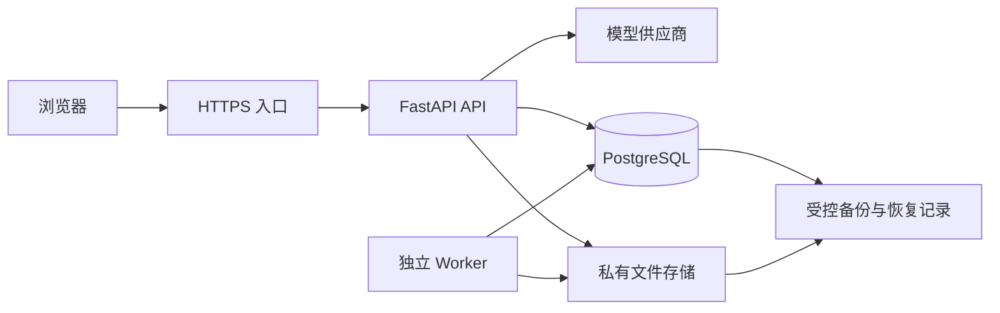

# AI 智能客服系统 v1.2：技术实现审计报告

审计日期：2026-09-05

审计对象：[开发文档 v1.2 快照](E:/ai-customer-service-plan/versions/AI智能客服系统开发文档-v1.2.md)。SHA-256：`107B55AC6F4ECCFC25BF4F638DA11F99F9816A73FCC7FB209120C7C950A5248D`。

结论：**架构可行，技术组合适合小团队逐步实现；关键业务约束已较完整，但还需要补齐几个执行与故障恢复协议，才能作为各模块直接照着开发的详细设计。** 难点集中在任务、文件、消息和费用的生命周期，主要风险不在 Vue 或 FastAPI 的选择。

本次审阅整份技术文档，并对照 PRD 和运营手册的相关要求。下文是规格缺口及故障场景推演，没有应用代码或运行环境可供验证，不能视为已复现的线上漏洞。现行开发文档未修改；新增本报告和精确版本快照。

## 1. 按优先级排列的发现

P1：对应能力处理真实数据或公开启用前，应先闭合的正确性／访问控制设计。P2：对应模块实施前应明确的工程协议。优先级不表示已经出现事故。

| 编号 | 优先级 | 问题 | 影响阶段 |
| --- | --- | --- | --- |
| T01 | P1 | 恢复旧备份时，最新删除凭证从哪里恢复尚未定义 | V1 数据恢复 |
| T02 | P1 | 内容审核没有衔接持久化状态及所有读取出口 | V2 内容审核 |
| T03 | P2 | 持久 job 缺少领取、租约、接手和失效执行者隔离协议 | V1 Worker |
| T04 | P2 | 文件写入与数据库发布之间缺少失败补偿和残留文件清理协议 | V1 导出；V2 文件导入 |
| T05 | P2 | 流连接断开后，生成任务由谁继续或终止尚未选定 | V1 流式聊天 |

### T01 · P1：删除记录可能随业务数据库一起回退

位置：[恢复顺序，第 288 行](E:/ai-customer-service-plan/versions/AI智能客服系统开发文档-v1.2.md:288)、[删除凭证表，第 382 行](E:/ai-customer-service-plan/versions/AI智能客服系统开发文档-v1.2.md:382)、[恢复点目标，第 865 行](E:/ai-customer-service-plan/versions/AI智能客服系统开发文档-v1.2.md:865)。

文档已要求恢复时先应用删除凭证，这个原则正确。缺口是：凭证列在同一业务数据库中，备份允许最多 24 小时数据损失，但未说明恢复时如何取得备份时间点之后的完整删除记录。

具体场景：00:00 备份了会话；10:00 用户删除，数据库记录删除凭证；11:00 主机与数据库故障，只能恢复 00:00 备份。如果删除凭证没有另行可靠保存，恢复库中既有旧正文，也没有 10:00 的删除记录。此时即使“先应用删除凭证”，也无法应用已经丢失的那一条。

需要补充：明确已确认删除记录的耐久性目标、独立恢复来源和可验证的完整水位。可采用不会随业务快照一起回退的最小删除日志，或设计能可靠覆盖已确认删除的日志／复制与恢复流程；不能仅写“增加备份频率”。删除确认与日志落地的先后关系也要定义。恢复时拿不到完整凭证，受影响范围保持隔离，不开放正文读取或后台再处理。

数据库的时间点恢复需要基础备份与对应 WAL；恢复范围受实际保留日志限制。仅启用归档并不能证明所有已确认删除都能恢复，这是需要另外验证的系统保证。[PostgreSQL 连续归档与时间点恢复](https://www.postgresql.org/docs/current/continuous-archiving.html)

验收补充：**先备份，再删除，再丢失主库**；用旧备份恢复并核对最新删除水位。删除日志缺失、落后或不可访问时必须阻止相关数据开放。原 A02-2 还应覆盖这个顺序，而不只是从已包含删除凭证的备份恢复。

### T02 · P1：只控制流式输出，不能保证历史／任务查询不返回待审核内容

位置：[分批保存与失败片段，第 235 行](E:/ai-customer-service-plan/versions/AI智能客服系统开发文档-v1.2.md:235)、[历史与 run 查询，第 306 行](E:/ai-customer-service-plan/versions/AI智能客服系统开发文档-v1.2.md:306)、[消息和任务字段，第 377 行](E:/ai-customer-service-plan/versions/AI智能客服系统开发文档-v1.2.md:377)、[内容审核，第 733 行](E:/ai-customer-service-plan/versions/AI智能客服系统开发文档-v1.2.md:733)。

第 13.5 节已经要求先审核再发布，不应误报为“完全没有内容审核”。但消息的执行状态、审核状态和可见内容还没有分开定义：此前流程要求保存片段、失败后保留文本，并允许查询任务和历史。

具体场景：V2 使用完整答复审核。模型候选文本已经写入消息／run，流通道尚未展示；此时用户刷新，通过历史接口或 run 查询取得数据库中的文本。若这些接口仅检查会话归属与生成状态，就会绕过流通道的审核。最终审核拒绝后，“保留失败片段”的旧规则也可能继续展示被拒内容。

需要补充：定义候选内容与可发布内容的边界，增加独立审核状态（如 pending／approved／rejected）及策略版本。使用增量审核时记录可发布的已审核内容版本或边界；仅有 `run=completed` 不代表答案获准展示。历史、run 查询、重连、复制、常规导出、摘要及后续模型上下文都读取允许使用的内容。待审原文如确需质检保存，只进入单独受限的审查入口并设期限。有效答案切换必须与完成状态、审核结果及原有授权条件一起校验。

验收补充：人为暂停审核，在暂停期间读取历史、查询 run、刷新、导出并继续追问；待审核／被拒文本不得从这些路径返回或进入普通对话上下文。随后分别让审核通过、拒绝、超时及进程重启，检查结果一致。

这是对已有审核原则的执行细化，不是建议移除审核来满足首字延迟。完整审核产生的时间和费用仍应按原文纳入验收。

### T03 · P2：数据库记录任务，不自动解决任务重复执行和卡死

位置：[后台任务，第 190 行](E:/ai-customer-service-plan/versions/AI智能客服系统开发文档-v1.2.md:190)、[job 状态，第 286 行](E:/ai-customer-service-plan/versions/AI智能客服系统开发文档-v1.2.md:286)、[数据字段，第 382 行](E:/ai-customer-service-plan/versions/AI智能客服系统开发文档-v1.2.md:382)。

当前有持久状态、重试和删除 epoch，但缺少任务执行权如何领取与转移的协议。`write_epoch` 表示来源授权是否仍有效，不等于某个 Worker 此刻仍有权执行任务。

具体场景：Worker A 领取任务后失联；Worker B 接手；A 随后恢复。若两者保存的是相同来源 epoch，来源校验都可能通过。不接手则任务可能长期停在 running，直接接手重跑又可能重复进行外部收费调用。

建议新增 `claimed_by`、`lease_until`、`heartbeat_at`、单调递增的 `claim_version`、`attempt_count`、`next_run_at`。短事务领取并提交，执行期间续租；最终写入与发布同时验证来源授权和本次领取版本。旧执行者恢复后不能覆盖新执行者结果。定义有限重试、退避、失败人工处理、不同任务类型的并发配额。

PostgreSQL 的 `FOR UPDATE SKIP LOCKED` 适合多消费者领取队列表中的不同任务，但它只解决领取时的锁争用，不提供执行租约或外部操作“恰好一次”。不能在模型请求的整个等待期间持有数据库事务。[PostgreSQL SELECT 锁定说明](https://www.postgresql.org/docs/current/sql-select.html)

原文已要求不明费用保持 unknown，这一规则应保留：租约到期不等于外部请求没执行，不能自动生成另一个付费请求。接手者先核对 attempt；只有确定未派发，或上游有可验证的幂等／查询协议时，才按规定恢复。

验收补充：双 Worker 抢同一 job、领取后崩溃、续租中断、旧 Worker 延迟恢复。验证只有当前领取者可以提交；收费操作不因恢复而盲目重发；删除与对账不会被大文件任务长期挤占。

### T04 · P2：文件存在，不等于数据库中已经有可管理的产物

位置：[文件存储，第 189 行](E:/ai-customer-service-plan/versions/AI智能客服系统开发文档-v1.2.md:189)、[发布前校验和清理，第 280 行](E:/ai-customer-service-plan/versions/AI智能客服系统开发文档-v1.2.md:280)、[产物来源关系，第 382 行](E:/ai-customer-service-plan/versions/AI智能客服系统开发文档-v1.2.md:382)。

现有文档已经要求鉴权下载和发布前检查；缺少的是文件字节与数据库元数据分别写入时的故障协议。文件系统／对象存储操作不自动成为 PostgreSQL 事务的一部分。以下是根据两种存储边界推演的风险，不是已经发现真实残留文件。

具体场景：导出文件上传成功，登记数据库前进程崩溃；或者来源已删除，数据库拒绝发布，但上传仍迟到完成。数据库没有有效产物记录，清理任务可能枚举不到该文件。反向顺序也可能留下“数据库显示就绪、实际文件缺失”的下载记录。

建议定义产物实体：`artifact_id`、存储位置／对象版本、哈希、大小、来源、owner、创建任务及领取版本、staging／ready／deleting 等状态。先登记写入意图，写入不可公开的临时产物，校验文件后在数据库事务中复验授权并切换 ready；下载只解析已获准且 ready 的产物。失败产物由可重试清理任务处理，扫描临时目录／上传中对象以补足崩溃窗口，并覆盖迟到写入。采用对象版本或独立对象名，避免旧任务覆盖新文件。

本地目录和对象存储可共享一个应用接口，但要分别定义临时写入、最终发布、取消／删除、对象版本及备份行为，不能假定两种存储都有同样的重命名语义。删除完成状态应包含未完成上传和清理待办的实际范围，不能只以数据库行已删除判断。

验收补充：在文件写入前后、元数据提交前后分别中断；并发删除来源；恢复时检查未注册文件、错误 ready 状态、迟到上传和临时文件清理。数据库与文件备份要有匹配清单及哈希验证。

### T05 · P2：需要明确流连接和生成任务是否共享生命周期

位置：[生成流程，第 230 行](E:/ai-customer-service-plan/versions/AI智能客服系统开发文档-v1.2.md:230)、[重连和异常任务，第 255 行](E:/ai-customer-service-plan/versions/AI智能客服系统开发文档-v1.2.md:255)、[流事件与 fetch，第 355 行](E:/ai-customer-service-plan/versions/AI智能客服系统开发文档-v1.2.md:355)。

文档已定义幂等、状态查询、事件序号和不自动重发，因此不应说它“没有重连设计”。剩余缺口是：模型调用由 HTTP 请求协程、同进程任务，还是独立执行器拥有；浏览器断开后，这个执行者到底继续还是终止。

具体场景：POST 已创建 run 并发出供应商请求，但浏览器还没收到 `run.created` 就断网。若请求协程终止而 run 未完成，数据库可能保留活动锁；若后台继续，但前端重新连接时只读到状态、不知道哪一段已发布，也可能重复显示文本或误判为需要再次生成。

V1 可以选择较简单、明确的协议：断流后尽力取消生成并记录中断／待核对状态；刷新只恢复数据库中可见快照，重新生成必须由用户明确触发并沿用原 turn 预算。也可以选择继续生成，但必须有独立任务所有者、存活检查以及可轮询的内容快照或事件补传。两种方案均可，不能留给不同开发人员各自选择。

接口还应明确：相同 `client_message_id` 在 running／completed／failed 状态分别返回什么；客户端未取得 run ID 时如何定位原提交；快照的内容版本与最后序号；如何处理重复、缺口与迟到事件；取消、失败、完成与有效答案何时统一提交。允许用查询快照而不必建设完整事件总线，但协议要唯一。

FastAPI 的 `BackgroundTasks` 使用 Starlette 的进程内后台任务机制，在响应发出后执行。根据这一执行方式，不能仅以这个 API 的存在代替本项目要求的持久执行与恢复协议。[FastAPI Background Tasks](https://fastapi.tiangolo.com/tutorial/background-tasks/)、[Starlette 进程内后台任务](https://starlette.dev/background/)

验收补充：提交后立即断开、首事件丢失、流中途断开、重连到另一个 API 实例、服务重启及完成事件丢失。检查不会自动再付费调用，用户能取得准确可见快照，活动锁最终有确定处理结果。

## 2. 你选中的“文件存储／后台任务”具体意味着什么

| 文档用语 | 实际应实现的东西 | 关键边界 |
| --- | --- | --- |
| 受控本地目录／持久卷 | 应用可读写、普通访客无法直接下载的专用目录 | 不放公开静态站点目录；容量、权限、备份和清理均需管理 |
| 对象存储 | 用私有对象标识保存文件，应用数据库记录元数据 | 文件存在不代表允许下载；用户访问仍走后端鉴权 |
| 持久 job | PostgreSQL 里的一条任务及其状态、归属、执行记录 | 写进表只能证明有记录，还需 T03 的领取与恢复协议 |
| Worker | 独立运行的后台执行进程，可与 API 共用同一套代码 | 通过数据库领取删除、对账、导出等任务；不必变成独立微服务项目 |

小规模单主机部署可让 API 和 Worker 显式挂载同一个私有持久卷。将 Worker 放到另一台主机后，不能假定同名本地卷拥有同一份文件；需共享存储或对象存储。Docker 文档区分本地卷与支持共享的驱动。[Docker Volumes](https://docs.docker.com/engine/storage/volumes/)

因此这两行的方向可以保留，建议把它们补成“部署拓扑＋任务协议＋产物生命周期”，不是简单换成 Redis、Celery 或某家对象存储的名字就完成设计。

## 3. 推荐的第一版实现边界

保留模块化单体：Vue 前端、FastAPI API、独立 Worker、PostgreSQL、私有文件存储和 HTTPS 入口。V1 先固定单主机／明确的执行实例数；以后扩实例再验证任务领取、流式恢复与撤销广播。文件持久卷不等于备份，备份和删除日志必须另外设计故障边界。

图中在线生成暂由 API 承担，需要先按 T05 冻结断流终止规则；如果选择断线后继续生成，应相应改为独立执行器。删除凭证的独立耐久来源按 T01 专门落实，不能从图中的一条备份箭头推定已经具备。

第一版可以先不增加 Redis、专用向量数据库、Kubernetes 或训练服务器；这是根据当前单团队范围的工程取舍。PostgreSQL 队列可承担小规模后台任务，但要限制任务并发、数据库连接总数、单事务时间和文件处理资源，并保留删除／对账的执行容量。

## 4. 开工时应形成的最小技术交付

这部分是实施准备清单，不另列为缺陷，也不要求今天建设全部未来模块。

| 交付 | 内容 | 建议顺序 |
| --- | --- | --- |
| V1 运行和状态设计 | API／Worker 拓扑，run、job、attempt 生命周期，断流和进程失败处理 | 最先冻结 |
| 数据库迁移 | 字段类型、外键、同工作空间约束、唯一键、活动 run 约束、账本精度及查询索引 | 随 V1 核心功能 |
| 事务与锁顺序 | 预算多桶更新、消息完成、版本撤销、删除、任务接手的短事务边界 | 在并发实现前 |
| OpenAPI 和流协议 | 请求与响应模型、错误、幂等结果、任务快照／事件恢复、分页和鉴权 | 前后端联调前 |
| 文件及恢复设计 | T01／T04 的元数据、临时产物、清理、备份清单、恢复开放条件 | 使用真实数据前 |
| 发布与测试证据 | 原有 A01—A06、PM-T1—PM-T6，加本报告故障场景；区分模拟上游与真实配额测试 | 对应能力上线前 |

不建议继续以新增页面数量衡量技术进度。先贯通“发送一次消息—记录与预算—取消／失败—刷新—删除—重启恢复”这条链，再接知识和客服工作台。原有 24—39 人日估算仍是规划值，本次没有实际团队速度或代码证据来确认或推翻它。

## 5. 已具备、无需重做的部分

API Key 只在服务端使用；供应商适配层独立；RAG 与训练边界清楚；turn／run／attempt 分账；unknown 费用不擅自清零；删除与授权有 epoch；末轮重试保留有效答案；版本撤销覆盖旧会话；业务身份不信任客户端自报；正常负载与故障测试分组。这些应继续保留。

本报告是在已有约束基础上补足实现接口和失败路径，未将“文档还没有 SQL／代码”本身当成漏洞。合规结论、当前模型价格及训练资格也未在本轮重新作全面核验。
