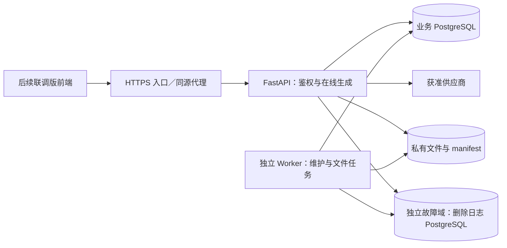

# AI 智能客服系统后端开发文档

规格版本：v0.1 · 日期：2026-09-05 · 状态：开发实施稿，工程 v0.4 已完成供应商、助手版本和预算账本的本地闭环；完整 V1 尚未验收。

本文将总体技术设计 v1.3 转为后端任务、接口契约和联调要求，面向开发、测试及接手维护人员。首期按 V0 验证、V1 内部系统安排，V2—V4 保留扩展边界。工程 v0.4 已实现受控 OpenAI 兼容连接、部署价格、助手草稿／启用／撤销／回退、预算预留／结算及本地 TCP／HTTP 契约测试；可运行入口见[工程说明](E:/ai-customer-service-plan/开发/backend/README.md)，既有核心整改证据见[复验记录](E:/ai-customer-service-plan/审计/后端核心整改复验记录-v0.3.md)。真实 PostgreSQL 实例和获准外部供应商尚未执行，本稿仍包含未实现的目标契约，不应据此推断全部功能已可用。

## 1. 依据、版本与范围

| 依据 | 本次使用版本／作用 |
| --- | --- |
| [总体技术设计](E:/ai-customer-service-plan/AI智能客服系统开发文档.md) | v1.3；架构、状态、预算、删除恢复和验收的总规格 |
| [产品需求 PRD](E:/ai-customer-service-plan/AI智能客服系统-产品需求文档PRD.md) | v1.3；业务分期、权限、交互、阶段门 |
| [产品验收标准](E:/ai-customer-service-plan/产品/验收标准.md) | AC-00—AC-22、NF-01—NF-08 及原审计案例 |
| [前端开发说明](E:/ai-customer-service-plan/开发/frontend/README.md)／[模块清单](E:/ai-customer-service-plan/产品/前端功能模块.md) | v0.4；已完成核心接口接线，v0.3 冻结包保留为基线 |
| [前端冻结记录](E:/ai-customer-service-plan/归档/前端-v0.3-冻结记录-20260905.md) | v0.3.0；只作为当前页面基线 |
| [前端独立审计](E:/ai-customer-service-plan/审计/前端页面独立审计报告-v0.3.md) | FE-A06—FE-A13，2 项 P1、5 项 P2、1 项 P3 尚未整改 |
| [运营手册](E:/ai-customer-service-plan/AI智能客服系统-运营手册.md) | v1.3；停用、备份恢复、数据处置与接手 |

前端冻结包 SHA-256：`3CB91C741E0D8E549EC8F10A48C0C906BE0217BCE227E173F676419DE30A4A85`。本次编写没有修改冻结前端、冻结包或三份 v1.3 主文档。

本稿有两类内容：**沿用**表示已有 v1.3 约束；**补充**表示为了实现或页面联调而提出的字段、端点及工程约定。接口或数据变更在实现过程中维护相关 OpenAPI、迁移及契约测试，联调或交付该接口前核对兼容性；不要求每次局部改动前生成整份规格或另行人工签核。主规格中的权限、预算、删除和阶段边界保持有效。第 16 节的业务输入仅阻断依赖它的真实能力启用，已授权的本地实现和假供应商测试可继续。

### 1.1 首期交付范围

| 阶段／优先级 | 后端交付 |
| --- | --- |
| V0 验证 | 测试数据、单供应商有限额度验证；验证请求、流式、用量和错误映射，形成 AC-00 记录 |
| V1 Must | 内部登录、主体隔离、助手与连接最小管理、聊天／快照／停止／末轮重试、持久历史、受控导出、安全删除、真实预算账本、Worker、独立删除日志、紧急停用、基础事件、备份与接手 |
| V1 Should | 简单评分、完整配置版本页面对应接口；可按正式范围延期 |
| V1 Could | 概览聚合、高级搜索、普通用户自助导出；现有前端有页面不提升其产品优先级 |
| V2 | 知识库、全文审核、访客及可信身份、人工接管、纠错闭环、公开准入 |
| V3／V4 | 经批准的业务工具、数据集与训练／评测；不纳入首期后端实现 |

V1 只建设单团队工作空间，保留 `workspace_id` 隔离，不扩展为多商家 SaaS。当前 `admin/member` 是前端预览身份，正式主体必须来自服务端登录会话。

### 1.2 与总体开发文档的对应关系

| 总体技术设计 v1.3 | 本稿细化位置 | 保持的约束 |
| --- | --- | --- |
| 第 3、4 节：分期与角色 | 第 1、3、5 节 | Must／Should／Could 不因已有页面改变；主体隔离 |
| 第 5 节：架构、版本、停用 | 第 2、3、8 节 | 单业务后端、独立 Worker、可撤销运行授权 |
| 第 6.2、6.3、6.6 节：生成与重试 | 第 6、8 节 | POST 流、重送 JSON、末轮及原 turn 预算、失联不接管生成 |
| 第 6.4、6.5、8.4 节：任务与文件 | 第 8、10 节 | 来源 epoch 与领取版本分离；先登记文件意图再写字节 |
| 第 6.7 节：候选与发布 | 第 6、7、8 节 | 普通查询只读获准 publication；V2 全文审核 |
| 第 7、8.1 节：接口与数据库 | 第 4—7 节 | 继承原端点；新增端点标明补充；当前已有 B001/B002 与 J001 核心迁移，其余模型按阶段补齐 |
| 第 13.6 节：独立删除日志 | 第 11 节 | 持久确认后 202、连续 applied_seq、恢复冻结与水位 |
| 第 14.2 节：预算 | 第 9 节 | 次数、Token、金额与时间累计；unknown 继续预留 |
| 第 12、15 节：测试与交付 | 第 13—15 节 | 原负载口径、故障用例、独立恢复及接手证据 |

## 2. 运行架构与工程组织

### 2.1 进程与故障域

沿用 FastAPI + PostgreSQL + HTTP/SSE + 数据库持久任务。首期一个 API 实例和一个独立 Worker；两者共享显式挂载的私有持久卷。独立删除日志必须放在业务主机之外的故障域。



在线生成由创建 run 的 API 执行器拥有，不交给响应结束后的 BackgroundTasks，也不由 Worker 失联接手后重发模型请求。删除、对账和导出使用持久 job；业务数据库和私有卷同机仍有单点故障，不称为高可用部署。

### 2.2 工程实现补充

建议 FastAPI/Pydantic 定义请求与响应模型，SQLAlchemy 异步会话访问数据库，Alembic 管理迁移，独立供应商适配器负责 HTTP 请求，pytest 承载单元及集成测试。建工程时锁定 Python、依赖及容器镜像的精确版本；本稿不填写未经工程兼容验证的版本号。

每个并发任务使用独立 `AsyncSession`；生成、心跳、对账不能共享一个活动事务会话。该约束与 [SQLAlchemy 异步会话文档](https://docs.sqlalchemy.org/en/20/orm/extensions/asyncio.html#using-asyncsession-with-concurrent-tasks)一致。数据库事务不得跨模型调用、日志服务或文件 I/O 持有。

以下为目标工程组织；当前只实现其中一部分，实际入口与目录以工程 README 为准，无需为了满足目标目录树创建空模块：

```text
开发/backend/
  pyproject.toml              依赖声明与工具配置
  requirements.lock          精确依赖锁；具体锁工具在工程初始化时固定
  .env.example               无真实密钥的配置清单
  app/
    main.py                  API 入口、异常处理和生命周期
    api/v1/                  路由及请求／响应 DTO
    core/                    配置、鉴权依赖、日志、数据库
    auth/                    登录、会话、成员权限
    assistants/              助手、部署版本与撤销
    providers/               供应商能力、调用、用量归一化
    chat/                    turn/run、上下文、租约、SSE 与快照
    content/                 候选、发布内容及统一可见读取
    billing/                 价格、额度、预留、账本与核对
    jobs/                    持久调度、领取、检查点
    deletion/                intent、独立日志客户端与恢复
    artifacts/               私有写入、来源清单、下载与清理
    observability/           审计、产品事件、出箱与健康状态
    cli.py                   受控账号、管理及恢复命令
  workers/main.py            独立 Worker 入口
  migrations/business/       业务库迁移
  migrations/journal/        独立日志库迁移及追加过程
  tests/unit/
  tests/integration/
  tests/contracts/
  tests/faults/
  deploy/                    本地容器与部署配置
  docs/openapi.json          从实现导出并版本化的 HTTP 契约
```

迁移由独立维护权限执行；API 启动不自动执行有破坏风险的迁移。Alembic 的版本迁移流程参考[官方教程](https://alembic.sqlalchemy.org/en/latest/tutorial.html)，自动生成结果仍需检查约束、数据回填和升级兼容性。

## 3. 身份、权限与密钥

### 3.1 授权模型

内部登录采用服务端可撤销会话；浏览器只持有不透明 Cookie，数据库保存会话哈希和失效时间。正式环境使用 HTTPS、HttpOnly、Secure、SameSite Cookie，限制 Path／Domain。闲置及绝对期限在部署策略中显式配置；没有策略时真实用户登录能力不启用。

补充同源 Cookie 的 CSRF 防护：登录前获取短期预认证 CSRF 信息，登录后轮换并绑定服务端会话；所有写接口验证可信 Origin 和 CSRF token。JSON DTO 拒绝未定义字段，客户端不能提交角色、workspace、owner、系统提示词或执行令牌来改变当前主体。允许匿名登录请求不等于允许跨站提交登录。

| 主体 | 默认授权 |
| --- | --- |
| 未登录 | 登录及必要健康入口；不读会话、账本或任务 |
| member | 授权助手、自有且允许访问的会话／消息／run；取消与末轮重试；本人任务最小状态；评分按启用范围 |
| admin | 工作空间配置、预算、连接、版本、受控管理任务；会话默认仍按本人范围 |
| 额外内容管理授权 | 若需读取他人会话，单独配置 `conversation:read:workspace` 等权限并留审计；不能因 admin 字样默认取得全部正文 |
| Worker 服务身份 | 按删除、对账、文件任务分别授予权限；不模拟用户登录，不获取任意候选正文 |

所有查询、搜索、下载、取消、重试、幂等重放都校验当前访问权；未知或越权对象统一返回 404，已认证但没有管理动作权限返回 403。管理员移除成员或注销会话后，使对应未发布生成失效；清理和不含正文的对账仍继续。

V1 可先用受控 CLI 创建首位管理员、管理成员和重置密码，留审计且无默认口令；本轮不补造账号管理页面。密码使用经过维护的密码哈希实现，禁止明文或可逆保存。

### 3.2 连接与凭据

连接返回 DTO 仅含 `id/name/provider/base_url/revision/status/capabilities/has_secret` 及脱敏测试结果；绝不返回密钥明文、密钥引用路径或内部执行令牌。管理员写入凭据后仅服务器保存；不可写入前端 VITE_*、本地存储、错误日志或构建产物。

Base URL 必须属于已批准的供应商出站范围；验证协议、端口、DNS 解析和目标地址，禁止环回、内网、链路本地、云元数据地址及未经验证的重定向。不要让连接测试成为任意 URL 请求代理。自建内部服务按单独受控允许列表配置。

连接／密钥／模型能力每次变更递增 revision，使旧测试失效；测试绑定不可变配置快照，只有请求 revision 仍当前时才能写回“可用”。已有模型部署绑定不可变连接配置版本；供应商或地区改变需重新批准和显式迁移，不让保存表单静默改写已有会话的数据接收方。

真实连接测试也会产生费用：创建有单独上限的管理 job/operation/attempt，受工作空间预算约束，不能借用虚构空 turn。尚未有价格、额度或供应商批准信息时仅运行本地假供应商测试。

### 3.3 供应商适配器契约

沿用总体设计第 5.2 节，V1 实现一个真实适配器和一个测试专用假供应商。领域服务通过以下内部接口调用；这些不是浏览器可直接访问的 HTTP 端点。

| 内部方法 | 输入／结果与边界 |
| --- | --- |
| count_or_estimate_tokens | 对最终消息模板、系统规则和历史计量，返回数量及 actual/estimated 依据；不能只数用户输入 |
| generate_stream | 输入不可变请求配置、输出限制、截止时间和原 attempt；输出规范化 delta／usage／finish／error；每次真正提交都已登记 attempt |
| normalize_usage | 保留可核对的白名单原始用量和计费桶映射，记录模型／价格版本，缺字段显式 unavailable |
| normalize_error | 脱敏分类认证、参数、限流、超时、网络与供应商故障；区分明确未发送和结果未知 |
| cancel（能力可选） | 尽力取消现有 provider_request_id；返回 confirmed/unsupported/unknown，不能把关闭本地连接当作供应商零费用 |
| query_usage_or_status（能力可选） | 只查询已有 provider_request_id 的状态／用量；不支持时交人工核对，不调用 generate 替代 |

供应商 SDK 的隐藏自动重试必须关闭或纳入可逐次记录的受控提交；否则实际提交次数会超过预算。退避仅在已确认安全、仍有次数／额度／时间时执行。供应商幂等能力没有验证前不能假定支持；不能在失败时静默切换到未经批准的数据接收方。

测试能力包括中文多轮、流式边界、错误 Key、无权限模型、超时、429／5xx、缺 usage、取消与重复请求；每项能力均记版本和证据。V0 需另有隔离的测试聊天入口或契约测试工具，不把尚未接线的冻结前端当成已经完成真实多轮验证。

## 4. 通用接口契约

下文路径前缀统一为 `/api/v1`，健康入口除外。REST 使用 snake_case；资源 ID 为服务端生成、不复用的不透明 UUID，示例中的 `conv_001` 等仅为便于阅读的代号。时间统一返回 UTC RFC 3339，日期窗口额外返回工作空间时区。金额使用十进制字符串及 ISO 币种，例如 `{"amount":"0.024000","currency":"CNY"}`；不向前端返回二进制浮点预算值。

普通成功响应为 `{"data":...,"request_id":"..."}`，204 无正文；错误结构如下。SSE 数据不套普通成功 envelope。所有用户内容、账本、会话快照使用 `Cache-Control: no-store`。

```json
{
  "error": {
    "code": "conversation_conflict",
    "message": "会话状态已更新，请刷新后重试。",
    "request_id": "req_001",
    "turn_id": "turn_001",
    "run_id": "run_001",
    "retryable": false
  }
}
```

`retryable` 只描述是否存在允许的重试路径，不授权浏览器自动创建新 run。未知外部副作用不能因为 HTTP 5xx 被无条件重发；先查原提交。

| HTTP | 稳定 code 及行为 |
| --- | --- |
| 401 | `unauthenticated/session_expired`；清空客户端认证关联缓存，重新登录 |
| 403／404 | `permission_denied/resource_not_found`；不返回对象是否属于他人的差异细节 |
| 409 | `idempotency_conflict/conversation_conflict/assistant_version_revoked/config_revision_conflict/service_paused` |
| 413／422 | `payload_too_large/validation_error`；前者字节体积限制，后者字段／业务输入校验 |
| 429 | `rate_limited/budget_exceeded`；可恢复限流附 Retry-After，预算不可靠重试绕过 |
| 502／503 | `provider_unavailable/dependency_unavailable/deletion_confirmation_pending`；脱敏并记录原因 |
| 运行终止事件 | `client_disconnected/executor_lost/deadline_exceeded/provider_error/content_rejected`；run 状态和费用状态分开 |

### 4.1 分页、排序与幂等

列表补充 `limit` 默认 20、最大 100，`cursor` 不透明；包含 `items/next_cursor/has_more`。会话按 `last_activity_at DESC,id DESC`，消息按 `seq ASC`，账本按服务端记账时间及 ID 排序。游标绑定查询条件与权限范围；过滤变化清空游标。动态会话列表有更新时刷新第一页并按 ID 去重，不把游标当成数据库快照保证。

新页面可以保存已访问游标支持上一页；需要随机页码时另行定义契约，不能用当前页条数伪造总记录数。请求 `include_total=true` 时总数必须用相同权限和过滤条件计算。

消息以 `(conversation_id,client_message_id)` 去重；其他创建／重试／删除等写操作采用 `Idempotency-Key`。服务端先鉴权与当前可见性检查，再识别同键同内容，最后才处理新操作的预期 revision。请求哈希包含方法、资源和规范化业务字段；同键不同请求返回 409。同键命中重新构造当前可见结果，不能原样缓存已被撤销正文或下载地址。

消息提交映射在资源保留期间可查询；删除后保留必要去重墓碑，不因通用幂等 TTL 到期复活旧提交。其他幂等记录期限属于部署配置，过期行为及客户端最大重试窗口要进入契约测试。

## 5. 页面接口清单

“沿用”端点来自总体设计第 7 节；“补充”端点在本稿新增。Should／Could 接口可以延后或先由受控管理命令覆盖其基础能力，不能省略 Must 的领域约束。

### 5.1 身份与工作空间

| 方法及路径 | 输入／输出关键字段 | 权限／来源 |
| --- | --- | --- |
| GET /auth/csrf | 预认证或当前会话的 CSRF 信息，短期且 no-store | 补充 |
| POST /auth/login | username、password；返回 user、workspace、permissions、会话期限并设置 Cookie | 沿用；受速率限制 |
| GET /auth/me | 当前主体、permissions、workspace、功能启用范围、期限 | 补充 |
| POST /auth/logout | 撤销会话并清 Cookie，204；重复退出安全 | 沿用 |
| GET /workspace | id、name、timezone、revision，不带账本或密钥 | 补充；成员 |
| PATCH /workspace | name、expected_revision | 补充；admin |
| GET /service-mode | mode、authorization_epoch、适用范围及固定暂停提示 | 补充；成员 |
| PUT /service-mode | mode、expected_epoch、reason；返回新 epoch 和实例确认状态 | 沿用；admin 管理能力 |

V1 暂停使用 service_closed；没有真实人工入口时不能把 human_only 渲染成“已转人工”。停用不阻断登录、必要历史、删除、对账和管理恢复。

### 5.2 连接与助手

| 方法及路径 | 关键契约 | 权限／来源 |
| --- | --- | --- |
| GET /provider-connections | 分页脱敏连接列表 | 补充；admin |
| POST /provider-connections | name、provider、base_url、受保护 secret 写入、能力配置；201 | 沿用；admin |
| PATCH /provider-connections/{id} | 修改及 expected_revision；生成新配置 revision | 补充；admin |
| DELETE /provider-connections/{id}/secret | expected_revision 查询参数；撤销凭据引用并使依赖部署不可运行，记录审计；在途费用继续核对 | 补充；admin，沿用主规格的凭据删除要求 |
| POST /provider-connections/{id}/test | expected_revision、Idempotency-Key；202 + job_id；小额真实测试 | 沿用路径、补充异步响应；admin |
| GET /assistants | 当前授权助手与默认版本摘要 | 沿用；成员 |
| GET /assistants/{id} | name、description、revision、default_version_id | 补充；有使用权限者；提示词详情限管理权限 |
| PATCH /assistants/{id} | 名称／介绍与 expected_revision；提示词另存版本 | 补充；admin，完整页面 Should |
| GET /assistants/{id}/versions | 脱敏版本摘要；管理详情按权限 | 补充；admin |
| POST /assistants/{id}/versions | prompt、deployment_id、策略版本；创建 draft | 补充；admin |
| POST /assistant-versions/{id}/activate | expected_revision、reason；批准 draft 为 active | 补充；admin |
| PUT /assistants/{id}/default-version | active version_id、expected_revision、reason | 补充；admin |
| POST /assistant-versions/{id}/revoke | expected_revision、reason；撤销授权并阻断旧任务发布 | 沿用；admin |
| POST /assistants/{id}/rollback | problem_version_id、target_version_id、expected_revision、reason | 沿用；admin |
| POST /conversations/{id}/migrate-version | target_version_id、expected_conversation_revision、reason | 沿用；单独会话管理权限 |

版本是 draft/active/revoked；active 与“新会话默认”分开，多份已批准 active 可以并存。revoked 不可原地重新激活；已有绑定默认暂停，迁移需校验目标供应商的数据授权、递增 write_epoch 并记录原目标版本。不要沿用前端“只有一个 active 就是默认”的示例推断。

### 5.3 聊天与历史

| 方法及路径 | 关键契约 | 权限／来源 |
| --- | --- | --- |
| POST /conversations | assistant_id、Idempotency-Key；201 返回空会话与 revision | 沿用 |
| GET /conversations | q、status、cursor、limit；返回 last_activity_at、turn_count、有效回复数 | 沿用 |
| GET /conversations/{id} | 会话摘要、head_turn_id、revision、write_epoch、绑定与可执行动作 | 补充 |
| GET /conversations/{id}/messages | 游标历史、当前有效答案及各 run 的可见状态；不带候选正文 | 沿用 |
| POST /conversations/{id}/messages:stream | client_message_id、expected_conversation_revision、content | 沿用；新提交 SSE，重送 JSON |
| GET /conversations/{id}/submissions/{client_message_id} | 一次一致性读取的原 run 可见快照 | 沿用；不存在 404 |
| GET /runs/{id} | 完整可见快照和执行状态 | 沿用 |
| POST /runs/{id}/cancel | Idempotency-Key；返回最终状态／快照；重复取消不覆盖 completed | 沿用 |
| POST /runs/{id}/retry | 新 Idempotency-Key、expected_head_turn_id、expected_conversation_revision | 沿用；与首次发送相同 SSE／JSON 分支 |
| POST /messages/{id}/feedback | rating=up/down/null、Idempotency-Key；同主体同消息 upsert | 沿用；Should |
| DELETE /conversations/{id} | Idempotency-Key + expected_conversation_revision 查询参数；202 receipt_id/job_id，未确认 503 | 沿用路径；补充预期版本参数 |

上述资源全部按当前主体获准范围访问。删除的预期版本参数与其他写操作的 JSON expected_revision 同样在冲突时返回 409；网络重送先解析原 intent，不因第一次已递增 revision 而拒绝补齐。

### 5.4 导出、任务、用量与概览

| 方法及路径 | 关键契约 | 权限／来源 |
| --- | --- | --- |
| POST /exports | conversation_ids、format=json、Idempotency-Key；202 job_id | 沿用；V1 管理能力 Must，成员自助 Could |
| GET /exports/{id}/download | 当前授权 + ready + 全部来源有效；后端代理下载 | 沿用；自助开放受范围控制 |
| GET /jobs | type、status、cursor、limit；有权任务列表 | 补充 |
| GET /jobs/{id} | queued/running/blocked/failed/completed/cancelled、阶段、错误、允许操作 | 沿用 |
| GET /usage | from/to、currency、model_id、turn_id、计费状态、分页；限制查询时间跨度 | 沿用；管理报表 |
| GET /budget-policies/current | 已批准版本、币种、时区、各层限额 | 补充；admin |
| PUT /budget-policies/current | expected_revision、完整限额与 reason；新版本；降低额度后立刻限制新派发 | 补充；admin |
| GET /overview | 已授权会话／回复数、任务、费用、预算及配置状态、as_of/scope | 补充；admin，Could |
| POST /product-events | event_id、schema_version、允许事件和最小测量字段 | 沿用；已认证且去重 |
| GET /health/live | 进程存活；不暴露配置 | 补充；运维入口，无 /api/v1 前缀 |
| GET /health/ready | 迁移与恢复闸门是否就绪；不暴露配置 | 补充；运维入口，无 /api/v1 前缀 |

预算结算、删除及失败恢复采用受控 Worker／CLI，不提供任意“改为 completed”“清零费用”接口。跨来源导出请求应原子校验所有来源，不能静默漏掉无权限记录后仍宣称完整导出。

概览是查询视图，不新建模型调用。会话计数只包含生命周期 active 且已有用户 turn 的记录；有效回复数按当前有效完整答案计轮次。管理员看板明确 `conversation_scope=own`、`billing_scope=workspace`，避免把两种范围当成同一分母。“待处理任务”必须同时覆盖 queued/running/blocked/failed 并分状态展示；completed/cancelled 不算待处理。

## 6. 聊天 DTO、SSE 与前端处理

### 6.1 核心 DTO

| DTO | 最低字段 |
| --- | --- |
| Conversation | id、assistant_id、current_assistant_version_id、head_turn_id、lifecycle_state、service_state、revision、write_epoch、created_at、last_activity_at、turn_count |
| Turn | id、user_message_id、active_answer_id、run_ids、budget_policy_version、可执行 retry 及拒绝原因 |
| RunSnapshot | conversation_id、turn_id、run_id、status、error、active_answer_id、conversation_revision、write_epoch、visible_content_version、published_seq、visible_text、is_complete、replayed |
| Usage | attempt_id、operation_kind、model_id、计费桶 Token、quality=actual/estimated/pending、reservation_state、spent/held、currency、price_version |
| Job | id、type、status、stage、created_at、updated_at、error_code、retryable、receipt_id／artifact_id；下载按权限返回可执行动作 |
| Version | id、status、authorization_epoch、deployment_id、policy_version、created_at、is_default；管理端另有 prompt |
| BudgetSnapshot | policy_version、currency、timezone、window_start/end、limit/spent/held/available；日／月分桶 |

`visible_text` 始终属于这个 run；旧有效答案从 `active_answer_id` 对应的获准消息读取。失败 retry 的新片段不能被前端错当旧有效答案的正文。

### 6.2 首次发送与快照示例

```json
{
  "client_message_id": "d80a9bf7-ff87-44f0-a5a5-6e4cecfebddd",
  "expected_conversation_revision": 7,
  "content": "如何整理产品使用说明？"
}
```

首次获准新提交返回 200 text/event-stream；相同 client_message_id、相同内容的网络重送，无论原 run 状态如何，都返回 200 application/json。以下为重送或查询 envelope 中的示例快照；查询时 replayed=false：

```json
{
  "data": {
    "conversation_id": "conv_001",
    "turn_id": "turn_001",
    "run_id": "run_001",
    "status": "completed",
    "error": null,
    "active_answer_id": "answer_001",
    "conversation_revision": 9,
    "write_epoch": 1,
    "visible_content_version": 3,
    "published_seq": 4,
    "visible_text": "可以按使用步骤、常见问题和注意事项整理。",
    "is_complete": true,
    "replayed": true
  },
  "request_id": "req_001"
}
```

状态为 created/running/reviewing/completed/failed/cancelled；费用未核对不增加一个“unknown run”状态。正文未获准时 visible_text 为空串，不返回候选表引用或内容。资源撤销时先执行当前访问策略，再决定是否允许最小状态读取，不承诺所有旧幂等请求都仍有正文。

### 6.3 SSE 事件

每个事件具有 `conversation_id/turn_id/run_id/write_epoch/stream_seq/visible_content_version/conversation_revision`。事件帧以空行分隔；data 是 UTF-8 JSON，必须正确转义正文换行。TCP 分片可以拆开 UTF-8 字符和帧，前端解析器需跨 chunk 缓冲。

```text
event: run.created
id: run_001:1
data: {"conversation_id":"conv_001","turn_id":"turn_001","run_id":"run_001","write_epoch":1,"stream_seq":1,"visible_content_version":0,"conversation_revision":8,"status":"running"}

event: message.delta
id: run_001:2
data: {"conversation_id":"conv_001","turn_id":"turn_001","run_id":"run_001","write_epoch":1,"stream_seq":2,"visible_content_version":1,"conversation_revision":8,"text":"可以按使用步骤整理。"}

event: run.completed
id: run_001:3
data: {"conversation_id":"conv_001","turn_id":"turn_001","run_id":"run_001","write_epoch":1,"stream_seq":3,"visible_content_version":1,"conversation_revision":9,"status":"completed","active_answer_id":"answer_001","is_complete":true}

```

上例与 JSON 快照为不同分片次数的独立示例。支持 run.failed、run.cancelled、usage.updated、conversation.invalidated；V2 才开启 citation.added。V2 reviewing 使用不含正文的状态事件，具体 `run.status` 事件作为补充契约纳入 OpenAPI 附件。

SSE 每段正文先提交对应 publication 和序号，再经发布闸门发出；终止事件先提交终态。设置 no-store，禁用代理缓存／缓冲；心跳使用 SSE 注释、不推进正文序号、不计首字。流实现需支持取消、限制待发送缓冲并测慢客户端断连；[FastAPI 响应文档](https://fastapi.tiangolo.com/advanced/custom-response/#streamingresponse)说明了流式响应及异步取消注意事项，框架流功能本身不代替业务取消事务。

前端联调版按以下规则处理：

1. 使用 fetch POST 并依据 Content-Type 分支；JSON 快照替换该 run 内容，不拼接已有片段。
2. 同一 run 重复 stream_seq 丢弃；序号有缺口、EOF 没有终态或响应丢失时查询原提交／run。
3. 只对 running/reviewing/created 做 1、2、5 秒退避轮询，最大间隔 5 秒；不重新连接生成流，不保证 Last-Event-ID 重放。
4. 较旧 revision 不覆盖新有效答案；conversation.invalidated 丢弃旧 epoch 缓冲，清除不再获准的内容。
5. 用户主动 retry 才使用新的幂等键创建新 run；网络重送保留原键、正文及 expected_revision。
6. sessionStorage 仅保留随机定位 ID，不存正文、凭证或密钥。认证失效时清理；多标签页冲突以服务端 409 和快照为准。
7. 读屏通知只播报开始、完成、失败／停止等简短状态；不逐字播报 stream delta。该条在未来前端版本整改 FE-A07。

## 7. 数据模型、索引与迁移

主规格第 8.1 节是表名和领域含义的依据。以下补充目标字段、约束与迁移分组；当前已有 B001/B002 与 J001 核心迁移及本地验证记录，未实现领域仍需后续迁移，本文片段不作为直接执行脚本。

| 迁移组 | 表及关键约束 |
| --- | --- |
| B001 身份 | workspaces/users/memberships/auth_sessions；成员关联唯一，session_hash 唯一，状态与失效时间索引 |
| B002 连接与配置 | provider_connections/assistants/assistant_versions/model_deployments/service_controls；immutable 配置 revision、运行 authorization_epoch、默认指针 |
| B003 会话执行 | conversations/turns/messages/generation_runs/idempotency_records；head/revision/epoch、executor/lease/deadline、输入快照血缘 |
| B004 发布内容 | answer_candidates/content_reviews/answer_publications；content_hash、policy_version、完整性、可撤销发布授权；候选正文可空 |
| B005 计费 | operations/operation_attempts/usage_records/budget_policies/budget_reservations/budget_ledger；精确金额及结算事件唯一 |
| B006 持久任务 | jobs/deletion_intents/deletion_receipts；租约、claim_version、检查点、日志映射和连续 applied_seq |
| B007 文件 | artifacts/artifact_sources/artifact_write_sessions；存储键唯一、完整来源、manifest/hash/size、writer/claim_version |
| B008 反馈与事件 | feedback/audit_events/product_events/event_outbox；最新评分唯一，事件去重，无多余正文 |
| J001 独立日志 | deletion_journal/journal_heads；独立库、独立权限及追加过程，(workspace_id,seq) 和 operation_id 范围唯一 |

补充预算行锁落点：增加 `budget_accounts` 投影，主键覆盖 workspace、scope、subject、period_start、currency；保存 limit/spent/held/revision。预留和结算同时更新账本与投影，能用账本重建校验。这是业务库内部计数视图，不建立第二份供应商收费事实。

同一 workspace 的外键关系需要约束空间一致，例如联合唯一键及联合外键；不能只靠调用约定。字段类型建议：UUID、timestamptz、bigint 计数／epoch、numeric(24,8) 金额，金额舍入方向由价格策略规定。正文 JSON 不得被无限扩大；原始 usage 只保存白名单计费字段。

必须落实的数据库约束：

- `(conversation_id,client_message_id)` 和 `(conversation_id,seq)` 唯一；AI 消息的空 client_message_id 不参与用户提交去重。
- 每个会话最多一个非终态 run；可在 generation_runs 冗余受外键保护的 conversation_id，建立下述部分唯一索引。
- `turns.active_answer_id` 必须指向同 turn 的完整、当前获准 publication 对应消息。跨行“已完成且获准”条件通过受控事务和必要触发器保证，不能写成无效的跨表 CHECK。
- operation 至少且仅有一个根归属：turn_id 或 job_id；run_id 可空但非空时必须与 turn 同源。
- attempt 编号在 operation 内唯一；`(attempt_id,charge_kind,settlement_version)` 与 budget_ledger.event_key 唯一。
- feedback 的 `(actor_id,message_id)` 唯一；重复提交改变同一评分，不增加分母。
- 不对保留会计记录使用会话正文的级联删除；清理正文、保留不含正文的必要资源代号及关联。
- 新增 `last_activity_at` 保存可排序时间。新 turn 受理、答案成功完成在相应事务更新；费用对账不改变“最近会话”。

```sql
-- 迁移设计片段，非已执行的数据库变更
CREATE UNIQUE INDEX uq_conversation_live_run
ON generation_runs (conversation_id)
WHERE status IN ('created', 'running', 'reviewing');

CREATE INDEX ix_conversation_recent
ON conversations (workspace_id, owner_id, last_activity_at DESC, id DESC)
WHERE lifecycle_state = 'active';

ALTER TABLE operations ADD CONSTRAINT ck_operation_one_root
CHECK ((turn_id IS NOT NULL) <> (job_id IS NOT NULL));
```

数据库集成测试使用真实 PostgreSQL，不能用 SQLite 代替锁、部分索引、并发和日志事务语义。迁移测试覆盖空库、上一已发布版本、数据回填及失败恢复；破坏性变更优先先扩展再切换，不以回滚到旧业务库绕过独立删除日志。

## 8. 关键事务与执行状态

### 8.1 锁顺序及提交边界

补充统一锁约定，后续 SQL 必须按此顺序获取需要的锁：授权主体／service_controls／助手及部署配置 → 按 ID 排序的 conversations → turns → runs 或 jobs → 按固定层级和键排序的 budget_accounts → operations/attempts/reservations → artifacts／publication／outbox。同层多资源一律排序，不同路径不得反向加锁。

Worker 的领取事务只锁 job 并提交；随后执行步骤开启新事务，按全局次序获取来源及 job 等锁。禁止“持有领取锁再读会话”、预算行 SKIP LOCKED 或账本先锁预算再回头锁 run。取消／完成只获取自身需要的有序子集；账单修正单独按账本次序，不反向获取已删除内容锁。

授权撤销和派发许可事务锁定相同授权行，普通许可可用适合的共享锁，撤销用排他锁；不得靠读取旧 epoch 后无条件派发／发布。网络发送不持事务，按照 v1.3 的“已持久派发许可”边界记录在途请求；发布另有有界、按会话排序的闸门，撤销提交后丢弃未发出的旧事件。

所有“检查后写入”必须位于同一事务或带全部版本条件的 UPDATE；影响行数为 0 即失去执行权，不补做无条件写入。多表快照使用单次一致查询或只读一致性事务，避免 active_answer_id 与正文来自不同时刻。

### 8.2 新消息

1. 鉴权、输入大小和字段校验；在已授权范围查幂等记录。新消息读取并锁定会话末端，检查 revision、active 生命周期、服务模式和运行版本。
2. 选定有效上下文和不可变引用，最终请求输入限制通过后，创建用户 message、turn、created run、execution_token、租约、输入快照和 outbox；递增 revision 并登记 client_message_id。若后续运行前校验失败，也要有可查询失败 run，不能出现永久 created。
3. 每次外部提交前另开短事务核验授权／执行租约、预算与截止时间，原子登记 attempt、计数、预留和派发许可；提交后才取密钥和调用供应商。
4. 创建响应流时启动唯一 API 执行器。SSE 首帧发送失败与完全无首帧的路径同样进入断连清理，不能遗留无限活动占用。
5. V1 仅获批 internal-visible-v1 策略可逐段写入 publication；完整答案完成时在一个事务中提交 run.completed、完整 publication、active_answer_id、revision、最后序号及释放活动占用，然后发送终态。

补充空会话策略：后续前端“新建”先创建本地草稿，首次实际发送前才 POST /conversations，创建返回丢失时用同一幂等键恢复。API 仍可存在尚未发送的空会话，但默认历史／概览排除 turn_count=0，设置创建速率限制。服务端幂等无法自动合并前端每次生成不同键的重复空请求，FE-A06 还需前端联调版修复。

### 8.3 重试、终止及版本变化

| 操作 | 原子条件与结果 |
| --- | --- |
| retry | 原 run 已终态、仍是末轮、无非终态 run、head/revision 符合；新 run 关联 retry_of_run_id，复用原 turn 剩余额度 |
| retry 完成 | 仅新答案完整、获准、来源及末端仍有效时切换 active_answer_id；更新依赖摘要失效状态 |
| retry 失败／取消 | 旧有效答案不变；新 run 的可见片段与失败原因分开呈现 |
| 用户 cancel | 用 execution_token、当前状态、epoch 作条件终止；已先提交 completed 时返回 completed，不覆盖 |
| 客户端断连 | 尽力取消上游；库健康时检测到断连后 5 秒内 failed/client_disconnected，失效令牌、释放活动占用，费用 unknown 保留 |
| API 失联 | run 租约 30 秒、10 秒心跳；Worker 每 5 秒扫描；健康条件下最后成功心跳后 40 秒内条件终止；不接管生成 |
| 120 秒 deadline／turn 剩余时间用尽 | 非终态 run 终止，失效发布授权；人工等待重试的时间不计入 turn 累计运行时间 |
| 版本迁移／撤销 | 校验预期 revision 与许可；递增 write_epoch、终止旧任务及发布权，记录绑定变化；历史实际版本不改写 |

摘要只包含当前有效完整答案，关联消息／答案版本；被替换、删除或撤销时先退出上下文。V1 初始可以不启用付费自动摘要，超限减少无关历史后给出安全提示；一旦启用，摘要必须计入触发 turn 的调用数、Token、金额和耗时。

### 8.4 候选与普通读取

统一内容查询服务供 SSE、历史、run／提交快照、导出、复制来源、摘要及下一轮上下文使用。普通 DTO 禁止从 ORM 自动展开 answer_candidates。

V1 internal-visible-v1 的 not_required 必须由获批后端配置决定；V2 support-text-reviewed-v1 的候选 pending，全文哈希与 approved 审核匹配后才整段发布。reviewing 不等于 completed，错误／超时／拒绝只返回固定安全提示。无批准保留依据时隔离正文只在受控内存中存在；哈希可记录，正文引用为空。后续候选隔离期限上限与来源删除要求见主规格，不默认永久存储。

## 9. 费用、预算与对账

### 9.1 沿用预算常量

| 项目 | support-text-v1 |
| --- | --- |
| 最终模型输入／单次输出 | 4,000／1,200 Token |
| turn 累计模型 Token | 24,000，含全部尝试和缓存计算量 |
| V1／V2 模型尝试总数 | 最多 3，含摘要、失败网络提交、主动重生成 |
| 自动网络重试 | 每 operation 最多 1 次，turn 合计最多 2 次，同时受总尝试数约束 |
| V1 工具／检索尝试 | 0／0；V2 检索最多 3；V3 模型最多 4、工具最多 3 |
| run／turn 累计处理时间 | 120／180 秒，run deadline 取自身上限与 turn 剩余时间较小者 |
| 日／月／会话／turn 金额 | 必须配置币种及限额，不设置无限默认 |
| 同会话活动生成 | 最多 1 |

金额桶覆盖工作空间、用户、会话、turn；每次 attempt 同时检查所有适用桶。日/月按服务端已配置时区分开计算，分别返回 spent/held/available，不使用前端示例的 `min(日额度,月额度)-同一笔总消费`。

每个 attempt 的预留绑定派发时窗口和价格版本；跨日 retry 的新 attempt 使用派发时的日／月桶，并继续受原 turn／会话累计上限约束。旧 attempt 的迟到结算回到其原桶，不能按对账当天改归属释放旧额度。币种分别聚合，汇率转换需明确价格／汇率版本与日期。

### 9.2 预留与结算

在同一预算事务里检查 `limit-spent-held >= reservation`，占用调用次数、预计 Token、金额和幂等事件。模型未知输出按已验证输出上限预留；无法约束费用或无可用价格时拒绝启用。多个并发会话争抢最后额度时，不能先 SELECT 余额后各自扣款。

Token 累计上限也需要预留最终输入加最大输出，不能等结果回来才知道已超 24,000。确定用量后补差；结果未知的 attempt 保留保守 Token 占用和已派发次数。自动重试、手动 retry 或新 API 执行器不能重置这些计数。

usage 的 actual/estimated/pending 与 reservation 的 reserved/unknown/settled/voided 分开保存。实际用量确认后，唯一结算事件把预留转为消费并释放确定未消费差额；明确未派发才可 void。断流、取消、崩溃及未知账单不因 TTL 到期而释放。

计费适配器区分普通输入、缓存读、缓存写、输出及独立计费项目；若输出已含推理 Token，不重复加价。没有的字段返回 unavailable／null 或 estimated，不伪造 0。同一费用多层额度约束不等于重复收费。

对账只查询原 attempt 的供应商记录或依据获准人工账单追加差额事件，不覆盖原事实。actual 超过 held 时记录真实差额并告警、暂停新的风险消费；额度护栏不能把真实账单截断成“未超支”。会话已删除也保留不含正文的必要计费关联。

## 10. Worker、文件与导出

### 10.1 领取与恢复

job 状态 queued/running/blocked/failed/completed，允许取消的类型另有 cancelled。短事务使用 FOR UPDATE SKIP LOCKED 领取到期任务，递增 claim_version，写 claimed_by、30 秒 lease，提交后执行 I/O。10 秒心跳、5 秒调度；每步提交检查仍 running、领取者／版本匹配和数据库时间下租约未过期。SKIP LOCKED 用于队列，不能用于跳过预算锁；其适用边界见 [PostgreSQL SELECT 文档](https://www.postgresql.org/docs/current/sql-select.html#SQL-FOR-UPDATE-SHARE)。

默认维护类 2 个槽、文件类 1 个槽，租约续期和失联扫描不占这些长任务槽。job 最多 5 次自动领取，失败退避 5/15/60/300 秒；达到上限告警。未知付费请求、独立凭证未确认或写入者未停止标 blocked，核对前不盲目重跑。

| job 类别 | 步骤提交条件 |
| --- | --- |
| 导出／内容产物 | 来源 active、全部来源 epoch 与当前主体权限有效、内容获准、当前领取版本有效 |
| 删除／凭证重放 | 有效授权 intent／独立凭证；来源可 deleting/purged/不存在；不要求用户仍登录 |
| 用量核对 | 原 attempt／账本关联存在；不要求正文 active、AI 开启或原用户在线 |
| 连接测试 | 获批管理 job、预算与不可变配置版本；旧 revision 结果不能标记新配置可用 |

### 10.2 文件完整生命周期

顺序固定：登记 artifact + 全部 artifact_sources + write_session → 写私有 manifest → 在私有卷写唯一临时文件 → 确认完成、大小和哈希 → 短事务复验权限／来源／租约后 ready → 后端鉴权下载。

文件键由服务端生成，不接受用户路径；同一来源的新领取者使用不同 artifact/write_attempt，禁止覆盖旧路径。manifest 记录全部来源代号、workspace、artifact、job/claim_version，不包含客户正文或姓名。

导出仅使用获准内容，至少输出当前有效完整答案；失败／取消的候选或不完整片段不当成正式答案。产物与权限脱钩时立即停止发布／下载并入清理队列。大文件按有界分块代理发送、复验撤销状态，不能只在打开文件时检查一次后发出长期无撤销链接。

写入超时上限 15 分钟只触发撤权和取消，不证明写入者停止。删除前确认 in_flight 写入已终止；未知继续 blocked。5 分钟扫描数据库及 manifest；无主临时对象默认 24 小时进入清理，已删除来源产物立即清理。文件缺失／哈希不符返回失败，禁止生成空下载冒充成功。

## 11. 独立删除日志与恢复

### 11.1 删除四步

1. 业务库短事务保存已授权 deletion_intent，conversation=deleting，递增 epoch/revision，创建 blocked job，立即关闭内容读写／派发／发布／下载。
2. 使用同一 operation_id 在独立日志持久追加，只保存最小资源代号、请求哈希、授权代号和时间。日志不可达或确认不明返回 503 deletion_confirmation_pending，本地继续阻断。
3. 独立日志确认 seq 后，业务库关联 receipt、登记连续日志投影并将 job 排队。日志已成功但本地失败时后台用原操作补齐。
4. 全部关联完成后返回 202；不把“持久受理”解释成“全部数据已清除”。

```json
{
  "data": {
    "receipt_id": "receipt_001",
    "job_id": "job_001",
    "status": "accepted",
    "online_cleanup_status": "queued",
    "backup_disposal_status": "pending"
  },
  "request_id": "req_001"
}
```

删除 job 清理正文、输入快照、摘要、反馈正文、候选／发布内容、全部受控导出及当前阶段存在的衍生物。仅当日志确认、在线副本清理、写入者停止、发布／下载授权撤销都有证据时可报告在线清理完成；外部副本和备份到期分别列状态。取消删除不把资源复活。

### 11.2 日志连续性与故障域

按 workspace 锁 journal_heads，同一事务校验 operation_id/request_hash、检查恢复冻结、递增 head 并插入 immutable journal。用事务内 head 维护连续序号，不能把普通 sequence 无缺口作为假设。应用仅可通过受限追加／查询过程访问，不授予修改／删除／恢复权限。

独立实例要求 fsync 与 synchronous_commit=on 及兑现持久写入的存储；应用不得切为异步确认。异步提交成功后可能仍丢最近事务，参见 [PostgreSQL 提交持久性文档](https://www.postgresql.org/docs/current/wal-async-commit.html)。同机两个容器只可验证开发协议，不满足 V1 独立故障域验收。

applied_seq 只推进已连续应用的前缀；先收到 12、尚未应用 11 时不能从 10 跳到 12。“已应用”表示资源已阻断、清理和残余状态已登记，不表示物理副本全部删除。日志保留期覆盖所有可恢复备份及尚未处置产物。

### 11.3 恢复开放顺序

隔离旧部署／旧写入者并撤销凭据 → 保持普通 API 与模型派发关闭 → 独立日志冻结追加并取得稳定 H → 核对实例身份、连续性和哈希 → 从可信前缀或完整保留日志重放至 H → 依据 manifest 清理／隔离文件及未知项 → 失效所有旧租约与下载权 → 确认 applied_seq=H、文件校验、迁移及批准记录 → 解冻后开放新部署。

独立日志存在而本地 intent 缺失时重建最小清理任务，不重建正文。常规进程重启也检查独立日志身份／水位，不能把旧备份恢复伪装成重启跳过协议。日志缺口、身份不符、未知文件或旧写入者未隔离时保持相应范围关闭。

主规格中的普通业务 RPO 24 小时、RTO 4 小时仍是待业务批准目标；已返回 202 的删除在“独立日志保持确认提交且可访问”故障模型下要求 RPO=0。V0 本地假日志不构成该目标的证据。

## 12. 前端接入顺序与当前状态

前端 v0.4 已按本节完成 F1—F4 核心接线，并接入 F5 的安全删除受理与任务状态；v0.3 冻结包保持原状。导出、retry、迁移、对账修正、后端概览聚合和授权全文搜索仍按现有未实现接口边界显示为不可用。

| 批次 | 对应页面 | 后端完成条件／前端后续动作 |
| --- | --- | --- |
| F1 | 身份、设置 | auth/me、Cookie/CSRF、workspace/service-mode；移除预览身份授予权限的路径 |
| F2 | 连接、助手 | 配置 revision、密钥脱敏、预算化测试、默认指针／撤销；确认真实调用告知 |
| F3 | 聊天、历史 | 会话 ID／revision、SSE＋JSON、原提交查询、取消／retry、持久分页；先通过假供应商故障契约 |
| F4 | 用量、任务 | Decimal／币种、日月桶、unknown、真实 job；去掉定时器伪造完成和内存 payload 下载 |
| F5 | 管理导出、删除 | 独立 receipt＋job、来源撤销、代理下载、恢复记录；未配置依赖的动作返回明确不可用 |
| F6 | 概览、搜索、评分 | 在范围纳入后对接聚合／授权搜索／upsert；重跑无障碍和窄屏检查 |

### 12.1 示例字段不能直接作为服务端模型

| v0.3 示例 | 正式后端／联调版 |
| --- | --- |
| owner: admin/member | owner_id 与服务端 membership；角色与数据归属分离 |
| updatedAt: 今天／刚刚 | last_activity_at UTC 时间，客户端本地格式化 |
| newConversation 每次立刻插入 | 本地未发送草稿＋幂等创建，默认统计排除空会话 |
| active 版本就是默认版本 | default_version_id 单独管理；active 表示允许执行 |
| costCents/heldCents 与字符估算 | 十进制金额／币种、真实 usage 桶、价格版本和质量标记 |
| 三种示例 job 状态 | 完整持久状态及真实检查点；blocked 与 failed 区分 |
| connection.tested 布尔值 | tested_revision/config_revision/capabilities/test_job 状态 |
| timer 生成、内存 activeAnswerId | 服务端 run、epoch、revision、publication 与有效指针 |
| scenarios=disconnect/budget | 只在测试环境的假供应商故障控制，正式请求 DTO 不接受客户端强制场景 |

FE-A06 和 FE-A08 的服务端配套分别为排除空会话统计及真实时间排序；仍需联调版前端调整。FE-A07、FE-A09—FE-A13 涉及读屏、移动布局、语义、触控与样式，应在前端新版本整改，不能以“后端接口已完成”关闭这些审计项。

## 13. 环境、部署与运维交付

### 13.1 配置清单

| 配置组 | 必须明确的值 |
| --- | --- |
| 环境 | APP_ENV、HTTP 监听、允许 Origin、HTTPS 代理信任范围 |
| 业务库 | DATABASE_URL 的外部注入、迁移版本、API／Worker 连接池总额 |
| 删除日志 | 独立连接／服务地址、JOURNAL_INSTANCE_ID、持久提交要求、最小权限、恢复操作身份 |
| 会话 | Cookie 策略、SESSION_IDLE_TTL、SESSION_ABSOLUTE_TTL、CSRF／登录限流 |
| 供应商 | 允许的出站目标、密钥引用、连接／模型能力 revision、价格版本 |
| 预算 | 币种、工作空间时区、用户／工作空间日月额度、会话／turn 额度、管理测试额度 |
| 持久卷 | PRIVATE_STORAGE_ROOT、API/Worker 挂载、权限、manifest、备份范围 |
| 任务 | 30/10/5 秒租约／心跳／扫描，2+1 槽、5 次领取、文件超时及扫描初值 |
| 观测 | 请求／run／attempt／job 关联 ID、保留策略、错误脱敏、告警接收与值班 |
| 功能 | 使用真实或假供应商、Should/Could 启用清单、候选保留依据、V2 功能默认关闭 |

沿用业务连接池上限 API 12、Worker 6，独立日志池总额最多 2；为迁移／维护保留连接。连接数计算包含 overflow 和进程数，多进程不能各自无条件使用全部预算。

建议本地 API 使用 127.0.0.1:8000，测试由独立临时端口承载。冻结前端当前 4173 是构建预览；后续联调版通过开发代理将 /api 指向后端，正式由同源 HTTPS 入口提供。Cookie 跨源开发只允许明确 Origin，不使用带凭证的通配 CORS。

### 13.2 当前运行入口与后续交付

安装工程锁定依赖和包后，可使用以下已有入口；配置及 Windows 虚拟环境命令见工程 README。测试目前集中在 `tests/test_core_contract.py`，按需划分测试目录，不要求先创建空目录。

```text
python -m uvicorn app.main:app --host 127.0.0.1 --port 8000
ai-cs-worker
alembic -c migrations/business/alembic.ini upgrade head
alembic -c migrations/journal/alembic.ini upgrade head
python -m pytest -q
```

独立日志迁移由日志维护者执行，不给普通 API 生产 DDL 权限。部署交付另含账号初始化、紧急停用、对账检查、恢复冻结／重放／核验 CLI；这些命令必须调用同一领域约束，不能另建绕过删除和授权的管理导出。

初次启动不创建默认管理员、不自动开启收费模型；配置缺失时输出脱敏的具体未就绪原因。readiness 对迁移、恢复水位与产物隔离进行检查；模型暂不可用可只关闭生成而保留获准历史／管理，不能让活性探针故障重启破坏恢复过程。

### 13.3 观测、停用及发布

日志记录 request_id、conversation/turn/run/attempt/job 代号、版本、耗时和脱敏错误；不记录正文、密码、供应商 Key、Cookie 或完整 IP。product_events 使用限定 schema，客户端不能声明费用已结算、问题已解决或审核已通过；服务端状态与 outbox 同事务提交，消费者按 event_id 去重。

至少监测活动 run、租约延迟、预算拒绝／unknown 金额与账龄、Worker 队列／blocked、日志确认失败／水位落后、staging 残留、下载拒绝、各实例停用确认。阈值和接收人须在环境清单落实，不能只有日志而没有处理人。

版本发布要有迁移／回退兼容方案和明确实例隔离；不能简单恢复旧业务库及私有卷后立刻开放。紧急停用按主规格全入口确认不超过 5 分钟的演练目标实施，未确认实例不得继续自动派发或发布；账单对账和删除仍运行。

## 14. 开发任务与交付顺序

下表保留完整工作包的依赖与完成条件，实施状态已按工程 v0.4 的本地记录补记在表后；不能因为有骨架或部分本地测试就判整个工作包完成。整体估算沿用 v1.3 的 V0 2—4、V1 Must 33—52 开发人日，不另造工期承诺。具体人员、开始日期及当期 Should/Could 需另定。

| 编号 | 工作包 | 依赖 | 可复核完成标志 |
| --- | --- | --- | --- |
| BE-00 | V0 测试范围及供应商验证 | 获准测试数据、供应商及有上限预算 | AC-00 请求／用量／错误记录；模型能力与价格字段确认 |
| BE-01 | 工程骨架、假供应商、身份和迁移 | 总体契约；正式 V1 前按 G1 | 干净环境可启动，角色隔离、Cookie/CSRF、迁移检查通过 |
| BE-02 | 助手／部署／连接版本、停用 | BE-01 | 配置并发、测试过期、撤销、默认指针及审计通过 |
| BE-03 | 预算、attempt、账本与预留 | BE-01/02；真实调用前必需 | 并发额度、重试总量、unknown 与迟到结算通过 |
| BE-04 | 会话、发布内容、SSE 与快照 | BE-01—03 | 首事件丢失、同键 JSON、终态竞争、末轮 retry 和状态恢复通过 |
| BE-05 | Worker、独立日志与恢复闸门 | BE-01；可先用隔离测试库验证 | 双领取／过期令牌、连续日志、重启核验通过 |
| BE-06 | 文件、导出、安全删除 | BE-04/05 | 先阻断后 receipt、文件各阶段崩溃、未知写入与旧备份恢复通过 |
| BE-07 | 只读接口及前端契约 | BE-02—06 | 7 模块接口齐备；增选概览／搜索／评分有明确范围 |
| BE-08 | 故障、负载、接手与内部试用 | 当期 Must 全部具备 | AC／NF 及适用原审计记录、备份恢复、另一维护者接手、试用记录 |

现有记录：BE-01 的骨架、身份和核心迁移已有本地证据；BE-02 已有加密凭据、配置 revision、连接 Job、部署与助手草稿／启用／撤销／回退的本地实现；BE-03 已有价格、额度预留、attempt、账本结算及受控连接测试的本地实现；BE-04 已经实际 HTTP 路径验证绑定助手的普通与流式生成。BE-05 的删除日志投影和领取栅栏、BE-06 的在线正文删除仍只有部分实现与本地复验，所有工作包整体仍待补齐或验证。BE-00 尚无获准的外部供应商验证；BE-03 尚无真实账单对账和 PostgreSQL 并发证据；BE-07 的完整接口和 BE-08 的阶段验收未完成。详细状态由[产品状态](E:/ai-customer-service-plan/产品/产品状态.md)引用证据维护。

预算 BE-03 必须先于任何不受控真实模型流量；BE-00 通过受控独立验证脚本与显式费用上限执行，不能把 V0 视为无限额度例外。Should/Could 延期时同步 capability 与前端入口，不用虚假成功替代未接入功能。

## 15. 测试与验收矩阵

下表是能力与验收案例映射，不是每次修改必须全跑的清单。日常验证按[开发任务矩阵](E:/ai-customer-service-plan/开发/README.md)触发；相关数据库并发、HTTP 断流、权限和删除风险变更仍需对应真实环境证据。完整负载、接手、备份恢复及 AC／NF 用于相关专项和阶段交付，性能、预算与安全门槛不降低。

| 用例组 | 关键场景 | 关联验收 |
| --- | --- | --- |
| 身份与资源 | A/B 主体改 ID、失效会话、CSRF、管理权限、搜索／下载／幂等重放越权 | AC-01、AC-05、NF-07 |
| 顺序与流 | 重复发送、同键不同体、首帧丢失、完成事件丢失、UTF-8 跨 chunk、慢客户端、快照缺口 | AC-02、T05-1 |
| 有效答案 | 旧轮 retry 拒绝、旧答案保留、摘要失效、版本撤销／迁移后旧结果不能发布 | AC-03/04/09、A03、A04 |
| 预算与计费 | 两并发会话抢剩余额度、3 次尝试耗尽、摘要占用、跨日归属、缓存桶去重、取消及迟到 usage | AC-08、A01、A06-2、NF-03 |
| Worker | 双领取、lease 过期、旧实例恢复、文件槽满载、未知外部调用不重发 | AC-10、T03、T05-2、NF-04 |
| 删除恢复 | 日志提交前后断电／超时、applied_seq 乱序、同操作确认、旧备份／新文件、journal 不可信 | AC-06、A02、T01、NF-05 |
| 文件与导出 | staging 各步骤失败、事务回滚、迟到写入、全部来源映射、删除后继续下载被阻断 | AC-07、T04、NF-06 |
| 停用与事件 | 长连接撤销、实例未确认、客户端伪造计费事件、outbox 重投、评分覆盖率不造假 | AC-11/12、PM-T1/T5、NF-07 |
| 前端契约 | 空草稿计数、最近排序、Decimal、日月桶、完整 job 状态、SSE/JSON 和 503 删除提示 | FE-A06/08 的配套；前端其他项单独复验 |
| 后续 V2 | 所有出口不泄露 pending/rejected、哈希版本绑定、无审核额度不发布、访客隔离 | T02、AC-14—20；V1 内部策略不能冒充该验收 |

单元测试负责预算算术与状态规则；集成测试使用真实 PostgreSQL 和可控供应商；故障测试覆盖真实 HTTP 断连、进程终止、数据库不可用、卷写失败及独立日志恢复。仅 ASGI 进程内测试不能证明代理断连与恢复行为，必须增加经过实际 HTTP 入口的用例。

沿用正常负载口径：预热 5 分钟，20 个并发会话，每会话一次只提交一个请求；测量至少 30 分钟且不少于 1,000 个逻辑请求。成功率和完整回复率均至少 99%；内部成功样本 p95 首字／完成不超过 5／30 秒，V2 公开审核档位另按 35／40 秒。失败仍在分母，故障注入与预算耗尽单独组，不事后改组。

阶段交付验收材料按当期能力包含 OpenAPI、迁移版本、锁文件、配置与预算版本、供应商能力报告、脚本／原始记录、实际环境和已知问题。局部任务交付受影响结果与适用验证即可。审计放[审计目录](E:/ai-customer-service-plan/审计/README.md)，冻结证据放[归档目录](E:/ai-customer-service-plan/归档/README.md)；实际实现、验收或范围状态变化时更新[产品状态](E:/ai-customer-service-plan/产品/产品状态.md)。既有 v0.3 的 SQLite 证据不能替代本节要求的真实环境验收。

## 16. 开发前输入与本稿补充决策

| 编号 | 当前约定或待落实输入 | 影响 |
| --- | --- | --- |
| BD-01 | 沿用 FastAPI、PostgreSQL、单 API＋独立 Worker；工程创建时锁定依赖版本 | BE-01 工程初始化 |
| BD-02 | 首个供应商、模型、地区、出站范围、数据接收许可和真实价格待定 | BE-00 真实验证及收费能力启用 |
| BD-03 | 金额、币种、工作空间时区、用户／会话／turn／管理测试限额待定 | 真实派发前必需；不得照抄前端示例金额 |
| BD-04 | 内部账号来源、会话期限、具名管理员及维护替补待定；本稿采用不透明 Cookie 方案 | 真实登录与接手 |
| BD-05 | 独立日志主机／服务、备份、存储持久性、日志与业务保留策略待定 | V1 真实数据删除／恢复验收 |
| BD-06 | 新增 REST envelope、分页、只读聚合与配置管理端点为实施补充 | 接口变更时同步维护契约并测试，交付该接口联调前核对兼容性 |
| BD-07 | 草稿先在客户端、默认统计排除空会话、服务端 last_activity_at 排序 | 后续前端版本及 FE-A06/08 配套 |
| BD-08 | admin 默认不自动取得他人正文；扩展内容管理授权需显式范围与审计 | 历史、导出、搜索和概览范围 |
| BD-09 | 实际业务、正式 V1 范围、费用与 G1 记录待定 | 文档及假供应商协议工作可继续；正式阶段按原 PRD |
| BD-10 | 前端 v0.4 已建立真实 API 适配层；v0.3 冻结基线继续保留 | 后续接口变更同步维护 v0.4 契约与真实浏览器联调 |

后续任务基于已有工程和所选工作包继续实现、补齐适用验证，同时按依赖落实 BE-00 的实际输入；无需重新建立已有骨架，不能在没有供应商和预算配置时默认发起真实调用。

## 17. 修订与文档核对

| 日期／版本 | 变更 | 实现状态 |
| --- | --- | --- |
| 2026-09-05／v0.1 | 从技术设计 v1.3 与冻结前端 v0.3 整理后端接口、DTO、事务、迁移、Worker、删除恢复、部署、任务和验收 | 文档已形成；后端尚未实现 |
| 2026-09-05／v0.1 状态与规则校正 | 依据既有工程 v0.3 记录更正尚无工程／命令的表述；补记部分工作包进度，限定按需阅读、契约维护与验证触发范围 | 仅规则、命令说明和状态整理；不改变业务契约及既有阶段验收结论 |

以下为 v0.1 首次文档交付时的历史核对记录，保留当时证据；不表示每次任务需要重新进行全部核对。当时使用官方 FastAPI、SQLAlchemy、Alembic 和 PostgreSQL 文档，来源链接位于相应说明处；未选择实际供应商、查询其价格或执行真实调用。三份主规格哈希核对值：

| 原文 | SHA-256 |
| --- | --- |
| 技术设计 v1.3 | `51FE9D9684FBE23A365032ACEEDE94ACBF676C41832B58A1B207EE0B4A90D2CB` |
| PRD v1.3 | `01741E3E344EC265C3BC862435D6AB1C40549F9C06C27D56615E0C43BD8DDFCE` |
| 运营手册 v1.3 | `373F3FF72838D8BF0446AF49DED6D294AA52A05689008D762C5218A5D032783E` |

本轮文档核对：45 个方法／路径组合无重复；4 段 JSON 与 3 条 SSE data 示例均可解析；代码围栏配对，本稿及五个关联入口／状态文档的本地链接可访问。三份主文档和冻结包哈希不变，当前前端 62 个归档文件逐项比对无差异。以上为文档与基线核对，未执行后端应用测试。

[开发目录](E:/ai-customer-service-plan/开发/README.md) · [工作区导航](E:/ai-customer-service-plan/README.md)
